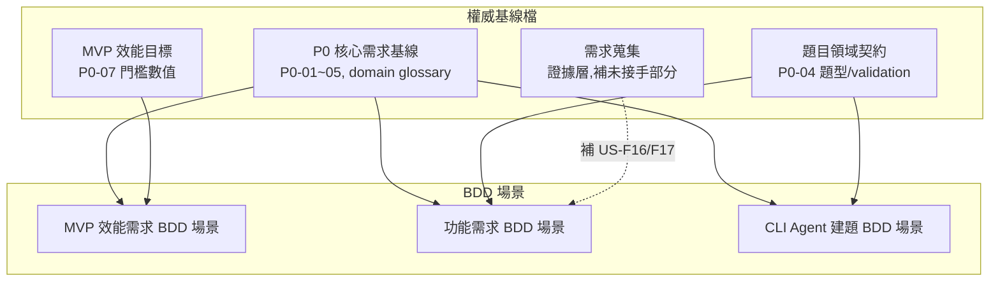
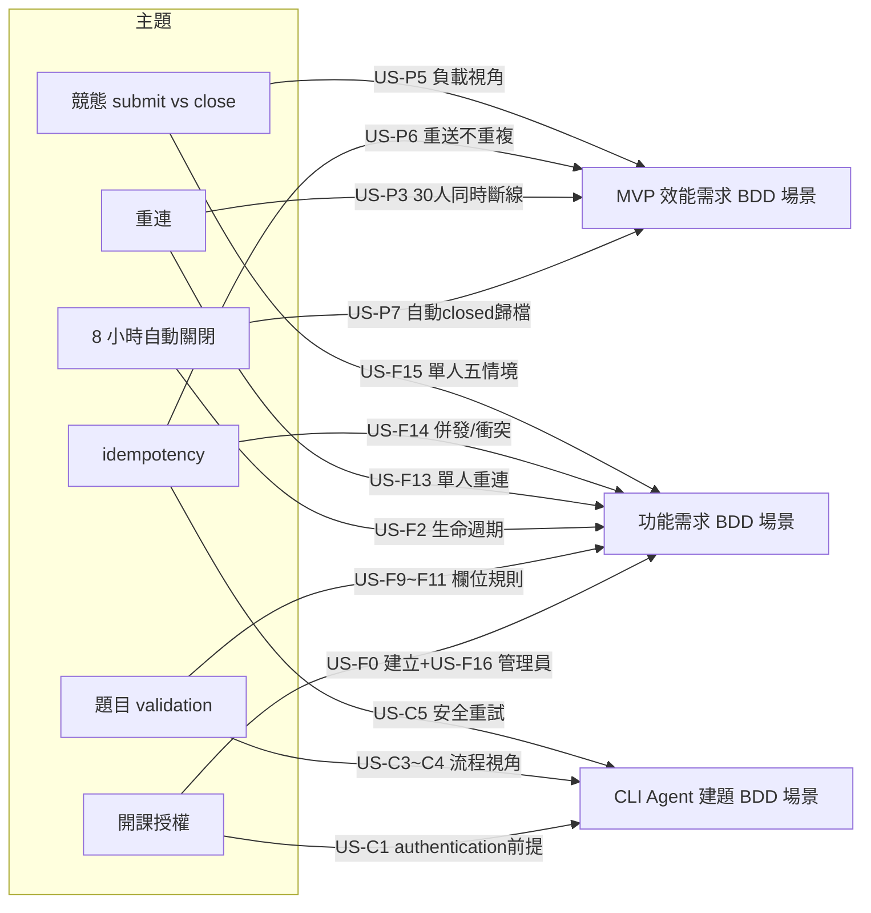

# 智學互動平台 - BDD 場景關聯圖

> [!info] 目的
> 說明本專案三份 BDD 場景文件的視角分工、共同來源、交叉引用與不重複原則,以便快速理解三份文件的關係與查閱順序。

## 三份 BDD 檔

| BDD 檔 | 視角 | 回答的問題 | 涵蓋 P0 | 檔案 |
|---|---|---|---|---|
| [[MVP 效能需求 BDD 場景]] | 負載／門檻 | 在 300 人壓力下**多快、多正確**？ | P0-07 | `10_需求蒐集/MVP 效能需求 BDD 場景.md` |
| [[功能需求 BDD 場景]] | 功能行為（單人） | 系統**該做什麼**？(單人正常流程與非負載邊界) | P0-01～05 + P0-04 + US-F16/F17 | `10_需求蒐集/功能需求 BDD 場景.md` |
| [[CLI Agent 建題 BDD 場景]] | CLI／Agent 互動流程 | 老師透過 AI Agent 建題的**互動流程**怎麼走？ | US-06 MVP 最小端到端 | `10_需求蒐集/CLI Agent 建題 BDD 場景.md` |

## 共同來源

三份 BDD 都從同一組權威基線檔推導,並共用同一套 ubiquitous language(沿用 [[P0 核心需求基線#Domain glossary]] 與 [[題目領域契約#Domain object]]:Course、LiveSession、SessionQuestion、Participant、Submission、session code)。

- 門檻數值只在 [[MVP 效能需求 BDD 場景]] 定義,另兩份引用不複製。
- 題型欄位規則只在 [[題目領域契約]] 定義,[[功能需求 BDD 場景]] 與 [[CLI Agent 建題 BDD 場景]] 引用不重複。
- [[需求蒐集]] 為證據層,大部分內容已被基線取代;US-F16(`can_create_course`)與 US-F17(結果統計圖呈現)為未被基線接手的現行需求,補入 [[功能需求 BDD 場景]]。

## 交叉引用（重疊主題）

三份在重疊主題上互相 wikilink,而非各寫一份完整內容。每條規則只在一處定義「權威語意」,其他檔只寫自己視角的場景並 link 過去。

| 重疊主題 | 效能檔 | 功能檔 | CLI 檔 |
|---|---|---|---|
| 競態(submit vs close) | US-P5 負載下依伺服器順序 | US-F15 單人五種情境 | — |
| idempotency | US-P6 重送不重複 | US-F14 多分頁併發/不同答案衝突 | US-C5 安全重試不重複建立 |
| 重連 | US-P3 30 人同時斷線 p95 | US-F13 單人重連恢復狀態 | — |
| 8 小時自動關閉 | US-P7 自動 closed 歸檔 | US-F2 生命週期 + US-F15 自動關閉競態 | — |
| 題目 validation | — | US-F9～F11 欄位規則/批次/確認 | US-C3～C4 流程視角(套用相同規則) |
| 開課授權 | — | US-F0 建立 + US-F16 管理員旗標 | US-C1 authentication 前提 |

## 不重複原則

每一條規則只在一個地方定義「權威語意」,其他檔只寫自己視角的場景並 link:

- **門檻數值**(p95 ≤ 500ms 等)→ [[MVP 效能需求 BDD 場景]] 唯一來源,[[功能需求 BDD 場景]]／[[CLI Agent 建題 BDD 場景]] 不寫數值。
- **競態判定邏輯**(伺服器順序為權威)→ [[功能需求 BDD 場景#US-F15]] 寫完整五情境,[[MVP 效能需求 BDD 場景#US-P5]] 只寫負載子集並 link。
- **題型欄位規則**(poll/open_text/quiz 的 required/forbidden)→ [[功能需求 BDD 場景#US-F9]] 寫,[[CLI Agent 建題 BDD 場景#US-C3]] 只說「套用與 Web 相同 validation」並 link。
- **建立課程授權閘** → [[功能需求 BDD 場景#US-F0]] 寫(老師視角),[[CLI Agent 建題 BDD 場景#US-C1]] 引用為 authentication 前提。

## 一句話總結

三份是**同一系統的三個驗收視角**(效能壓力 / 功能行為 / CLI-Agent 流程),共用同一套基線來源與 ubiquitous language,在重疊主題上互相 cross-link 而不重複定義,各自只寫自己視角獨有的場景。

## 查閱順序建議

- 要看「系統該做什麼」→ 從 [[功能需求 BDD 場景]] 入手。
- 要看「能不能撐住 300 人」→ 看 [[MVP 效能需求 BDD 場景]]。
- 要看「AI Agent 建題怎麼走」→ 看 [[CLI Agent 建題 BDD 場景]]。
- 要看「三份怎麼分工」→ 看本檔。

## 相關連結

- 效能 BDD 場景: [[MVP 效能需求 BDD 場景]]
- 功能 BDD 場景: [[功能需求 BDD 場景]]
- CLI／Agent 建題 BDD 場景: [[CLI Agent 建題 BDD 場景]]
- 基線來源: [[P0 核心需求基線]]、[[題目領域契約]]、[[MVP 效能目標]]、[[需求蒐集]]
- 專案首頁: [[智學互動平台]]