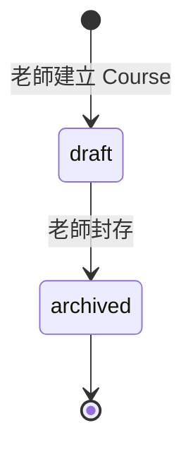
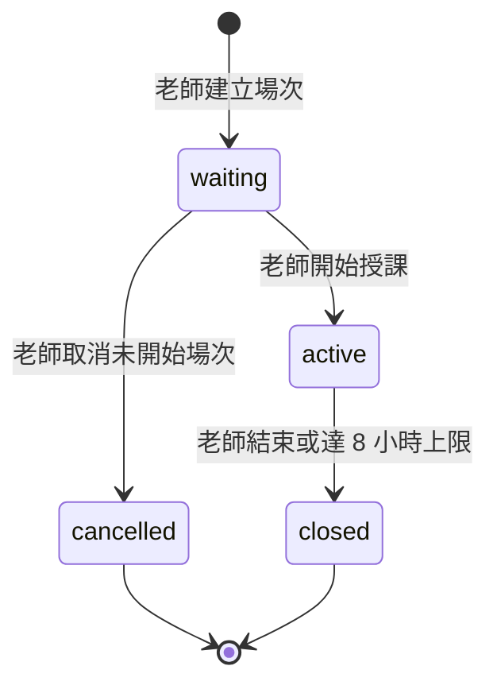
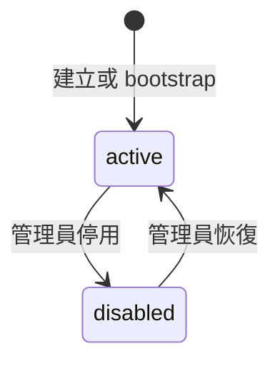

# 智學互動平台 - P0 核心需求基線

> [!important] Phase B override（2026-08-23）
> 本檔較早的 MVP 條款若寫「不建立 student account／roster」或將 Participant 限定為 anonymous-only，已由 Phase B backend decision supersede；這些文字仍是需求演進的歷史證據，不是目前 student authorization contract。現行 P0 讀法：admin 建立 student account（無公開 self-registration）、teacher/admin 管理 `CourseEnrollment`、active enrollment 才能以 cookie 使用 account-bound Participant；student 不能使用 owner/admin paths，`canCreateCourse` 永遠為 `false`，anonymous session-code + participant-token fallback 保留。
> 結果治理不因 account-bound live participant 而改變：open_text projection 只含匿名 `{ text }`，close/archive 不得保留可由 account、displayName 或 token 回查答案的鏈結，student 沒有歷史結果入口。`[x]` 仍只代表需求確認，不代表 B3/full regression 已驗證。

> [!important] 現行規範
> 本檔是 [[智學互動平台]] P0-01、P0-02、P0-03 與 P0-05 的現行需求基線。若本檔與原始 [[需求蒐集]] 中的 Course `draft → active → closed`、多輪上課、帳號生命週期或學員重連規則不一致，以本檔為準；原檔保留作為需求來源與既有 AC 追蹤證據。

## 文件目的與邊界

本基線補齊下列核心需求：

1. Course 與 LiveSession 的責任及生命週期。
2. 多輪上課、session code 與題目重用。
3. Web 登入、登出、密碼與帳號生命週期。
4. 學員重連、重複提交與關題競態。
5. 四週 MVP 的 CLI／Agent 交付邊界。

題目欄位與共用驗證以 [[題目領域契約]] 為唯一來源；結果歸檔與保留以 [[結果資料治理]] 為唯一來源；容量與延遲門檻以 [[MVP 效能目標]] 為唯一來源。

> [!note] M1 與 M2 邊界
> 本檔定義使用者可觀察的狀態、規則、限制與驗收結果。資料表、endpoint、cookie/session 實作、token 編碼、transaction isolation、lock、WebSocket protocol 與 framework mapping 留待 M2 系統分析與設計。

> [!note] 驗收勾選語意
> 本檔 `[x]` 代表需求內容已由使用者確認並納入基線,不代表功能已實作或測試通過。實作與測試狀態應在 M3/M4 的實作測試筆記另行追蹤。

## MVP 範圍

### 本次納入

- 系統管理員與老師 Web 帳號的基本生命週期。
- Course 建立、題目維護、封存與歷史場次索引。
- 每次授課建立獨立 LiveSession。
- 學員以 session code 和自填顯示名匿名加入。
- 逐題開放、作答、即時彙總、vote-to-reveal 與結果歸檔。
- 單一已驗證 Agent host 的 CLI／Agent 最小端到端建題：必要 authentication、課程查詢、共用 validation、完整預覽、老師明確確認與建立題目。

### 延後交付

既有 [[需求蒐集#Epic:AI Agent 課程題目管理|AI Agent 課程題目管理 Epic]] 中，下列能力保留為後續需求，不列入 2026-09-10 MVP：

- 完整 CLI access key 輪替、安全鎖與進階生命週期。
- 跨 Windows、macOS、Linux 的完整發行與安裝矩陣。
- 進階通知、稽核查詢與 CSV 匯出。
- 多 Agent host 的官方驗證。
- 修復安裝、回滾、集中部署、離線發行與其他進階維運能力。

### MVP 明確不支援

- 學員帳號或課程名冊。
- SSO、MFA、Email 自助密碼重設及複雜 RBAC。
- 共同授課、Course 所有權移轉或管理員指派既有 Course 老師。
- 同一 Course 同時進行多個 LiveSession。
- Course 或帳號硬刪除。
- LiveSession 暫停後恢復、closed/cancelled 後重開。
- 學員事後查詢歷史結果。

## Domain glossary

| 名詞 | 定義 | 核心責任 |
|---|---|---|
| Course | 老師長期維護的課程與題庫容器 | 保存課程資料、QuestionDefinition 與歷史 LiveSession 索引 |
| LiveSession | Course 的一次實際授課場次 | 管理加入 code、匿名參與者、逐題互動及該場結果 |
| QuestionDefinition | Course 中可編輯、可跨場重用的題目定義 | 提供題目內容與驗證語意，詳見 [[題目領域契約]] |
| SessionQuestion | LiveSession 啟用時由 QuestionDefinition 建立的不可變快照 | 保存該場題目內容、順序及逐題狀態 |
| Participant | 某 LiveSession 內的匿名學員識別 | 由場次限定 opaque token 表示，不是平台帳號 |
| Submission | Participant 對某一 SessionQuestion 第一次被接受的答案 | 每位 participant 每題最多一筆有效答案 |
| ArchivedResult | LiveSession closed 後可查詢的匿名答案與彙總 | 依 [[結果資料治理]] 保存及刪除 |

## P0-01 Course 與 LiveSession

### Course 生命週期

| 狀態 | 可編輯課程資料 | 可增刪改排序題目 | 可建立 LiveSession | 可查歷史結果 |
|---|---:|---:|---:|---:|
| `draft` | 是 | 是，但有進行中場次時不得影響該場快照 | 是，且同時最多一個未結束場次 | 是 |
| `archived` | 否 | 否 | 否 | 是 |

業務規則：

- Course 是持久容器，不再使用 `active` 或 `closed` 表示上課狀態。
- Course 建立者自動成為唯一老師。
- MVP 不支援共同授課、老師指派或所有權移轉。
- 只有 `draft` Course 可以建立 LiveSession。
- Course 只有在不存在 `waiting` 或 `active` LiveSession 時才能封存。
- `archived` 不可恢復、不可編輯及不可再建立場次，但保留歷史場次與結果查詢。
- MVP 不提供 Course 刪除。

### LiveSession 生命週期

| 狀態 | Code 有效 | 學員可加入／重連 | 可開題與作答 | 結果狀態 |
|---|---:|---:|---:|---|
| `waiting` | 是 | 是 | 否 | 尚未形成 |
| `active` | 是 | 是 | 是，只限目前 `open` 的 SessionQuestion | 即時彙總 |
| `closed` | 否 | 否 | 否 | 進入歸檔 |
| `cancelled` | 否 | 否 | 否 | 不形成互動結果 |

業務規則：

- 同一 Course 同時最多存在一個 `waiting` 或 `active` LiveSession。
- LiveSession 建立時進入 `waiting`，並取得自己的 session code。
- LiveSession 從 `waiting` 進入 `active` 時，依當下選定題目及順序建立 SessionQuestion 快照。
- `active` 不代表所有題目自動開放；所有 SessionQuestion 初始均為 `not_open`，由老師逐題控制。
- `cancelled` 只適用於尚未 active 且沒有任何 Submission 的場次。
- `closed` 與 `cancelled` 都是不可逆終止狀態。
- LiveSession 建立滿 8 小時仍未終止時，系統自動 closed；當時開放中的題目也一併 closed，後續加入與作答均被拒絕。

### P0-01 驗收條件

- [x] P0-01-AC-01 系統將 Course 與 LiveSession 視為不同 domain object，Course 不使用 `active`／`closed` 表示授課狀態。
- [x] P0-01-AC-02 老師可在同一 `draft` Course 先後建立多個 LiveSession，且每個場次有獨立 ID、狀態與結果。
- [x] P0-01-AC-03 同一 Course 已有 `waiting` 或 `active` 場次時，建立第二個未結束場次會被拒絕。
- [x] P0-01-AC-04 Course 存在未結束場次時不得封存；封存後不可編輯、開場或恢復，但仍能查歷史結果。
- [x] P0-01-AC-05 `waiting` 場次可在未開始且沒有答案時取消；`active` 場次只能 closed。
- [x] P0-01-AC-06 LiveSession closed/cancelled 後均不可恢復或再次接受加入與作答。

## P0-02 多輪上課、session code 與題目重用

### Session code

- 每個 LiveSession 產生一組新的 8 碼 code。
- 字元集使用大寫英文字母與數字，排除 `O/0`、`I/1` 等容易混淆的字元。
- 使用者輸入時不分大小寫。
- Code 只在所屬 LiveSession 的 `waiting` 與 `active` 期間有效。
- LiveSession closed、cancelled 或建立滿 8 小時時，code 立即失效。
- 舊 code 不得指向後續新場次，也不得重新啟用。
- Code 只用於找到及加入 LiveSession，不作為 Participant 身分或 CLI credential。

### 題目重用與快照

- QuestionDefinition 歸屬 Course，可供同一 Course 的多個 LiveSession 重用。
- 老師建立 LiveSession 時可選擇題目子集合及順序。
- 場次從 `waiting` 進入 `active` 時，系統建立該場 SessionQuestion 不可變快照。
- LiveSession active 後，Course 中的 QuestionDefinition 即使後續被修改，也不影響該場快照與歷史結果。
- SessionQuestion 的逐題狀態為 `not_open → open → closed`，同一時間最多一題 `open`。
- SessionQuestion closed 後不得在同一 LiveSession 重開；要在同一場重問，老師必須在場次開始前準備另一個 SessionQuestion。MVP 不支援 active 後新增題目。
- 同一 QuestionDefinition 在下一個 LiveSession 可再次使用，並重新從 `not_open` 開始。

### P0-02 驗收條件

- [x] P0-02-AC-01 每次建立 LiveSession 均產生新的 8 碼 code，且不沿用前一場 code。
- [x] P0-02-AC-02 Code 對大小寫不敏感且不含已排除的混淆字元。
- [x] P0-02-AC-03 場次 closed、cancelled 或建立滿 8 小時後，code 不再允許加入或重連。
- [x] P0-02-AC-04 LiveSession 啟用時固定 SessionQuestion 的內容與順序，後續修改 QuestionDefinition 不影響進行中或歷史場次。
- [x] P0-02-AC-05 同一 QuestionDefinition 可在不同 LiveSession 重用，各場的逐題狀態、答案與結果完全分離。
- [x] P0-02-AC-06 同一 LiveSession 的 SessionQuestion closed 後不可重開，但不阻止下一個 LiveSession 再次使用來源題目。

## P0-03 Web 帳號生命週期

### 角色與帳號狀態

MVP 只建立系統管理員與老師帳號；學員不建立帳號。

- `active`：可依角色登入並執行授權功能。
- `disabled`：不得登入；既有 Web Session、CLI credential 與未使用 token 立即失效。
- 停用不刪除 Course、LiveSession、ArchivedResult 或稽核資料。
- CLI key security lock 只阻擋 CLI credential 建立／啟用／輪替，不等同停用 Web 帳號；帳號停用則同時阻擋 Web 與 CLI。
- MVP 不硬刪帳號。

### 帳號建立與首位管理員

- 部署時提供一次性 bootstrap 流程建立第一位系統管理員。
- Bootstrap 成功後必須自動失效，不得再次建立額外首位管理員；具體命令與秘密傳遞方式留待 M2。
- 後續老師或管理員帳號由有效系統管理員建立。
- 管理員建立帳號時簽發一次性臨時密碼，使用者首次登入必須設定自己的新密碼後才能使用其他功能。
- 管理員無法讀回使用者後續設定的密碼。

### 登入、登出與 Web Session

- 使用者以獨立 DB 帳號登入，不整合 SSO。
- Web Session 必須由 Secure、HttpOnly、SameSite cookie 保護；具體 session 儲存與 cookie 值形式留待 M2。
- 閒置 30 分鐘或自登入起滿 8 小時，Session 失效並要求重新登入。
- 使用者可登出目前 Session；登出後瀏覽器返回不得重新顯示受保護內容。
- 停用帳號、管理員重設密碼或使用者成功變更密碼時，所有既有 Web Session 立即失效。
- 建立／輪替 CLI key及管理員高風險操作，仍要求最近 10 分鐘完成密碼 step-up 驗證。

### 密碼規則與復原

- 密碼長度為 12～128 個 Unicode 字元，允許 passphrase。
- 不要求固定大小寫、數字、符號組合，也不要求定期更換。
- 不得使用平台列為常見或已知外洩的密碼。
- 密碼不得明文保存；實際安全雜湊演算法與參數由 M2 在 [[技術棧]] 定案。
- 使用者變更密碼時須先驗證目前密碼。
- MVP 不提供 Email 自助重設。忘記密碼時，由管理員簽發新的一次性臨時密碼；下次登入強制改密碼。
- 登入失敗須採帳號與來源雙重 rate limit，並回傳不洩露帳號是否存在的通用錯誤；不得因大量失敗永久鎖死帳號。

### P0-03 驗收條件

- [x] P0-03-AC-01 一次性 bootstrap 只能成功建立一位首位管理員，成功後再次使用會被拒絕。
- [x] P0-03-AC-02 管理員建立的帳號只能以一次性臨時密碼首次登入，未設定新密碼前不得使用其他功能。
- [x] P0-03-AC-03 Active 管理員與老師可登入；disabled 帳號收到通用登入失敗且不得建立 Session。
- [x] P0-03-AC-04 Web Session 閒置 30 分鐘或登入滿 8 小時後失效；高風險操作仍要求 10 分鐘內的 step-up。
- [x] P0-03-AC-05 登出、改密碼、管理員重設密碼或帳號停用後，既有 Web Session 均立即失效。
- [x] P0-03-AC-06 密碼須為 12～128 字元且不得使用常見／已知外洩密碼；不強迫字元組合或定期更換。
- [x] P0-03-AC-07 登入失敗受帳號＋來源 rate limit 控制，錯誤不得洩露帳號是否存在，也不得永久鎖死帳號。
- [x] P0-03-AC-08 帳號停用時相關 CLI credential 與未使用 token 同步失效，但 Course、場次結果與稽核保留。
- [x] P0-03-AC-09 MVP 不提供帳號硬刪、Email 自助重設、SSO、MFA 或學員帳號。

## P0-05 學員重連、重複提交與競態

### 匿名 Participant

- 學員使用 session code 與自填顯示名加入 LiveSession。
- 加入成功後，由伺服器簽發只對該 LiveSession 有效的 opaque participant token。
- Token 可由同一 browser 保存並用於重連，但不得用於其他 LiveSession，也不得建立跨場追蹤身分。
- 清除 browser 資料、改用其他 browser 或裝置後，平台不保證識別為同一 participant；此限制延續原無帳號設計。
- 顯示名去除前後空白後須為 1～40 個安全可顯示 Unicode 字元，不得包含換行、控制字元或顯示方向控制符。
- 同一 LiveSession 允許重複顯示名；顯示名只供 UI 展示，不作身份、防重複或授權依據。

### 重連

使用有效 participant token 重連後，學員可取得：

- LiveSession 最新狀態。
- 目前 SessionQuestion 及其狀態。
- 自己是否已提交目前題目。
- 依 vote-to-reveal 規則有權看到的最新彙總。

瀏覽器快取或 WebSocket 事件不是權威資料；斷線後以伺服器回傳的最新狀態為準。LiveSession closed/cancelled 或滿 8 小時後不得重連。

### Submission 與 idempotency

- 同一 participant 對同一 SessionQuestion 最多一筆有效 Submission。
- 第一次成功提交後不得修改答案。
- 同一 idempotency key 的安全重送回傳第一次提交結果，不新增第二筆 Submission。
- 同一 participant 對同一題使用不同答案再次提交時回傳衝突，不覆寫第一次答案。
- 多分頁或併發請求同時提交時，最多一筆成功。
- 只有 LiveSession `active` 且 SessionQuestion `open` 時可提交。

### Submit／close 競態

伺服器的提交順序是唯一權威：

| 情境 | 最終結果 |
|---|---|
| Submission 先成功提交，題目後 closed | 答案保留並納入結果 |
| 題目先成功 closed，Submission 後提交 | 答案拒絕，不納入結果 |
| Client 已送出但尚未取得回應 | 使用原 idempotency key 查回第一次權威結果 |
| WebSocket 先顯示 closed，但權威查詢顯示 Submission 已先提交 | 以權威查詢結果為準，答案納入 |
| LiveSession 自動 closed 與 Submission 同時發生 | 同樣依伺服器提交順序判定 |

不以 client device time 或 WebSocket 到達先後判定。具體 transaction、lock 或 optimistic concurrency 實作留待 M2。

### P0-05 驗收條件

- [x] P0-05-AC-01 學員加入後取得場次限定 participant token，且該 token 不可用於其他 LiveSession。
- [x] P0-05-AC-02 顯示名為 1～40 字元、允許重複且不作為 participant 唯一鍵。
- [x] P0-05-AC-03 有效 token 重連可恢復最新場次、目前題目、自己是否已答及可見彙總。
- [x] P0-05-AC-04 同一 participant 每題只接受第一次有效答案；不同答案再次提交回傳衝突。
- [x] P0-05-AC-05 相同 idempotency key 重送回傳第一次結果，多分頁併發不產生第二筆有效答案。
- [x] P0-05-AC-06 Submit 與題目 closed 競態依伺服器提交順序判定，不採 client time 或事件到達順序。
- [x] P0-05-AC-07 場次 closed/cancelled 或滿 8 小時後拒絕加入、重連與新 Submission。
- [x] P0-05-AC-08 清除 browser 資料或跨裝置可能取得新 participant 身分，仍列為無帳號模式的已知限制。

## P0 需求追蹤

| P0 | 現行規範 | 原始來源 | M2 主要輸入 | 未來驗證 |
|---|---|---|---|---|
| P0-01 | 本檔 Course／LiveSession | [[需求蒐集#課程與互動題目機制]]、BR-04～BR-06 | ER Model、狀態 transition API、權限 | 狀態矩陣與 transition 測試 |
| P0-02 | 本檔多輪／code／快照 | [[需求蒐集#待確認事項]] | Code 產生與唯一性、快照交易 | 多輪隔離、到期與重用測試 |
| P0-03 | 本檔 Web 帳號生命週期 | US-01、US-04、US-07 的 Web Session 假設 | Auth/session、bootstrap、password reset | 帳號生命週期矩陣 |
| P0-04 | [[題目領域契約]] | [[需求蒐集#題目需求層概念 schema]] | Domain model、Web/CLI adapter | Schema parity fixtures |
| P0-05 | 本檔 Participant／Submission | US-02、US-03、BR-09～BR-14 | Token、idempotency、交易與即時同步 | 重連與競態矩陣 |
| P0-06 | [[結果資料治理]] | AC-02-07、原待確認事項 | Archive query、retention job | 權限與 90 天刪除測試 |
| P0-07 | [[MVP 效能目標]] | 專案首頁 300 人決策 | 部署、容量、壓測與監控 | 負載測試報告 |

## M2 設計輸入清單

> [!todo] M2 應決定，但不得改變本基線的可觀察結果
> - Course、LiveSession、QuestionDefinition、SessionQuestion、Participant、Submission 與 ArchivedResult 的儲存模型。
> - Session code 的安全亂數、碰撞處理、索引與到期工作。
> - Web Session、cookie、CSRF、bootstrap 與 password reset 的具體實作。
> - Participant token 格式、保存方式與重連 protocol。
> - Submission idempotency、unique constraint、transaction isolation 或 concurrency control。
> - 即時通訊、狀態同步、重連、事件順序、snapshot/replay 與背壓。
> - LiveSession 8 小時自動 closed 的可靠排程。
> - 與 [[題目領域契約]]、[[結果資料治理]]、[[MVP 效能目標]] 對應的 API、測試與監控設計。

## 相關連結

- 專案首頁：[[智學互動平台]]
- 原始需求與既有 AC：[[需求蒐集]]
- 題目共用語意：[[題目領域契約]]
- 結果歸檔與保留：[[結果資料治理]]
- 效能驗收：[[MVP 效能目標]]
- 技術選型：[[技術棧]]
