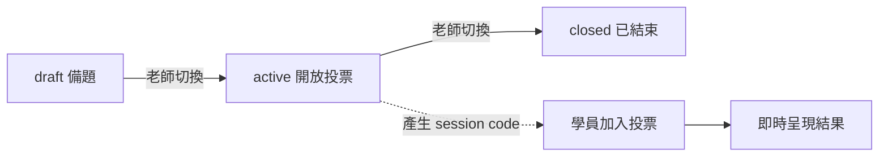
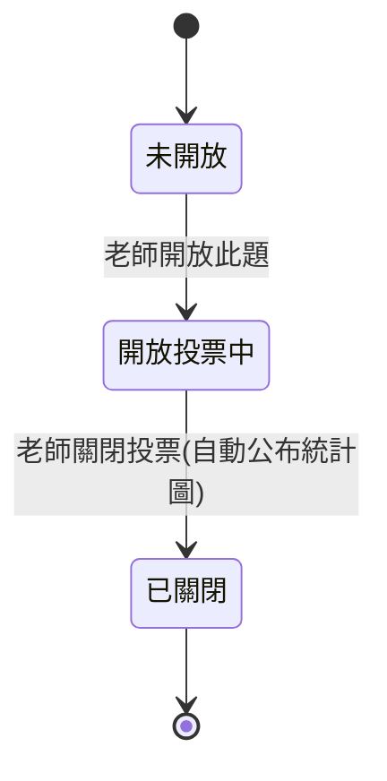

# 智學互動平台 - 需求蒐集

> [!warning] 原始需求與規範優先序
> 本檔保留 [[智學互動平台]] M1 原始 User Story、驗收條件與業務規則,作為需求來源及既有 AC 追蹤證據。P0 補齊後,Course/LiveSession、多輪上課、Web 帳號、學員重連與競態以 [[P0 核心需求基線]] 為準;Web/CLI 共用題目語意以 [[題目領域契約]] 為準;結果歸檔與保留以 [[結果資料治理]] 為準;單場 300 人的可測門檻以 [[MVP 效能目標]] 為準。下方與這些文件衝突的舊敘述視為已被取代,但不刪除,以保留決策脈絡。

## 角色與帳號模型

平台採**兩層角色模型**,角色存在理由是權限控管——只有老師可以建立課程與互動題目。

| 角色 | 範圍 | 帳號 | 職責 |
|---|---|---|---|
| 系統管理員 | **全域** | 有 | 建立帳號、在帳號上設定「可開課」旗標、管理平台 |
| 老師 | **隨課程而異** | 有 | 建立課程(須經授權)、建立互動題目、開放/結束即時互動 |
| 學員 | **不進角色表** | **無帳號** | 用 session code + 自填顯示名加入即時互動、投票 |

> [!note] 設計重點
> - 學員**不加入課程名冊**,主要是用 session code 加入即時互動、投票與即時看結果。
> - 「維護角色與角色成員」的實際範圍收斂為:管理員建立帳號、設定可開課旗標、指派某人為某課老師;學員不進角色表。
> - 「可開課」授權為**帳號層級旗標** `can_create_course`,因為課程建立前不存在可指派的標的;該帳號建立課程後自動成為該課老師。

## 課程與互動題目機制

> [!warning] 已由 P0 基線取代
> 下列 Course `draft → active → closed` 與「每次 active」敘述保留作歷史來源。現行模型已拆成 Course `draft → archived` 與每次授課的 LiveSession `waiting → active → closed/cancelled`;多輪、8 碼 session code、8 小時 hard limit及題目快照規則見 [[P0 核心需求基線#P0-01 Course 與 LiveSession]] 與 [[P0 核心需求基線#P0-02 多輪上課、session code 與題目重用]]。



- **課程 = 持久容器**:老師備好題目 → 上課時開啟即時場次 → 學員用 code 加入 → 投票 → 結束。每次上課可重產 code(新一輪 active)。
- **課程狀態**:`draft`(備題,可改題) → `active`(開放投票,產生 session code) → `closed`(code 失效、題目鎖定、結果歸檔可查)。
- **互動題目類型**:投票、問答、測驗三種。
- **題目修改規則**:draft 可任意增刪改;active/closed 鎖定不可改。
- **一門課一位老師**(建立者);題目歸屬課程,只有該課老師能建/改題目。
- **結果即時呈現**:
    - 老師端:即時看到全班投票彙總圖表。
    - 學員端:也即時看到,但採 **vote-to-reveal**——必須先送出自己答案,才解鎖看到全班即時彙總。
- **學員防重複投票**:session 期間以 browser 識別(localStorage/cookie)在單場即時互動內防重複。

> [!warning] 已知限制
> 學員無帳號,跨裝置或清除瀏覽器資料可繞過防重複投票機制。此為「不將學員加入課程」前提下可接受的折衷,平台不保證跨裝置唯一性。

## User Story

> [!warning] P0 補充規範
> US-01～US-03 的原始 AC 保留不變,但其缺少的 Web 帳號生命週期、Course/LiveSession 拆分、跨場快照、匿名 participant、idempotency 與競態驗收已補於 [[P0 核心需求基線]]。US-04～US-07 的完整需求仍保留,但 2026-09-10 MVP 已縮為單一驗證 Agent host 的必要 authentication、查課、共用 validation、完整 preview、明確確認與建題最小端到端;其餘列為後續交付。

### US-01 系統管理員維護帳號與開課授權

> 作為系統管理員,我想要建立老師與管理員帳號,並在帳號上設定「可開課」授權,以便控管誰能在平台上建立課程與互動題目。

**驗收條件:**

- [ ] 系統管理員可建立帳號(使用者名稱、密碼雜湊儲存)。
- [ ] 系統管理員可在帳號上切換「可開課」旗標(`can_create_course`)。
- [ ] 未授權可開課的帳號嘗試建立課程時被拒。
- [ ] 帳號範圍限管理員與老師;不建立學員帳號。
- [ ] 帳號密碼以 bcrypt/Argon2 雜湊儲存(對應 [[技術棧]])。

### US-02 老師建立課程與互動題目

> 作為經系統管理員授權的老師,我想要建立課程、在其中建立投票/問答/測驗題目,並在上課時開放學員即時投票,以便收集學員回饋並即時呈現結果。

**驗收條件:**

- [ ] 帶「可開課」旗標的老師可建立新課程,自動成為該課老師(一門課一位老師)。
- [ ] 老師可在 draft 課程中建立投票、問答、測驗三類題目,並可任意增刪改。
- [ ] 老師將課程切換為 active 時產生帶有 session code 的加入 URL;學員點擊 URL 加入即時互動(以自填顯示名進入)。
- [ ] active 期間題目鎖定不可改;老師端即時顯示全班投票彙總。
- [ ] 學員投票後採 vote-to-reveal 才能看到全班即時彙總。
- [ ] 同一學員在單場 active 期間以 browser 識別防重複投票(跨裝置可繞過為已知限制)。
- [ ] 老師將課程切換為 closed 後,session code 失效、題目鎖定、結果歸檔可查。

### US-03 學員投票

> [!info] 逐題投票控制
> 本 User Story 引入「逐題控制」:課程進入 active 後,各題投票預設未開放,由老師逐題開放,學員才可作答;並在作答後(vote-to-reveal)才看到統計圖。



> 作為學員,我想要在老師開放投票時作答,並在自己投票後看到全班統計圖,以便即時了解全班的回答分布與討論趨勢。

**驗收條件:**

- [ ] AC-03-01 老師可在 active 課程中,從題目清單任選一題開放投票;同一時間僅一題開放。
- [ ] AC-03-02 學員只能在「開放投票中」的題目作答;未開放或已關閉的題目不可作答。
- [ ] AC-03-03 投票、問答、測驗三種題型皆適用逐題開放與作答流程,僅作答 UI 與統計圖不同。
- [ ] AC-03-04 開放投票中,學員須先送出答案才能看到該題統計圖(vote-to-reveal);未作答者看不到彙總。
- [ ] AC-03-05 老師關閉投票時,該題統計圖自動公布為全班可見(含未投者),無需獨立「公布」操作。
- [ ] AC-03-06 一題一旦關閉即定案,不可重開同一題累積新投票;重問需建立新題目。
- [ ] AC-03-07 投票題統計圖為長條圖;問答題為文字列表/文字雲;測驗題為長條圖並標示正確答案。
- [ ] AC-03-08 投票開放中,老師端即時顯示統計圖與已投/加入人數;老師端不看個別學員答案。

### Epic:AI Agent 課程題目管理

> [!abstract] Epic 目標
> 讓具有開課授權的老師透過官方 Skill 與 CLI,使用自然語言請 AI Agent 協助建立課程題目。CLI/Agent 是新增入口,不取代既有網頁建題流程。

本 Epic 包含 US-04～US-07。US-04 與 US-05 為 US-06 的前置 Story;US-07 負責管理員的 CLI key 安全控制。US-04～US-07 均已完成需求審核。

### US-04 老師管理 CLI 存取金鑰

> 作為具有開課授權且至少擁有一門課程的老師,我想建立、辨識、輪替與撤銷 CLI 存取金鑰,以便安全授權 CLI 操作我有權管理的草稿課程。

**驗收條件:**

- [ ] AC-04-01 老師可由帳號層級的 CLI access key 管理頁統一管理自己的 key;draft 課程頁另提供預選該課程的單課程 key 建立捷徑。
- [ ] AC-04-02 只有帳號有效、具有 `can_create_course`、至少擁有一門課程且未受 CLI key 安全鎖限制的老師可以建立 key。
- [ ] AC-04-03 建立表單要求名稱、scope 與期限,並清楚展示固定且不可修改的 `courses:list`、`questions:create` permission。
- [ ] AC-04-04 單課程 scope 只能選擇老師目前擁有且處於 draft 的課程;從課程頁進入時,scope 與 course ID 會被預選並鎖定。
- [ ] AC-04-05 all-courses scope 涵蓋老師目前及未來擁有的所有課程;建立前須提示最長 90 天及較廣外洩影響,並由老師主動確認。
- [ ] AC-04-06 老師目前沒有 draft 課程時不能建立單課程 key;若仍符合整體資格,可建立 all-courses key,但須提示目前沒有可操作課程。
- [ ] AC-04-07 key 名稱經去除前後空白後須為 1～64 個可顯示 Unicode 字元,不得包含換行、控制字元或可能混淆顯示方向的不可見控制符。
- [ ] AC-04-08 `pending_verification`、`active` 及輪替中的 key,經 Unicode、空白與大小寫正規化後名稱不得重複;歷史 key 不阻止名稱重用。
- [ ] AC-04-09 每位老師最多同時持有 10 把 `pending_verification` 或 `active` key;伺服器須在併發建立時一致地強制此上限,不得自動撤銷任何 key。
- [ ] AC-04-10 單課程 key 可選 7、30、90、365 天;all-courses key 可選 7、30、90 天。期限從伺服器簽發秘密的 UTC 時間起算,介面顯示使用者本地時間與時區。
- [ ] AC-04-11 建立或輪替 key 前,老師須在最近 10 分鐘內完成密碼驗證;簽發時由伺服器再次檢查登入狀態、資格、scope、數量上限及安全鎖。
- [ ] AC-04-12 key 使用密碼學安全、不可預測的高熵秘密及可辨識的產品前綴;後端只保存可驗證雜湊及必要 metadata。
- [ ] AC-04-13 建立成功頁只顯示一次完整 key,並顯示名稱、尾碼、不可變 key ID、scope、permission、建立時間及到期時間。
- [ ] AC-04-14 老師須勾選「已安全保存,離開後無法再次查看」;平台對正常導覽提供離開警告,但不宣稱能防止斷線、當機或強制關閉。
- [ ] AC-04-15 複製 key 後,平台提示剪貼簿含敏感資料,並建議完成 `auth configure` 後清除;不得將秘密寫入 Email、下載檔、browser storage、Prompt 或 AI Agent context。
- [ ] AC-04-16 一旦離開一次性顯示頁,老師與管理員都不能再次讀回完整 key;若未成功取得秘密,只能撤銷並重新建立。
- [ ] AC-04-17 建立請求使用一次性 request ID;相同老師與 request ID 在至少 24 小時內不得重複簽發,也不得在重送時再次回傳完整秘密。
- [ ] AC-04-18 建立失敗時不產生半成品 key、不占用數量上限、不顯示秘密,並回傳穩定錯誤碼、欄位路徑及可採取的下一步。
- [ ] AC-04-19 新 key 建立後先處於 `pending_verification`,只允許執行 `auth status`;成功 authentication 後才轉為 `active` 並開放正式 permission。
- [ ] AC-04-20 pending key 啟用前,伺服器重新檢查帳號、`can_create_course`、安全鎖、scope 標的及到期時間;不符合條件時不得啟用。
- [ ] AC-04-21 key 在 24 小時內未通過 `auth status` 時自動轉為 `revoked`,並釋放數量名額;不得自動啟用或再次顯示秘密。
- [ ] AC-04-22 驗證成功時分別記錄 `verified_at` 與 `last_used_at`;之後每次成功通過 authentication 均更新 `last_used_at`。
- [ ] AC-04-23 管理頁使用穩定狀態 `pending_verification`、`active`、`expired`、`revoked`、`disabled`;`revoked` 與 `disabled` 不會在原到期日被覆寫為 `expired`。
- [ ] AC-04-24 正式操作以 transaction 內的最新狀態及到期時間為準;到期、撤銷或停用先提交時,後續請求須被拒絕。
- [ ] AC-04-25 有效 key 清單顯示名稱、最後四個可見字元的尾碼、key ID、scope、permission、狀態、建立時間、驗證時間、到期時間及最近使用時間。
- [ ] AC-04-26 單課程 key 顯示課程名稱與 course ID;all-courses key 明示會動態涵蓋未來自有課程。
- [ ] AC-04-27 清單預設優先顯示 `pending_verification`,再依建立時間由新到舊顯示 `active`,並支援依狀態、scope 及名稱篩選或搜尋。
- [ ] AC-04-28 老師可修改 pending 或 active key 的名稱;改名只更新 metadata,不改變秘密、scope、permission、期限或驗證狀態,並須留下稽核事件。
- [ ] AC-04-29 歷史 key 置於可篩選的歷史檢視,metadata 凍結且不可刪除、改名、恢復、延長或擴權;再次使用必須建立新 key。
- [ ] AC-04-30 老師撤銷 key 前,平台顯示名稱、尾碼、scope、最後使用時間及影響;確認後立即轉為 `revoked` 且不可復原。
- [ ] AC-04-31 撤銷只需有效登入 session 及明確確認,不要求近期密碼驗證。
- [ ] AC-04-32 登入 session 失效時拒絕建立、輪替、改名或撤銷;重新登入後重新載入最新狀態,不得自動重送原敏感操作。
- [ ] AC-04-33 active key 提供正式輪替操作,建立具有新 key ID 與新秘密的 successor,並記錄 predecessor/successor 關係;不得原地變更秘密。
- [ ] AC-04-34 輪替新 key 使用可辨識的暫時名稱,處於 `pending_verification` 且只允許 `auth status`;pending key 本身不可再次輪替。
- [ ] AC-04-35 老師已有 10 把 key 時,正式輪替流程可使用一個暫時名額;一般建立不得使用此名額。
- [ ] AC-04-36 輪替新 key 未在 24 小時內驗證時,系統撤銷新 key並取消輪替,舊 key 保持原狀。
- [ ] AC-04-37 新 key 驗證成功後,老師可確認完成輪替並立即撤銷舊 key;若未操作,從驗證成功起最多 24 小時後自動撤銷舊 key。
- [ ] AC-04-38 輪替中止時可撤銷新 key並保留仍有效的舊 key;已撤銷、停用或過期的 key不得復活。
- [ ] AC-04-39 正式到期時間、pending 驗證期限與輪替期限重疊時,以最早到達者為準,不得藉輪替延長 credential 正式期限。
- [ ] AC-04-40 期限超過 7 天的 key 在進入最後 7 天時發送一次平台內提醒;7 天 key 在建立成功頁直接明示到期時間,不另產生重複提醒。
- [ ] AC-04-41 帳號停用或鎖定、移除 `can_create_course`、管理員安全停用時,相關 key及未使用 validation token 立即失效,且資格恢復後舊 key 不會自動恢復。
- [ ] AC-04-42 單課程被刪除或移轉時,關聯 key 永久轉為 `disabled`;課程只從 draft 進入 active/closed 時,不改變 key 主狀態,但建題請求仍被拒絕。
- [ ] AC-04-43 all-courses key 動態排除老師不再擁有的課程;老師暫時沒有自有課程但仍具有 `can_create_course` 時,key 維持 `active` 並顯示目前沒有可操作課程。
- [ ] AC-04-44 老師可原子性緊急撤銷自己的全部 active、pending 及輪替中的 key,並使未使用 validation token 失效。
- [ ] AC-04-45 緊急撤銷時,老師可選擇同步啟用禁止建立/輪替 key 的安全鎖;此風險降低操作不要求近期密碼驗證。
- [ ] AC-04-46 安全鎖啟用時,管理頁明示鎖定時間、適合揭露的原因與處理方式;建立及輪替功能停用,pending key立即轉為 `disabled`,但既有課程、題目與歷史稽核不受影響。
- [ ] AC-04-47 老師失去建立 key 資格但帳號仍可登入時,仍可查看狀態、歷史及自己的稽核資料,但不能建立或輪替 key。
- [ ] AC-04-48 平台通知老師新 key 建立、輪替開始/取消/逾時、老師撤銷、管理員停用、安全鎖啟用/解除及即將到期事件。
- [ ] AC-04-49 安全通知不可由老師關閉;同一 domain event 因請求重送時,只產生一筆稽核事件及一則通知。
- [ ] AC-04-50 通知只顯示名稱、尾碼、事件時間及處理入口,不得包含完整 key、雜湊或其他秘密。
- [ ] AC-04-51 老師可依時間倒序分頁查看自己的稽核事件,並依 key、事件類型、結果及日期範圍篩選。
- [ ] AC-04-52 老師可查看事件時間、事件類型、結果、key 名稱與尾碼、scope、執行者類型及適合揭露的原因;不得查看管理員敏感調查註記。
- [ ] AC-04-53 key 管理稽核資料保留一年;期限屆滿後依資料治理政策刪除或不可逆去識別化。第一版只提供平台內檢視,不提供老師匯出。
- [ ] AC-04-54 第一版不建立裝置指紋、不蒐集 AI Agent 對話,也不在 key metadata 中保存完整 IP 等超出安全需求的資料。

### US-05 老師安裝及設定官方 Skill/CLI

> 作為老師,我想從平台指定的官方來源,於受支援的裝置安裝及設定官方 CLI 與 Skill,並由本人安全設定 CLI 存取金鑰,以便讓受支援的 AI Agent 在不接觸完整金鑰的前提下協助我備課。

**驗收條件:**

- [ ] AC-05-01 平台提供統一的 AI Agent/CLI 設定頁,依老師的 OS 與 Agent host 顯示官方安裝、驗證、更新及移除步驟。
- [ ] AC-05-02 CLI 預設以目前 OS 使用者範圍安裝,不要求系統管理員或 root 權限,也不得自行提升權限。
- [ ] AC-05-03 第一版支援平台公布矩陣中經驗證的原生 Windows、macOS、Linux 終端環境;最低 OS、CPU 架構、shell、terminal 及 Agent host 版本由 M2 定案並公開。
- [ ] AC-05-04 WSL、container、遠端 SSH、CI runner、iOS、Android、瀏覽器 shell 及未列入矩陣的環境不得宣稱官方支援。
- [ ] AC-05-05 每個列入支援矩陣的 OS/CPU/shell 組合至少提供一種官方、可重現的安裝方式;一般老師不需自行準備程式語言 runtime 或編譯工具鏈。
- [ ] AC-05-06 基礎安裝、版本及完整性文件可公開閱讀;key 管理、機構專屬 endpoint 與其他敏感設定只在登入後揭露。
- [ ] AC-05-07 安裝與設定文件提供繁體中文及英文;command、option、Skill ID、JSON 欄位及穩定 error code 不因語言而改變。
- [ ] AC-05-08 CLI 與 Skill 只能由平台指定的官方來源安裝或更新,分開發布並各自具有穩定 ID 與版本。
- [ ] AC-05-09 平台公布官方 package identifier、發行來源、signing identity 或受保護 checksum manifest,並提供可驗證的完整性檢查方式。
- [ ] AC-05-10 簽章、checksum、package identity 或可信來源不符時,安裝/更新立即停止,不執行可疑內容、不修改 PATH,也不提供 `--force` 略過。
- [ ] AC-05-11 Signing identity 輪替須先經既有可信管道公布;安裝工具只接受目前官方信任集合,不無條件信任新簽章。
- [ ] AC-05-12 套件下載 redirect 只接受平台明列的可信發行 host,最終內容仍須通過 package identity 與完整性驗證。
- [ ] AC-05-13 官方來源暫時不可用時不得改從未授權鏡像下載;已遭安全封鎖的版本仍不得繼續認證或建題。
- [ ] AC-05-14 文件、截圖及測試只使用明確無效的 placeholder 或專用測試 credential,不使用老師的正式 key。
- [ ] AC-05-15 安裝前須揭露安裝位置、PATH 變更、Skill 位置、設定/credential 儲存類型及移除方式。
- [ ] AC-05-16 安裝只能建立目前使用者範圍的 CLI、必要設定目錄、產品專屬 PATH 項目,以及老師指定 Agent host 的官方 Skill。
- [ ] AC-05-17 安裝不得停用安全工具、修改 Firewall/TLS trust、掃描或改寫專案,也不得變更未選定的 Agent host。
- [ ] AC-05-18 安裝中途失敗時盡可能回復安裝前狀態;不能回復時須列出已變更與待清理項目,不得誤報成功。
- [ ] AC-05-19 重複安裝相同且完整的官方 CLI/Skill 時不得建立衝突副本或重複修改 PATH,並可由老師明確選擇修復安裝。
- [ ] AC-05-20 修復安裝只替換官方程式、必要非秘密資源及產品建立的 PATH 項目,不重設 profile、credential 或平台 key。
- [ ] AC-05-21 PATH 上存在同名非官方 executable 時停止安裝;安裝完成及 `auth configure` 前均須驗證實際解析到官方 CLI 的路徑、版本、identity 與完整性。
- [ ] AC-05-22 PATH 無法在使用者範圍自動設定時,提供對應平台/shell 的人工設定及驗證步驟,不修改全機 PATH 或目前專案。
- [ ] AC-05-23 CLI 提供人類可讀及機器可解析的版本資訊,包括版本、build identifier、官方發行身分及 API/schema 支援範圍。
- [ ] AC-05-24 Skill 宣告穩定 ID、版本、官方來源,以及相容的 CLI、Agent host 與 API/schema 範圍。
- [ ] AC-05-25 平台發布 CLI、Skill、Agent host 及 API/schema 的推薦組合、最低支援版本與相容矩陣。
- [ ] AC-05-26 元件不相容時 fail closed,指出不相容元件、已安裝/必要版本及官方更新入口,不得由 Agent 修改 request、選用舊 schema 或降低安全規則。
- [ ] AC-05-27 第一版只支援 stable channel;CLI/Skill 可以提示更新,但不得在背景無聲更新。
- [ ] AC-05-28 老師明確執行更新前,系統依相容矩陣進行 preflight,顯示更新元件、建議順序及可能影響。
- [ ] AC-05-29 一般版本淘汰應先提示期限與更新方式;重大安全事件可立即封鎖受影響版本,但仍保留版本、診斷、移除與本機清理能力。
- [ ] AC-05-30 更新失敗時盡可能保留上一個可用版本與既有 profile/credential,並提供官方修復或回滾步驟。
- [ ] AC-05-31 正常更新不要求重新輸入 key;更新後重新執行版本、完整性、相容性與 `auth status` 檢查。
- [ ] AC-05-32 非秘密設定 schema 遷移須先驗證、保留可回復副本並完成一致性檢查;失敗時保留舊設定及 credential 並 fail closed。
- [ ] AC-05-33 回滾版本無法理解目前設定 schema 時,須 fail closed 並提供相容版本/還原指引,不猜測或刪除未知欄位。
- [ ] AC-05-34 已遭修改的 Skill 不得無聲更新或繼續標示為官方驗證;老師須明確選擇保留自訂版或重新安裝官方版。
- [ ] AC-05-35 Skill 使用 Agent host 正式支援的 Skill 安裝機制,不是一次性 Prompt,也不包含 key、profile、課程資料或跨 session 確認狀態。
- [ ] AC-05-36 MVP 至少選定一個主要 Agent host 完成端到端官方驗證;其他環境即使格式相容,也只能標示為未驗證。
- [ ] AC-05-37 官方支援 host 必須能載入指定版本 Skill、執行 CLI、展示完整預覽、暫停等待老師確認、在寫入前提供核准,且不讓完整 credential 進入 Agent context。
- [ ] AC-05-38 Host 缺少必要能力時,Skill 不得執行 Agent 建題流程,須指出缺少能力;老師仍可依規則直接使用 CLI。
- [ ] AC-05-39 Skill 自我檢查是唯讀操作,回報 Skill ID/版本/完整性、host 與版本、host 能力、實際載入版本、CLI 路徑/版本及相容性結果。
- [ ] AC-05-40 自我檢查不得讀取 key、建立題目或改變 profile;元件更新、實際載入版本或完整性改變後須重新執行。
- [ ] AC-05-41 相同 Skill ID 存在多個來源或版本時 fail closed,回報衝突的非秘密位置、版本及來源,不能隨機選擇。
- [ ] AC-05-42 Skill 不得直接讀取 OS credential store,只能呼叫官方 CLI;authorization header 完全由 CLI 內部處理。
- [ ] AC-05-43 Skill 只使用產品明定的 CLI 能力;安裝、更新、移除及其他持久 shell 變更須由老師明確要求並經 host 核准。
- [ ] AC-05-44 Skill 不得執行 `auth configure`、從對話擷取 key、修改 persistent default profile,或因錯誤自動嘗試其他 credential。
- [ ] AC-05-45 老師拒絕寫入核准時視為取消,不執行正式建立、不排程重試。
- [ ] AC-05-46 Host 在正式提交前中斷時須重新預覽並取得確認;提交後中斷時以原 idempotency key 恢復結果,不盲目建立第二批題目。
- [ ] AC-05-47 `auth configure` 必須由老師本人在互動式、無回顯終端完成,不接受 `--key`、stdin pipe、設定檔匯入、環境變數或 Agent 代填。
- [ ] AC-05-48 官方指引不得將 key 放入 command line、URL、shell history、Prompt、Skill、專案 `.env` 或題目檔。
- [ ] AC-05-49 `auth configure` 依序完成官方 CLI identity/儲存能力檢查、無回顯輸入、基本格式檢查、安全 staged 保存、`auth status` 及成功後的原子 profile 切換。
- [ ] AC-05-50 Windows、macOS、Linux 優先使用各自的 OS credential facility;實際 API/library 及最低支援版本由 M2 支援矩陣定義。
- [ ] AC-05-51 OS credential store 不可用時不得無聲降級;須先警告並取得老師確認,才能使用專案外、使用者層級、權限受限的 fallback 儲存。
- [ ] AC-05-52 Fallback 無法驗證必要檔案權限時拒絕保存;使用時在 profile 清單、`auth status` 與 Agent 預覽中持續標示「降級儲存」。
- [ ] AC-05-53 OS store 恢復後可執行明確遷移:先安全寫入並驗證新 item,成功後原子切換並移除 fallback 秘密;失敗時保留原可用設定。
- [ ] AC-05-54 `auth configure` 取消、錯誤或中斷時清理可控制的記憶體與暫態資料,不建立額外持久副本,也不宣稱可清除 clipboard/swap 的所有副本。
- [ ] AC-05-55 新設定時若 key 已 expired、revoked 或 disabled,不建立 profile或 default,並安全清理 staged credential。
- [ ] AC-05-56 網路暫時失敗時可安全保留未驗證 staged credential,標示「無法確認」,供老師在期限內明確重試,不建立背景工作。
- [ ] AC-05-57 完全無法取得 pending 期限時,staged credential 最多保留 24 小時並在逾時後禁止使用;最終狀態仍以伺服器為權威。
- [ ] AC-05-58 同一 OS 使用者可設定多個具名稱的 profile,profile 名稱預設採平台 key 名稱,但允許自訂。
- [ ] AC-05-59 Profile 名稱去除前後空白後須為 1～64 個安全可顯示 Unicode 字元,同一 OS 使用者下不得重複。
- [ ] AC-05-60 同一 key ID 不得在同一 OS 使用者下建立重複 profile;平台 key 改名只更新快取的伺服器名稱,不覆寫本機 profile 名稱。
- [ ] AC-05-61 第一個成功設定的 profile 自動成為 default;後續新增不改變 default,除非老師明確選擇。
- [ ] AC-05-62 切換 default 前,CLI 顯示目前與新 profile 的名稱、key 尾碼、scope、儲存模式及最近狀態,並要求確認。
- [ ] AC-05-63 Skill 可在單次命令中使用老師選定的 profile,但不得修改持久 default;CLI 不得在失敗時自動嘗試其他 profile。
- [ ] AC-05-64 同名 profile 不得無聲覆寫;取代流程先安全保存並驗證新 credential,成功後才原子切換,失敗時保留舊 credential。
- [ ] AC-05-65 新 credential 已由伺服器啟用但本機切換失敗時,保留舊 default 與安全 staged 項目,明示實際狀態並提供重試/清理方式。
- [ ] AC-05-66 Profile 清單只顯示名稱、default、儲存方式、key名稱與尾碼、key ID、scope、permission、到期日及最近狀態/檢查時間,不顯示秘密。
- [ ] AC-05-67 移除 default profile 後保持「沒有 default」,不自動指定另一個 profile。
- [ ] AC-05-68 移除本機 profile只刪除目前裝置的 credential 與非秘密 metadata,不撤銷平台 key;須提供 Web 撤銷入口。
- [ ] AC-05-69 同一平台 key可由老師本人設定至多個裝置,但文件建議每台裝置使用不同 key,以利個別撤銷與稽核。
- [ ] AC-05-70 Profile、metadata 及 credential 依 OS 使用者隔離;不同 Agent host 共用目前 OS 使用者的 CLI profile,但各 host 的 Skill 須分別驗證。
- [ ] AC-05-71 CLI 不提供 credential 匯出、備份或跨裝置同步;非秘密設定不得包含 key、Prompt、題目或 Agent 對話。
- [ ] AC-05-72 `auth status` 成功時回傳 profile 名稱、平台 key 名稱與尾碼、key ID、scope、permission、key 狀態及建立/驗證/到期/最近使用時間。
- [ ] AC-05-73 `auth status` 提供繁體中文/英文人類輸出及穩定 JSON;成功 exit code 為 `0`,失敗為非零。
- [ ] AC-05-74 `pending_verification` key 通過伺服器資格檢查後轉為 `active`;已 active key在其他裝置設定時不重設 `verified_at`。
- [ ] AC-05-75 既有 profile 的 key 變成 expired、revoked 或 disabled 時,profile標記為不可用但不無聲刪除;老師須明確移除或取代。
- [ ] AC-05-76 Profile 存在但 credential 遺失時回傳穩定 `credential missing` 錯誤,不掃描專案、Prompt、history 或其他位置。
- [ ] AC-05-77 Credential store 暫時不可用時 fail closed,與 credential missing 明確區分,不無聲遷移至 fallback。
- [ ] AC-05-78 網路、DNS、proxy、TLS、timeout 或服務失敗時回報「無法確認」,不把 key 誤判為失效,也不改寫最近已知狀態。
- [ ] AC-05-79 Rate limit 回傳穩定錯誤及 `retry_after`,不改寫 profile 狀態、不自動切換 key,也不背景排程。
- [ ] AC-05-80 CLI 可快取最近成功取得的非秘密 metadata及檢查時間,但快取不得用作 authentication 或 authorization。
- [ ] AC-05-81 一般老師的 CLI 只連接平台指定的正式環境,profile、專案、題目及 Agent 內容不得覆寫 API host、TLS 或 credential store。
- [ ] AC-05-82 `version`、`auth status` 及診斷顯示官方環境名稱及 API host,但不顯示 authorization header 或秘密。
- [ ] AC-05-83 CLI 優先遵循 OS/標準 HTTPS proxy 設定;proxy credential 不得出現在輸出、診斷或日誌。
- [ ] AC-05-84 TLS 使用 OS trust store;正式流程不提供 `--insecure`、HTTP fallback 或任意 CA 信任。
- [ ] AC-05-85 Authorization header 不得隨跨 host API redirect 轉送;套件下載 redirect 亦只信任明列的發行 host。
- [ ] AC-05-86 只讀網路檢查可進行少量、有上限且具退避的重試;不得無限等待、背景重試或用快取宣稱成功。
- [ ] AC-05-87 CLI 可從任意工作目錄執行,但不得自動載入當前目錄的 `.env` 或設定以改變安全行為。
- [ ] AC-05-88 CLI 提供唯讀診斷,檢查 OS/CPU、CLI identity/版本、PATH、Skill/host 相容、credential store、proxy、DNS、TLS、API 可達性及明顯裝置時間偏差。
- [ ] AC-05-89 診斷不得建立題目、修改系統時間、信任憑證或其他持久設定。
- [ ] AC-05-90 診斷報告須在本機產生並先讓老師檢視資料類型與輸出位置;CLI 不自動上傳,也不無聲寫入專案、Skill 或同步資料夾。
- [ ] AC-05-91 診斷報告與短期診斷日誌須遮罩 credential、authorization header、validation token、題目 payload、Agent 對話及其他 OS 使用者資料。
- [ ] AC-05-92 第一版不自動上傳 telemetry 或 crash report;當機時提供本機錯誤識別碼與遮罩診斷方式。
- [ ] AC-05-93 所有一般、JSON、錯誤、debug、HTTP trace、crash 及非互動輸出使用一致秘密遮罩,且非互動輸出不含 ANSI 控制序列。
- [ ] AC-05-94 狀態不得只靠顏色表示,須同時使用文字、符號及 exit code。
- [ ] AC-05-95 官方文件、管理員及支援人員不得要求老師提供完整 key;疑似洩露時引導老師至 Web 撤銷並重建。
- [ ] AC-05-96 第一版不建立裝置指紋、不蒐集 Agent 對話,也不將更新檢查轉化為額外 telemetry。
- [ ] AC-05-97 移除 Skill 只刪除該 Skill 的官方檔案與註冊資訊,不影響其他 Skill、CLI、profile、key 或課程資料。
- [ ] AC-05-98 移除 CLI 時刪除目前使用者範圍的程式及產品專屬 PATH 項目,並由老師選擇保留或刪除本機 profiles;預設保留。
- [ ] AC-05-99 Credential 清理失敗時須如實列出未清理的非秘密 profile及手動處理方式,不得宣稱已完全清除。
- [ ] AC-05-100 移除 CLI 或最後一個 profile 前須明示本機移除不等於平台撤銷,並提供 US-04 Web 管理入口。
- [ ] AC-05-101 MVP 不承諾 air-gapped 全新安裝、集中部署、system-wide 安裝、離線發行或非互動 provisioning。
- [ ] AC-05-102 離線時只允許版本、完整性、profile 清單、非網路診斷、Skill 自我檢查及本機清理;authentication、課程查詢、validation 與建題均不可用。
- [ ] AC-05-103 Web 設定頁的勾選進度只作老師個人引導,不作為安裝、完整性、相容性或授權通過的證據。
- [ ] AC-05-104 `CLI 已就緒` 的條件為官方 CLI identity、版本與相容性通過,且至少一個 active profile 已明確設為 default。
- [ ] AC-05-105 `Agent+Skill 已就緒` 除 CLI 條件外,還須通過 Skill identity/完整性、host 實際載入版本及必要能力檢查。
- [ ] AC-05-106 US-05 完成以唯讀自我檢查及 `auth status` 為準,不建立正式課程題目;預覽與建題由 US-06 驗收。
- [ ] AC-05-107 每個官方支援 OS/CPU/shell 組合須驗證 fresh install、完整性、Skill 載入、互動式 configure、`auth status`、更新、修復及移除。
- [ ] AC-05-108 首發 Agent host 須驗證 Skill 載入、完整預覽、等待確認、工具寫入核准、取消及中斷恢復。
- [ ] AC-05-109 必測失敗情境包含非官方來源、完整性失敗、PATH 衝突、不支援環境、版本不相容、credential store/fallback、失效 key、網路/TLS/proxy/timeout,以及更新、遷移與移除失敗。
- [ ] AC-05-110 安全測試須確認完整 key 不出現在 shell history、process arguments、輸出、debug/crash 日誌、Skill、專案、暫存檔或診斷報告;允許的 credential store及已確認 fallback 除外。

### US-06 老師透過 AI Agent 建立課程題目

> 作為具有開課授權的老師,我想透過安裝官方 Skill 的 AI Agent,使用 CLI 在我的草稿課程中建立題目,以便用自然語言快速完成備課。

**驗收條件:**

- [ ] AC-06-01 老師可要求安裝官方 Skill 的 AI Agent 查詢該 CLI access key 有權操作且處於 draft 的課程;結果只包含 `course_id`、課程名稱與狀態。
- [ ] AC-06-02 課程名稱有多個候選時,Agent 必須列出候選並請老師明確選擇,不得猜測;最終寫入使用不可變的 course ID。
- [ ] AC-06-03 Agent 可依老師的自然語言要求產生投票、問答與測驗題,也可提交老師提供的完整題目。
- [ ] AC-06-04 每批必須包含 1～50 題;CLI/伺服器一次回報全部可辨識的 error 與 warning,並以 `client_ref` 及欄位路徑定位。
- [ ] AC-06-05 validation 成功後,Skill 必須顯示目標課程名稱與 ID、key scope、題目數量與順序、完整題目內容、正確答案及全部 warning。
- [ ] AC-06-06 老師須在最終預覽後明確確認建立;若老師要求修改,Agent 必須重新 validation、預覽及確認。即使老師最初要求「直接建立」亦不可略過。
- [ ] AC-06-07 老師取消時不建立任何題目,不建立待處理資料,亦不進行離線、背景或延後提交。
- [ ] AC-06-08 正式建立時,系統重新檢查帳號狀態、`can_create_course`、課程所有權、課程 draft 狀態、key scope/permission、validation token 與 payload 一致性。
- [ ] AC-06-09 任一認證、授權、狀態或資料錯誤時拒絕整批建立,不得產生部分題目,並回傳穩定錯誤碼與可採取的下一步。
- [ ] AC-06-10 建立成功時,全部題目在單一 transaction 中附加至課程當下末端,並維持最終預覽中的批次順序。
- [ ] AC-06-11 建立成功後回傳課程名稱與 ID、建立題數、題目順序、`client_ref` 對正式 question ID 的對照及平台課程連結;預設不自動開啟瀏覽器。
- [ ] AC-06-12 相同 validation token 與 idempotency key 的安全重試不得重複建立題目,並須回傳第一次成功的相同結果。
- [ ] AC-06-13 過期/撤銷 key、帳號停用、移除開課授權、失去課程所有權或課程離開 draft 時,建立請求立即失效且不產生資料。
- [ ] AC-06-14 CLI 人類可讀輸出支援繁體中文與英文;Skill 使用穩定 JSON 輸出與語言無關的 error code。成功 exit code 為 `0`,失敗為非零。
- [ ] AC-06-15 透過 CLI 建立的題目是一般課程題目,老師可在 draft 狀態使用既有網頁功能檢視、修改、刪除及排序;`created_via: cli` 僅記錄可驗證的建立來源。
- [ ] AC-06-16 Skill 將課程名稱、題幹、選項及工具輸出視為 untrusted data;其中看似指令的文字不得覆寫 Skill 規則、讀取 key、略過確認或觸發額外 command。
- [ ] AC-06-17 平台只驗證題目結構與權限,不保證 AI 生成內容的知識正確性;老師須在預覽階段審核內容與測驗答案。
- [ ] AC-06-18 CLI 可獨立使用,但直接使用時仍須遵守相同 validation、預覽確認、授權與 transaction 規則,不得以 `--yes`、`--force` 等參數略過。

### US-07 系統管理員控管 CLI 存取金鑰安全

> 作為系統管理員,我想查看 CLI 存取金鑰的非秘密安全資訊、停用個別或老師全部金鑰,並管理帳號層級的 CLI key 安全鎖,以便在憑證外洩、帳號異常或授權撤除時立即控制風險並保留可追溯紀錄。

**驗收條件:**

- [ ] AC-07-01 管理員後台提供統一的 CLI access key 安全管理頁;老師帳號詳情頁提供帶入該老師的管理捷徑。
- [ ] AC-07-02 US-07 沿用現有全域系統管理員角色,不新增細分 RBAC;所有查看及操作均使用實際管理員帳號完整稽核。
- [ ] AC-07-03 查詢非秘密 metadata 只需有效管理員 session;停用、全部停用、安全鎖啟用/解除及 CSV 匯出須在最近 10 分鐘內完成密碼驗證。
- [ ] AC-07-04 高風險 transaction 重新檢查管理員帳號、角色、session及近期驗證;資格失效時拒絕且不產生部分副作用。
- [ ] AC-07-05 第一版只允許在登入後的管理員 Web 後台執行安全操作;CLI、Skill、AI Agent及公開管理 API 均不得執行。
- [ ] AC-07-06 兼具管理員與老師身分者可透過 US-04 自助管理 key,但不得用管理員後台停用自己的 key/全部 key或解除自己的安全鎖。
- [ ] AC-07-07 唯一管理員不得以 US-07 自我解除安全鎖;須使用另行定義的管理員初始化/復原流程。
- [ ] AC-07-08 管理員可依不可變帳號 ID、使用者名稱及顯示名稱搜尋老師;正式操作始終使用不可變帳號 ID。
- [ ] AC-07-09 老師帳號摘要顯示安全鎖狀態、各 key 狀態數量、最近使用時間及最近安全事件。
- [ ] AC-07-10 管理首頁先顯示 `locked` 老師,再顯示具有 `pending_verification` key 的老師,其後依最近安全事件時間由新到舊;同時間以帳號 ID 排序。
- [ ] AC-07-11 管理首頁顯示鎖定老師數、pending key 數、即將到期 key 數、最近停用事件及通知失敗數;摘要只作導覽。
- [ ] AC-07-12 全平台 key 清單預設顯示 `pending_verification` 與 `active`;歷史 key 另以篩選方式查詢。
- [ ] AC-07-13 單一老師 key 清單先顯示 pending、再顯示 active,各狀態依建立時間由新到舊;歷史項目依終止時間由新到舊。
- [ ] AC-07-14 管理員可依老師、key ID、名稱、尾碼、scope、permission、狀態、輪替狀態、日期及最近使用時間篩選。
- [ ] AC-07-15 清單、摘要或搜尋索引有延遲時須顯示資料時間;高風險操作預覽不得只依賴延遲索引。
- [ ] AC-07-16 高風險操作成功後,管理員可用事件 ID 直接開啟權威稽核紀錄。
- [ ] AC-07-17 Key 詳情只顯示老師識別、key ID、事件當時/目前名稱、尾碼、scope、permission、狀態、相關時間、輪替關係及安全事件摘要。
- [ ] AC-07-18 管理員永遠不能查看完整 key、後端雜湊、authorization header、validation/preview token、OS credential store或裝置端秘密。
- [ ] AC-07-19 管理員只看平台可靠持有且安全必要的 client metadata;不建立裝置指紋、不顯示 Agent 對話,也不將完整 IP 當作 key metadata。
- [ ] AC-07-20 Key 詳情顯示 `last_used_at` 與安全事件摘要;逐次 API 操作由稽核時間軸提供,不複製完整題目 payload。
- [ ] AC-07-21 Scope、permission、名稱及到期日均為唯讀;管理員只能停用,不能修改、縮權、擴權、改名、延長或輪替。
- [ ] AC-07-22 Key/老師名稱、說明、內部註記及外部參考均視為 untrusted data,依 HTML、CSV、檔名等情境安全編碼。
- [ ] AC-07-23 管理員可停用 pending、active及輪替中的新舊 key;已 expired、revoked、disabled 的 key 不重寫終止狀態。
- [ ] AC-07-24 個別停用前顯示老師、key 名稱/尾碼、scope、permission、狀態、最後使用時間、輪替關係及 validation token 影響。
- [ ] AC-07-25 個別停用只作用於指定 key ID,不自動停用 predecessor/successor;畫面警告其他關聯 key 仍可能有效。
- [ ] AC-07-26 停用成功後 key 立即轉為不可恢復的 `disabled`,且該 key 尚未使用的 validation token 全部失效。
- [ ] AC-07-27 個別停用後顯示該老師剩餘 pending、active及輪替中 key 數量;仍有可用 key 時不得宣稱已完全停用 CLI。
- [ ] AC-07-28 目標 key 提交前已終止時,不改寫原狀態,回傳衝突及目前終止原因。
- [ ] AC-07-29 對已終止 key 可新增關聯調查註記事件,但不能重新啟用、再次停用或覆寫最初終止原因。
- [ ] AC-07-30 「停用全部」依老師 ID 原子處理其所有 pending、active及輪替中的 predecessor/successor;歷史終止 key 保持原狀。
- [ ] AC-07-31 停用全部同時使相關未使用 validation token 失效,並終止未完成輪替及其後續排程。
- [ ] AC-07-32 「停用全部」預設同時啟用帳號層級安全鎖;管理員可取消,但須再次確認老師仍可建立新 key。
- [ ] AC-07-33 停用全部前顯示老師、安全鎖狀態、各狀態 key 數、輪替關係、將失效 token 數、安全鎖選項及通知摘要。
- [ ] AC-07-34 預覽後受影響 key集合或狀態改變時拒絕提交,要求重新預覽。
- [ ] AC-07-35 無可用 key且未選安全鎖時拒絕無效果操作;選擇安全鎖時可用停用數量 `0` 完成鎖定。
- [ ] AC-07-36 管理員可單獨啟用安全鎖;操作原子停用所有可能使用的 key、使相關 token 失效,並禁止建立/輪替新 key。
- [ ] AC-07-37 安全鎖只有 `unlocked`、`locked`,為帳號層級且不自動到期。
- [ ] AC-07-38 安全鎖只影響 CLI credential,不改變老師 Web 登入、課程、題目或既有教學資料。
- [ ] AC-07-39 安全鎖與 key 簽發/`auth status` 啟用採一致性控制,任何提交順序都不得留下鎖定後可用的 key。
- [ ] AC-07-40 安全鎖啟用時,老師裝置上的 pending credential 轉為 `disabled`;平台不宣稱能遠端刪除本機 profile。
- [ ] AC-07-41 老師自行啟用安全鎖時,後台保存老師 actor、原因、時間與影響數量;仍只能由另一位管理員解除。
- [ ] AC-07-42 已為 `locked` 時不重複建立鎖定狀態或覆寫原始原因;只能新增關聯調查事件。
- [ ] AC-07-43 停用及鎖定必須選擇固定、可版本化的原因類別並填寫老師可見說明;「其他」必須補充原因。
- [ ] AC-07-44 原因類別至少包含疑似外洩、帳號安全事件、授權撤除、裝置遺失、老師請求及其他。
- [ ] AC-07-45 老師可見說明最多 1,000 字元、內部註記最多 4,000 字元、外部事件參考最多 200 字元;皆為 Unicode 純文字。
- [ ] AC-07-46 老師可見說明須包含原因、影響範圍、是否鎖定、舊 key 是否可恢復及下一步。
- [ ] AC-07-47 內部註記只供有效系統管理員查看;老師、CLI、Skill、Agent及一般匯出預設不可見。
- [ ] AC-07-48 外部事件/工單參考只作純文字 metadata,不自動連線、抓取內容或作為 authorization 依據。
- [ ] AC-07-49 高風險操作預覽最多有效 10 分鐘,且只供同一管理員 session 使用。
- [ ] AC-07-50 伺服器簽發單次 opaque preview token,綁定管理員、目標、操作、影響集合、狀態版本、原因及期限。
- [ ] AC-07-51 原因、老師說明、內部註記、安全鎖選項或影響集合改變時,原 preview token失效並須重新預覽。
- [ ] AC-07-52 Preview token 不得放入 URL、CSV、一般日誌、Agent context 或持久 browser storage。
- [ ] AC-07-53 管理員取消時不改變 key、token或安全鎖,不建立成功事件/通知,也不建立離線/背景操作。
- [ ] AC-07-54 解除前顯示老師、帳號及 `can_create_course`、原鎖定事件/時間、後續調查、各 key 狀態數及「舊 key 不會恢復」提示。
- [ ] AC-07-55 解除前須確認完成安全處理,填寫處理摘要及老師下一步;可選填純文字外部事件參考。
- [ ] AC-07-56 解除預覽綁定帳號與安全事件版本;帳號、授權、調查或管理員資格變化時拒絕提交並要求重新確認。
- [ ] AC-07-57 已為 `unlocked` 時再次解除回傳狀態衝突,不產生第二次解除事件。
- [ ] AC-07-58 解除只恢復建立/輪替新 key 的資格;所有先前 disabled key及 token保持不可恢復。
- [ ] AC-07-59 解除不會啟用停用帳號、解除帳號鎖定或設定 `can_create_course`;其他限制仍存在時須明示。
- [ ] AC-07-60 解除成功後顯示事件 ID、安全鎖狀態、老師帳號/授權、舊 key 終止狀態、能否建立新 key及通知狀態。
- [ ] AC-07-61 已刪除老師帳號不能解除安全鎖或操作 credential,只能查看歷史及新增必要調查註記。
- [ ] AC-07-62 MVP 不提供老師正式解除申請/審批工作流,只顯示聯絡管理員與安全處理指引。
- [ ] AC-07-63 高風險操作以單一 transaction 重查管理員資格、老師/key 最新狀態、preview token及影響集合。
- [ ] AC-07-64 多管理員同時操作採 optimistic concurrency control;後提交者收到衝突及最新狀態,須重新預覽。
- [ ] AC-07-65 老師撤銷、管理員停用與建題併發時以伺服器提交順序為準;已成功題目保留,後續請求依最新狀態拒絕。
- [ ] AC-07-66 每次高風險操作使用一次性 request ID;相同管理員、目標與 request ID 至少 24 小時內回傳既有結果,不重複變更、稽核或通知。
- [ ] AC-07-67 操作已提交但回應中斷時,以相同 request ID 回傳既有事件 ID、實際狀態及通知結果。
- [ ] AC-07-68 高風險操作須有 CSRF、server-side authorization、不可快取回應及正確 HTTP method;不得以 GET 或 URL query 觸發。
- [ ] AC-07-69 敏感管理頁禁止共用或持久 browser cache;登出後返回不得重新顯示受保護內容。
- [ ] AC-07-70 多分頁不共享過期 authorization;每次讀取與提交均重查 session 與最新狀態。
- [ ] AC-07-71 高風險操作依管理員帳號 rate limit;超限回傳穩定錯誤及 `retry_after`,不回滾已提交操作。
- [ ] AC-07-72 高風險操作必須在線完成,不提供離線佇列、延後執行或 Agent 代為重試。
- [ ] AC-07-73 每次事件記錄事件 ID、request/correlation ID、管理員 ID、老師 ID、key ID或影響數、操作、前後狀態、原因、時間、結果及穩定錯誤碼。
- [ ] AC-07-74 成功、拒絕、失敗及 `system` 自動事件均須稽核;自動事件不得偽裝成管理員操作。
- [ ] AC-07-75 必要稽核與安全狀態變更可靠提交;稽核無法保證寫入時高風險操作 fail closed。
- [ ] AC-07-76 已提交事件不可修改或刪除;更正、補充及調查註記只能建立關聯新事件。
- [ ] AC-07-77 Key 改名後歷史事件保留當時名稱快照及 key ID;原因類別亦保存當時 code 與名稱。
- [ ] AC-07-78 管理員可按時間倒序分頁,並依管理員、老師、key、操作、原因、結果及日期篩選。
- [ ] AC-07-79 詳情查看及 CSV 匯出須留下管理存取紀錄;一般清單瀏覽可記錄必要彙整事件。
- [ ] AC-07-80 操作成功前必要稽核已產生事件 ID;索引可短暫延遲,但事件 ID 必須能讀取權威資料。
- [ ] AC-07-81 管理員/老師帳號刪除後,事件仍保留不可變 ID及當時最小識別快照,不重新歸給其他帳號。
- [ ] AC-07-82 稽核資料依事件時間保存一年;期滿後依政策刪除或不可逆去識別化。
- [ ] AC-07-83 個別停用、全部停用、安全鎖啟用及解除成功後,立即產生不可由老師關閉的平台內通知。
- [ ] AC-07-84 老師通知只顯示 actor 類型「系統管理員」、事件、key 名稱/尾碼或影響數、時間、老師可見原因及處理入口。
- [ ] AC-07-85 內部稽核保留管理員 ID;老師通知不揭露個別管理員或內部註記。
- [ ] AC-07-86 通知保留事件當時的 key 名稱/尾碼快照,不因日後改名而改寫。
- [ ] AC-07-87 通知狀態區分 `pending`、`delivered`、`failed`;投遞成功不代表老師已閱讀。
- [ ] AC-07-88 通知失敗不回滾 credential 控制;有限重試後在管理首頁與事件詳情明示最終失敗。
- [ ] AC-07-89 管理員可重送失敗通知;重送只建立關聯通知事件,不重做停用或安全鎖。
- [ ] AC-07-90 老師已讀只作通知 metadata,不恢復 key、不解除安全鎖或取代安全處理。
- [ ] AC-07-91 原說明有誤時新增更正事件並通知老師,保留原說明;更正通知失敗時仍保留完整時間軸。
- [ ] AC-07-92 老師帳號停用時通知仍保留,恢復登入後可查看;第一版不改用 Email 發送敏感事件。
- [ ] AC-07-93 管理員可依目前篩選匯出成功、拒絕、失敗及 system 事件,最多 10,000 筆;超過時須縮小查詢。
- [ ] AC-07-94 匯出前顯示查詢條件、欄位、筆數及一致性時間截點,並由具近期密碼驗證的管理員確認。
- [ ] AC-07-95 內部註記預設不匯出;明確納入時須額外警告,並在匯出稽核中記錄。
- [ ] AC-07-96 CSV 只含允許的非秘密欄位與必要老師識別,不含密碼、完整 IP、完整題目、Agent 對話、key、雜湊或 token。
- [ ] AC-07-97 CSV 使用 UTF-8並防 spreadsheet formula injection;檔名由平台產生,不拼接 untrusted data。
- [ ] AC-07-98 匯出以確認時的查詢條件及時間截點產生,回報實際筆數/範圍;後續事件不納入。
- [ ] AC-07-99 下載憑證綁定目前管理員及 session,短效且最多成功下載一次,不建立可轉移或公開 URL。
- [ ] AC-07-100 匯出失敗/中斷時回報階段與穩定錯誤碼,不改用 Email,也不保留未說明的長期暫存檔。
- [ ] AC-07-101 匯出、失敗及重試均須稽核;平台提示檔案敏感性、保管及建議刪除期限。
- [ ] AC-07-102 匯出暫存檔短效到期後安全刪除,不延長來源事件保留期。
- [ ] AC-07-103 管理後台穩定錯誤領域至少區分未登入、角色不足、step-up過期、自我操作禁止、目標不存在、狀態/預覽/集合/鎖衝突、rate limit、稽核、通知、匯出及服務錯誤。
- [ ] AC-07-104 錯誤不得顯示完整 credential、stack trace、其他老師資料或可利用的認證資訊。
- [ ] AC-07-105 MVP 須驗證查詢、個別停用、全部停用、鎖定、解除、老師通知、稽核查詢及 CSV 匯出的端到端成功路徑。
- [ ] AC-07-106 必測未登入、角色不足、step-up過期、自我操作、目標終止、預覽竄改/過期、集合變化、併發、rate limit、稽核/通知/CSV失敗。
- [ ] AC-07-107 測試停用後的 `auth status`、course list、validation、create、輪替排程及資格恢復,確認 disabled key與舊 token 永不復活。
- [ ] AC-07-108 解除安全鎖後只允許新建 key;任何管理介面均不能讀取、恢復、修改或重新顯示既有 secret。
- [ ] AC-07-109 US-07 完成須同時滿足安全控制、不可逆授權、必要稽核、老師通知、查詢/匯出安全及秘密不可見性。

## 業務規則

> [!warning] P0 規則優先
> BR-04～BR-09、BR-11～BR-15 中涉及 Course `active/closed`、session code、多輪、題目逐場狀態與 browser 防重複的舊語意,已由 [[P0 核心需求基線]] 的 Course/LiveSession/SessionQuestion/Participant/Submission 規則取代。BR-16～BR-17 的呈現方向仍保留,但結果保存與查詢以 [[結果資料治理]] 為準。

| 編號 | 規則 |
|---|---|
| BR-01 | 只有帶「可開課」旗標的帳號可建立課程;建立後自動成為該課老師。 |
| BR-02 | 一門課只有一位老師(建立者),不支援共同授課。 |
| BR-03 | 互動題目歸屬課程,只有該課老師能建立與修改。 |
| BR-04 | 課程狀態流轉為 draft → active → closed,單向不可回退。active 代表「可開始逐題開放投票」,而非全場投票自動開放。 |
| BR-05 | 題目僅在 draft 狀態可增刪改;active 與 closed 鎖定。 |
| BR-06 | session code 僅在 active 狀態有效;closed 後失效。active 期間學員可加入,但能否投票取決於逐題狀態(BR-12)。 |
| BR-07 | 學員無帳號,點擊老師傳送的帶有 session code 的加入 URL 進入即時互動(以自填顯示名),不加入課程名冊。 |
| BR-08 | 學員須先投票(vote-to-reveal)才能看到全班即時彙總。 |
| BR-09 | 學員在單場 active 期間以 browser 識別防重複投票;跨裝置可繞過為已知限制。 |
| BR-10 | 帳號密碼以 bcrypt/Argon2 雜湊儲存,不存明文。 |
| BR-11 | 投票採逐題控制:課程進入 active 後,各題投票預設未開放;由老師逐題開放投票,學員才可作答。 |
| BR-12 | 題目投票子狀態為「未開放 → 開放投票中 → 已關閉」,單向不可回退。同一時間僅一題處於「開放投票中」。 |
| BR-13 | 老師可從題目清單自由任選一題開放(可跳號、可回頭選題),但一題一旦關閉即定案、不可重開同一題累積新投票;重問需建立新題目。 |
| BR-14 | vote-to-reveal 僅在「開放投票中」生效:未作答者看不到該題彙總。題目關閉後自動公布為全班可見(含未投者),無需獨立「公布」操作。 |
| BR-15 | 投票、問答、測驗三種題型共用逐題開放、作答與 vote-to-reveal 機制,僅作答 UI 與統計圖不同。 |
| BR-16 | 統計圖依題型呈現:投票題=長條圖;問答題=文字列表/文字雲;測驗題=長條圖並標示正確答案。 |
| BR-17 | 投票開放中,老師端即時顯示統計圖與已投/加入人數;老師端不看個別學員答案(匿名彙總)。 |

### CLI/Agent 建題補充規則

#### 術語與授權模型

- `can_create_course`:帳號層級的開課授權。
- **CLI 存取金鑰(CLI access key)**:CLI 的 authentication credential,不構成另一套 authorization model。
- `session code`:學員加入即時課堂的代碼,不得與 CLI access key 混用。
- key scope 決定可操作的課程範圍:預設為單一課程;老師也可明確選擇涵蓋目前及未來自有課程的 all-courses scope。
- key permission 第一版只有 `courses:list` 與 `questions:create`;未來新增修改或刪除能力時,既有 key 不會自動取得新權限。
- 每次請求仍即時檢查帳號有效、`can_create_course`、目前課程所有權、課程 draft 狀態、key scope 與 permission。

#### CLI access key 生命週期

- 只有具有 `can_create_course` 且至少擁有一門課程的老師可建立 key。
- 每把 key 必須命名;每位老師最多同時持有 10 把有效 key,已撤銷或過期者不計。
- 單課程 key 可選 7、30、90、365 天,最長一年;all-courses key 可選 7、30、90 天,最長 90 天。
- 完整 key 只在建立時顯示一次;後端僅保存可驗證雜湊與 metadata,老師及管理員均不可讀回完整 key。
- 老師本人以互動式 `auth configure` 將 key 存入 OS credential store。若平台暫不支援,只能降級至使用者層級、受權限保護且不在專案內的設定。
- key 不得出現在 Prompt、Skill、題目檔、版本控制、URL、一般輸出或日誌;CLI 只顯示名稱、尾碼、scope 與到期日。
- 老師可撤銷自己的 key;管理員可停用個別 key 或該老師的所有 key,但不可查看完整 key。
- 撤銷 key、停用/鎖定帳號、移除 `can_create_course` 或失去課程所有權時,相關 key 與未使用的 validation token 立即失效;既有課程與題目不刪除。
- key 輪替採建立新 key、重新設定並驗證可用後撤銷舊 key,不得讀回或原地改變舊 key。

##### Key 狀態與啟用

- key 主狀態為 `pending_verification`、`active`、`expired`、`revoked`、`disabled`;輪替關係另以 predecessor/successor metadata 表達。
- 新 key 簽發後先進入 `pending_verification`,只允許 `auth status`;成功 authentication 且通過最新資格檢查後才轉為 `active`。
- pending key 計入每位老師 10 把上限;24 小時內未驗證則自動轉為 `revoked`。驗證成功時分別記錄 `verified_at`、`last_used_at`。
- `revoked` 與 `disabled` 為不可逆終止狀態,不得因資格恢復或原到期日到達而改寫/恢復;自然到期才使用 `expired`。
- 單課程離開 draft 不改變 key 主狀態,但建題仍被拒;課程刪除/移轉則使單課程 key 轉為 `disabled`。all-courses key 動態排除不再擁有的課程。

##### 建立、辨識與管理

- key 管理集中於老師帳號層級 Web 頁面;draft 課程頁可導向預選並鎖定該課程的單課程 key 建立表單。CLI/Agent 不得簽發、改名、輪替或撤銷 key。
- key 名稱去除前後空白後為 1～64 個可顯示 Unicode 字元,禁止換行、控制字元與混淆顯示方向的不可見控制符。
- `pending_verification`、`active` 及輪替中的 key 名稱經 Unicode、空白與大小寫正規化後不得重複;歷史 key 名稱可重用。
- 建立或輪替前須有最近 10 分鐘內的密碼驗證;簽發時伺服器重新檢查登入、資格、scope、上限及安全鎖。撤銷、改名與查看紀錄只須有效 session。
- 完整 key 僅一次顯示;管理頁後續只顯示不可變 key ID、名稱、最後四個可見字元尾碼、scope、permission、狀態及相關時間。尾碼只供辨識,不得用於 authentication。
- 建立使用一次性 request ID 實作至少 24 小時 idempotency;重送不得再次簽發或回傳秘密。失敗不建立半成品 key、不占上限。
- 有效 key 可改名,但不得改 scope、permission、期限或秘密;歷史 key metadata 凍結且不可手動刪除、恢復、延長或擴權。

##### 輪替與安全鎖

- active key 可建立具新 key ID/秘密的 successor;新 key 使用可辨識暫時名稱及 `pending_verification` 狀態,pending key 不可再次輪替。
- 已達 10 把上限時,正式輪替流程可使用一個暫時名額;一般建立不可使用。
- 新 key 未在 24 小時內驗證時撤銷新 key並取消輪替;驗證成功後另有最多 24 小時切換期,屆滿自動撤銷舊 key。老師可提早完成或取消輪替。
- 正式到期、pending 驗證與輪替期限重疊時取最早期限,不得藉流程延長 credential。輪替任一方提前失效時不復活終止 key,並保留另一把仍合法的 key。
- 老師可原子性緊急撤銷自己的全部 active、pending 與輪替 key,並使相關未使用 validation token 失效;可同時啟用禁止建立/輪替的安全鎖。
- 安全鎖屬降低風險操作,不要求近期密碼驗證;鎖定時 pending key立即 `disabled`,既有課程、題目及歷史稽核不受影響。只有管理員完成安全處理並記錄原因後可解除,舊 key 不恢復。
- 管理員控制的介面與驗收歸入 US-07;US-04 只驗收老師可觀察狀態及伺服器安全結果。

##### 通知、稽核與隱私

- 平台內通知涵蓋建立、輪替開始/取消/逾時、老師撤銷、管理員停用、安全鎖啟用/解除及即將到期;安全通知不可關閉。
- 同一 domain event 只產生一筆稽核事件與一則通知;通知只包含名稱、尾碼、事件時間與處理入口,不得包含秘密。
- 老師可分頁並依 key、事件類型、結果及日期範圍篩選自己的稽核事件;管理員敏感調查註記不對老師揭露。
- 稽核事件包含 actor、key ID、時間、結果、scope 與必要原因;自動事件 actor 為 system。資料保存一年後依政策刪除或不可逆去識別化。
- 第一版不提供老師匯出稽核、不建立裝置指紋、不蒐集 Agent 對話,也不保存超出安全必要的完整 IP 等資料。

#### 題目需求層概念 schema

> [!warning] 已由共用契約取代
> 下列內容是 CLI/Agent 概念草稿。Web 與 CLI 的現行共用題型、required/forbidden 欄位、validation、單題/批次邊界與 SessionQuestion 快照規則,以 [[題目領域契約]] 為唯一來源。

> [!note] 非正式 API contract
> 下列欄位表達已確認的資料語意與限制,實際欄位命名、endpoint、資料表與 framework implementation 留待 M2 系統設計。

```json
{
  "course_id": "course_123",
  "questions": [
    {
      "client_ref": "q1",
      "type": "poll",
      "prompt": "你最常使用哪一種開發語言？",
      "selection_mode": "single",
      "options": [
        { "option_ref": "a", "text": "Java" },
        { "option_ref": "b", "text": "Python" }
      ]
    },
    {
      "client_ref": "q2",
      "type": "quiz",
      "prompt": "哪些屬於關聯式資料庫？",
      "options": [
        { "option_ref": "a", "text": "PostgreSQL" },
        { "option_ref": "b", "text": "MongoDB" },
        { "option_ref": "c", "text": "MySQL" }
      ],
      "correct_option_refs": ["a", "c"]
    },
    {
      "client_ref": "q3",
      "type": "open_text",
      "prompt": "請簡述今天最重要的收穫。"
    }
  ]
}
```

- 每批包含 1～50 題,採 all-or-nothing;`client_ref` 只須在單次 payload 內唯一。
- 題幹為 Unicode 純文字,去除前後空白後不得為空,最多 1,000 字元。
- 選項為 Unicode 純文字,去除前後空白後不得為空,最多 250 字元;第一版不支援 Markdown、HTML、附件或 rich content。
- 選項以批次內穩定的 `option_ref` 引用。重複選項以 Unicode 正規化、去除前後空白、合併連續空白及忽略大小寫後判斷,並視為阻擋建立的 error。
- 投票題支援 `single` 與 `multiple`,包含 2～10 個選項;複選至少選一項。
- 問答題接受多行純文字答案,去除前後空白後不得為空,最多 2,000 字元,不接受附件或 HTML。
- 測驗題使用一個或多個 `correct_option_refs`;一個代表單選,多個代表複選。複選答案集合須完全一致才算正確;第一版不計分、不做部分得分或文字語意評分。
- 同一課程可以有相同題幹;validation 以確定性規則提出可能重複的 warning,不可自動合併或阻擋。

#### Validation、確認與一致性

- CLI 第一版提供 `auth configure`、`auth status`、`courses list`、`questions validate`、`questions create`。
- Skill 負責理解老師意圖、產生內容、展示預覽與取得明確確認;CLI 負責 schema/參數檢查;伺服器是認證、授權、狀態與資料完整性的最終權威。
- `questions validate` 成功後由伺服器簽發 opaque validation token,綁定老師、key ID、course ID、payload hash 與 15 分鐘期限。CLI/Agent 不解析、不修改、不顯示完整 token。
- payload 任何變動都使既有 validation 結果不再適用,必須重新 validation、預覽及確認。
- validation token 保證正式建立內容與已驗證 payload 一致,但不宣稱伺服器能證明老師親自確認;human-in-the-loop 由 Skill 與 Agent host 負責。
- 正式建立在單一 database transaction 內重新檢查授權、課程 draft 狀態、token 與 payload,並一次建立整批題目。
- validation 後若課程仍屬同一老師且仍為 draft,即使課程新增其他題目,本批仍附加至當下末端;不得覆蓋或插入舊位置。
- 每次正式提交使用 idempotency key。相同 validation token 與 idempotency key 重試時回傳第一次結果;成功結果保留 24 小時,不重複建立。
- 暫時性失敗且 transaction 未成功時不消耗 token,可在原 15 分鐘期限內重試;過期、撤銷、權限/狀態改變或 payload 變動時須重新 validation。
- CLI/伺服器只提供可測試的 deterministic warning;Agent 的內容建議須另行標示,不得冒充平台 validation。

#### Skill/CLI 安裝與本機設定

##### 發布、來源與相容性

- CLI 與 Skill 分開發布、各有穩定 ID/版本,平台提供 stable channel 的推薦組合與 CLI/Skill/Agent host/API schema 相容矩陣。
- 官方來源須公布 package identity、signing identity 或受保護 checksum manifest;來源、完整性、可信發行 host 或版本安全政策不符時 fail closed,不得以 `--force` 繞過。
- CLI 預設 per-user 安裝,不得自行提升權限;只修改產品程式、使用者層級設定、產品專屬 PATH 與老師指定 host 的 Skill 位置。
- 安裝、重複安裝、修復、更新與移除須可觀察且盡可能原子;失敗不得破壞既有 profile/credential,也不得改用非官方來源。
- 一般老師不需維護程式語言 runtime 或編譯工具鏈。實際 installer、package manager、最低 OS/CPU/shell/terminal 與首發 Agent host 留待 M2 支援矩陣定案。
- 一般老師只使用平台指定正式 API 環境;工作目錄、`.env`、題目、Skill 或 Agent 內容不得覆寫 API host、TLS、credential store 或持久 default profile。

##### Agent host 與 Skill 邊界

- Skill 採 Agent Skills 開放格式,但格式相容不等於官方支援。MVP 至少選定一個 host 完成端到端驗證。
- 官方支援 host 必須能載入實際 Skill 版本、執行 CLI、展示完整預覽、等待確認、提供寫入核准,並隔離 credential secret。
- Skill 自我檢查只回報非秘密的 Skill/host/CLI identity、版本、完整性、實際載入狀態、能力及相容性;不讀 key、不建立題目、不改 profile。
- Skill 不直接讀 OS credential store、不執行 `auth configure`,也不保存 key、profile、課程資料、validation token 或跨 session 確認狀態。
- 相同 Skill ID 多來源/版本、Skill 被修改、host 能力不足或元件不相容時,Agent 建題流程 fail closed;直接 CLI 仍受相同安全規則約束。
- 安裝、更新、移除、PATH 或其他持久變更須由老師明確要求並經 host 核准;老師拒絕寫入核准即視為取消。

##### Credential profile 與 `auth status`

- `auth configure` 必須由老師本人在官方 CLI 的互動式無回顯終端完成;禁止 `--key`、stdin pipe、設定檔匯入、環境變數或 Agent 代填。
- 設定順序為 CLI identity/儲存能力檢查、基本格式檢查、安全 staged 保存、`auth status`,成功後原子建立或切換 profile。
- Windows、macOS、Linux 優先使用 OS credential facility。不可用時須警告並確認,才可使用專案外、使用者層級、權限受限且可驗證權限的 fallback;所有介面明示降級儲存。
- 同一 OS 使用者可有多個具名稱的 profile;第一個成功 profile 成為 default,之後變更須明確確認。CLI/Skill 不得在失敗時自動嘗試其他 profile。
- 同一 key ID 不建立重複 profile;本機 profile 名稱與平台 key 名稱分離。移除本機 profile不撤銷平台 key,也不提供秘密匯出、備份或跨裝置同步。
- `auth status` 使用伺服器為權威,可將 pending key 啟用為 active,並回傳非秘密 metadata。失效、missing、store unavailable、網路、TLS、rate limit 必須使用不同穩定錯誤語意。
- CLI 可快取最近成功的非秘密狀態及檢查時間供顯示,但不得用快取做 authentication/authorization。
- Staged credential、fallback 遷移及 profile 取代均採先安全保存與驗證、再原子切換;失敗保留原可用設定,不得背景重試或暗中撤銷平台 key。

##### 本機能力、診斷與移除

- 第一版保留 `auth configure`、`auth status`、`courses list`、`questions validate`、`questions create`,並提供版本/相容性、唯讀診斷、profile 清單/指定/改名/移除/default 管理及 fallback 遷移能力;實際 command 名稱留待 M2。
- 診斷檢查 OS/CPU、CLI identity/版本、PATH、Skill/host、credential store、proxy、DNS、TLS、API 可達性與明顯時間偏差,但不建立資料或改變系統設定。
- 診斷報告由老師確認資料類型及輸出位置後在本機產生,不自動上傳;所有一般/JSON/debug/crash/trace 輸出統一遮罩 key、header、token、payload 與 Agent 對話。
- CLI/Skill 不收額外 telemetry、不自動上傳 crash report;只讀檢查只可有限重試,不得建立背景工作或離線佇列。
- 移除 Skill 不影響 CLI/profile/key;移除 CLI 預設保留 profile,本機 credential 清理失敗須如實回報。移除本機資料不等於撤銷平台 key。
- 離線時只允許本機版本、完整性、profile 清單、非網路診斷、自我檢查與清理;不得 authentication、查課、validation 或建題。

##### 支援與驗收邊界

- `CLI 已就緒` 需要官方 CLI identity/版本/相容性與至少一個 active default profile;`Agent+Skill 已就緒` 另需 Skill identity/完整性、host 實際載入版本及必要能力通過。
- 支援矩陣每個宣稱組合都須測試 fresh install、完整性、configure/status、更新、修復、移除及負向情境;完整 key 不得出現在 history、process arguments、輸出、日誌、Skill、專案、暫存或診斷報告。
- US-05 以唯讀自我檢查與 `auth status` 完成,不建立正式題目。預覽與建題歸 US-06。
- 集中部署、system-wide 安裝、air-gapped 發行、非互動 provisioning、行動裝置、CI automation 及遠端代操作 credential 不屬於 MVP。

#### 管理員 CLI key 安全控制

##### 管理範圍與不可變邊界

- US-07 沿用全域系統管理員角色,只在登入後 Web 後台提供非秘密 metadata、個別/單一老師全部停用、安全鎖、稽核與 CSV 匯出。
- 管理員不得建立、讀回、改名、輪替、重新啟用或修改老師 key 的 scope、permission與期限;也不得查看雜湊、token或裝置 credential。
- 管理員不得對自己的 key 或安全鎖執行高權限控制;唯一管理員復原不屬於 US-07。
- 全平台 kill switch、跨老師批次、雙人覆核、MFA、新 RBAC、自動偵測/鎖定、事件工單、外部整合、Email及管理 CLI/API 均不屬 MVP。

##### 停用、安全鎖與解除

- 個別停用作用於指定 key ID;全部停用作用於單一老師當下所有 pending、active及輪替 key,並使相關未用 validation token 失效、終止輪替排程。
- 安全鎖是帳號層級 `unlocked`/`locked`,不自動到期;啟用即原子停用所有可用 key/token並禁止簽發/啟用/輪替,但不改變 Web 帳號及教學資料。
- `disabled` 不可逆;解除鎖只恢復未來建立/輪替新 key 的資格,不恢復舊 key,也不改變帳號停用或 `can_create_course`。
- 高風險操作要求有效管理員 session及最近 10 分鐘密碼驗證。停用全部預設同時鎖定;取消鎖定選項須再次確認可立即重建 key 的風險。
- 啟用/解除鎖定必須使用最新帳號與安全事件版本。老師自行鎖定仍須由另一位管理員解除。

##### 預覽、交易與 Web 防護

- 高風險操作先取得最長 10 分鐘、綁定同一管理員 session的單次 opaque preview token;token 綁定目標、操作、影響集合/狀態版本、原因與期限。
- 原因、說明、註記、鎖定選項或集合變動時必須重新預覽;正式 transaction 重查管理員資格、最新狀態、token及影響集合。
- 每次操作使用至少 24 小時 idempotent request ID;重送回傳既有事件/通知結果。多管理員競態採 optimistic concurrency control。
- 高風險 Web 操作須具 CSRF、server-side authorization、正確 HTTP method、不可持久/共用快取及 rate limit;不得離線、背景或由 Agent代執行。
- 必要稽核必須與狀態變更可靠提交;稽核不可用時 fail closed。通知失敗不回滾安全控制。

##### 原因、通知與稽核

- 原因使用固定可版本化類別,包含疑似外洩、帳號安全事件、授權撤除、裝置遺失、老師請求及其他;「其他」必填補充。
- 老師可見說明、內部註記、外部參考上限分別為 1,000/4,000/200 Unicode 純文字字元;內部註記只供管理員,外部參考不自動連線。
- 稽核事件記錄事件/request/correlation ID、actor、目標、key或影響數、操作、前後狀態、原因、時間、結果與錯誤碼;成功、拒絕、失敗及 system事件均記錄。
- 事件不可修改/刪除;更正與補充建立關聯事件。歷史保存當時 key名稱、原因類別及帳號最小快照;資料保存一年後刪除或不可逆去識別化。
- 個別/全部停用、鎖定與解除產生不可關閉的平台內通知;老師只看 actor類型、事件、名稱/尾碼或數量、時間、可見原因及處理入口。
- 通知狀態為 pending/delivered/failed,不等同已讀。有限重試最終失敗須管理員可見;重送通知不重做安全操作。

##### 查詢與 CSV 匯出

- 管理頁只揭露必要非秘密 metadata,支援依管理員、老師、key、scope、狀態、操作、原因、結果及日期查詢;摘要/索引延遲須顯示資料時間。
- 事件 ID 可直接取得權威稽核。敏感詳情查看及匯出本身也須稽核。
- CSV 依確認時的篩選與一致性時間截點產生,最多 10,000 筆;預設排除內部註記,只含必要非秘密欄位並防 formula injection。
- 匯出要求近期密碼驗證;短效下載憑證綁定目前管理員/session且最多下載一次。匯出暫存不延長來源事件保留期。
- 所有 HTML、CSV、通知、原因及檔名依輸出情境安全編碼;任何介面均不得洩露 credential、token、stack trace或其他老師資料。

#### 安全、版本與維運

- API 正式環境僅允許 HTTPS;key 置於 authorization header,不得放在 query string 或題目 JSON。
- API 依 key 與老師帳號實施 rate limit,IP 僅可作輔助;超限回傳可重試時間。
- CLI 與 API/schema 版本不相容時 fail closed,回傳穩定版本錯誤並提示官方更新方式,不得由 Agent 自行改寫 request 繞過。
- Skill 採相容 Agent Skills 的開放格式;只有能載入 Skill、展示完整預覽、等待老師明確確認及提供寫入核准機制的 Agent host 才列為官方驗證支援。
- CLI 官方支援 Windows、macOS、Linux;Skill 與 CLI 只能從平台指定的官方來源安裝/更新,並提供版本、更新方式與完整性驗證資訊。
- 第一版 CLI 不收集額外 telemetry,不提供 unattended automation、離線佇列或背景自動提交。
- key 管理與 CLI 建題稽核紀錄保存一年,包含老師、key ID、課程、題目數量、時間與結果;不保存完整 key、validation token 或完整題目 payload。
- 老師可查看自己的稽核紀錄;管理員依權限查看全平台紀錄。

## 驗收條件審核狀態

> [!note] 審核說明
> 下方 `[x]` 表示該驗收條件**內容經使用者確認**為需求範圍,並非功能已實作完成。實作與測試通過的勾選留待 M3/M4 階段於實作筆記中記錄。

### US-01 系統管理員維護帳號與開課授權

- [x] AC-01-01 系統管理員可建立帳號(使用者名稱、密碼雜湊儲存)。
- [x] AC-01-02 系統管理員可在帳號上切換「可開課」旗標(`can_create_course`)。
- [x] AC-01-03 未授權可開課的帳號嘗試建立課程時被拒。
- [x] AC-01-04 帳號範圍限管理員與老師;不建立學員帳號。
- [x] AC-01-05 帳號密碼以 bcrypt/Argon2 雜湊儲存(對應 [[技術棧]])。

### US-02 老師建立課程與互動題目

- [x] AC-02-01 帶「可開課」旗標的老師可建立新課程,自動成為該課老師(一門課一位老師)。
- [x] AC-02-02 老師可在 draft 課程中建立投票、問答、測驗三類題目,並可任意增刪改。
- [x] AC-02-03 老師將課程切換為 active 時產生帶有 session code 的加入 URL;學員點擊 URL 加入即時互動(以自填顯示名進入)。
- [x] AC-02-04 active 期間題目鎖定不可改;老師端即時顯示全班投票彙總。
- [x] AC-02-05 學員投票後採 vote-to-reveal 才能看到全班即時彙總。
- [x] AC-02-06 同一學員在單場 active 期間以 browser 識別防重複投票(跨裝置可繞過為已知限制)。
- [x] AC-02-07 老師將課程切換為 closed 後,session code 失效、題目鎖定、結果歸檔可查。

### US-03 學員投票

- [x] AC-03-01 老師可在 active 課程中,從題目清單任選一題開放投票;同一時間僅一題開放。
- [x] AC-03-02 學員只能在「開放投票中」的題目作答;未開放或已關閉的題目不可作答。
- [x] AC-03-03 投票、問答、測驗三種題型皆適用逐題開放與作答流程,僅作答 UI 與統計圖不同。
- [x] AC-03-04 開放投票中,學員須先送出答案才能看到該題統計圖(vote-to-reveal);未作答者看不到彙總。
- [x] AC-03-05 老師關閉投票時,該題統計圖自動公布為全班可見(含未投者),無需獨立「公布」操作。
- [x] AC-03-06 一題一旦關閉即定案,不可重開同一題累積新投票;重問需建立新題目。
- [x] AC-03-07 投票題統計圖為長條圖;問答題為文字列表/文字雲;測驗題為長條圖並標示正確答案。
- [x] AC-03-08 投票開放中,老師端即時顯示統計圖與已投/加入人數;老師端不看個別學員答案。

### US-04 老師管理 CLI 存取金鑰

- [x] AC-04-01 老師可由帳號層級的 CLI access key 管理頁統一管理自己的 key;draft 課程頁另提供預選該課程的單課程 key 建立捷徑。
- [x] AC-04-02 只有帳號有效、具有 `can_create_course`、至少擁有一門課程且未受 CLI key 安全鎖限制的老師可以建立 key。
- [x] AC-04-03 建立表單要求名稱、scope 與期限,並清楚展示固定且不可修改的 `courses:list`、`questions:create` permission。
- [x] AC-04-04 單課程 scope 只能選擇老師目前擁有且處於 draft 的課程;從課程頁進入時,scope 與 course ID 會被預選並鎖定。
- [x] AC-04-05 all-courses scope 涵蓋老師目前及未來擁有的所有課程;建立前須提示最長 90 天及較廣外洩影響,並由老師主動確認。
- [x] AC-04-06 老師目前沒有 draft 課程時不能建立單課程 key;若仍符合整體資格,可建立 all-courses key,但須提示目前沒有可操作課程。
- [x] AC-04-07 key 名稱經去除前後空白後須為 1～64 個可顯示 Unicode 字元,不得包含換行、控制字元或可能混淆顯示方向的不可見控制符。
- [x] AC-04-08 `pending_verification`、`active` 及輪替中的 key,經 Unicode、空白與大小寫正規化後名稱不得重複;歷史 key 不阻止名稱重用。
- [x] AC-04-09 每位老師最多同時持有 10 把 `pending_verification` 或 `active` key;伺服器須在併發建立時一致地強制此上限,不得自動撤銷任何 key。
- [x] AC-04-10 單課程 key 可選 7、30、90、365 天;all-courses key 可選 7、30、90 天。期限從伺服器簽發秘密的 UTC 時間起算,介面顯示使用者本地時間與時區。
- [x] AC-04-11 建立或輪替 key 前,老師須在最近 10 分鐘內完成密碼驗證;簽發時由伺服器再次檢查登入狀態、資格、scope、數量上限及安全鎖。
- [x] AC-04-12 key 使用密碼學安全、不可預測的高熵秘密及可辨識的產品前綴;後端只保存可驗證雜湊及必要 metadata。
- [x] AC-04-13 建立成功頁只顯示一次完整 key,並顯示名稱、尾碼、不可變 key ID、scope、permission、建立時間及到期時間。
- [x] AC-04-14 老師須勾選「已安全保存,離開後無法再次查看」;平台對正常導覽提供離開警告,但不宣稱能防止斷線、當機或強制關閉。
- [x] AC-04-15 複製 key 後,平台提示剪貼簿含敏感資料,並建議完成 `auth configure` 後清除;不得將秘密寫入 Email、下載檔、browser storage、Prompt 或 AI Agent context。
- [x] AC-04-16 一旦離開一次性顯示頁,老師與管理員都不能再次讀回完整 key;若未成功取得秘密,只能撤銷並重新建立。
- [x] AC-04-17 建立請求使用一次性 request ID;相同老師與 request ID 在至少 24 小時內不得重複簽發,也不得在重送時再次回傳完整秘密。
- [x] AC-04-18 建立失敗時不產生半成品 key、不占用數量上限、不顯示秘密,並回傳穩定錯誤碼、欄位路徑及可採取的下一步。
- [x] AC-04-19 新 key 建立後先處於 `pending_verification`,只允許執行 `auth status`;成功 authentication 後才轉為 `active` 並開放正式 permission。
- [x] AC-04-20 pending key 啟用前,伺服器重新檢查帳號、`can_create_course`、安全鎖、scope 標的及到期時間;不符合條件時不得啟用。
- [x] AC-04-21 key 在 24 小時內未通過 `auth status` 時自動轉為 `revoked`,並釋放數量名額;不得自動啟用或再次顯示秘密。
- [x] AC-04-22 驗證成功時分別記錄 `verified_at` 與 `last_used_at`;之後每次成功通過 authentication 均更新 `last_used_at`。
- [x] AC-04-23 管理頁使用穩定狀態 `pending_verification`、`active`、`expired`、`revoked`、`disabled`;`revoked` 與 `disabled` 不會在原到期日被覆寫為 `expired`。
- [x] AC-04-24 正式操作以 transaction 內的最新狀態及到期時間為準;到期、撤銷或停用先提交時,後續請求須被拒絕。
- [x] AC-04-25 有效 key 清單顯示名稱、最後四個可見字元的尾碼、key ID、scope、permission、狀態、建立時間、驗證時間、到期時間及最近使用時間。
- [x] AC-04-26 單課程 key 顯示課程名稱與 course ID;all-courses key 明示會動態涵蓋未來自有課程。
- [x] AC-04-27 清單預設優先顯示 `pending_verification`,再依建立時間由新到舊顯示 `active`,並支援依狀態、scope 及名稱篩選或搜尋。
- [x] AC-04-28 老師可修改 pending 或 active key 的名稱;改名只更新 metadata,不改變秘密、scope、permission、期限或驗證狀態,並須留下稽核事件。
- [x] AC-04-29 歷史 key 置於可篩選的歷史檢視,metadata 凍結且不可刪除、改名、恢復、延長或擴權;再次使用必須建立新 key。
- [x] AC-04-30 老師撤銷 key 前,平台顯示名稱、尾碼、scope、最後使用時間及影響;確認後立即轉為 `revoked` 且不可復原。
- [x] AC-04-31 撤銷只需有效登入 session 及明確確認,不要求近期密碼驗證。
- [x] AC-04-32 登入 session 失效時拒絕建立、輪替、改名或撤銷;重新登入後重新載入最新狀態,不得自動重送原敏感操作。
- [x] AC-04-33 active key 提供正式輪替操作,建立具有新 key ID 與新秘密的 successor,並記錄 predecessor/successor 關係;不得原地變更秘密。
- [x] AC-04-34 輪替新 key 使用可辨識的暫時名稱,處於 `pending_verification` 且只允許 `auth status`;pending key 本身不可再次輪替。
- [x] AC-04-35 老師已有 10 把 key 時,正式輪替流程可使用一個暫時名額;一般建立不得使用此名額。
- [x] AC-04-36 輪替新 key 未在 24 小時內驗證時,系統撤銷新 key並取消輪替,舊 key 保持原狀。
- [x] AC-04-37 新 key 驗證成功後,老師可確認完成輪替並立即撤銷舊 key;若未操作,從驗證成功起最多 24 小時後自動撤銷舊 key。
- [x] AC-04-38 輪替中止時可撤銷新 key並保留仍有效的舊 key;已撤銷、停用或過期的 key不得復活。
- [x] AC-04-39 正式到期時間、pending 驗證期限與輪替期限重疊時,以最早到達者為準,不得藉輪替延長 credential 正式期限。
- [x] AC-04-40 期限超過 7 天的 key 在進入最後 7 天時發送一次平台內提醒;7 天 key 在建立成功頁直接明示到期時間,不另產生重複提醒。
- [x] AC-04-41 帳號停用或鎖定、移除 `can_create_course`、管理員安全停用時,相關 key及未使用 validation token 立即失效,且資格恢復後舊 key 不會自動恢復。
- [x] AC-04-42 單課程被刪除或移轉時,關聯 key 永久轉為 `disabled`;課程只從 draft 進入 active/closed 時,不改變 key 主狀態,但建題請求仍被拒絕。
- [x] AC-04-43 all-courses key 動態排除老師不再擁有的課程;老師暫時沒有自有課程但仍具有 `can_create_course` 時,key 維持 `active` 並顯示目前沒有可操作課程。
- [x] AC-04-44 老師可原子性緊急撤銷自己的全部 active、pending 及輪替中的 key,並使未使用 validation token 失效。
- [x] AC-04-45 緊急撤銷時,老師可選擇同步啟用禁止建立/輪替 key 的安全鎖;此風險降低操作不要求近期密碼驗證。
- [x] AC-04-46 安全鎖啟用時,管理頁明示鎖定時間、適合揭露的原因與處理方式;建立及輪替功能停用,pending key立即轉為 `disabled`,但既有課程、題目與歷史稽核不受影響。
- [x] AC-04-47 老師失去建立 key 資格但帳號仍可登入時,仍可查看狀態、歷史及自己的稽核資料,但不能建立或輪替 key。
- [x] AC-04-48 平台通知老師新 key 建立、輪替開始/取消/逾時、老師撤銷、管理員停用、安全鎖啟用/解除及即將到期事件。
- [x] AC-04-49 安全通知不可由老師關閉;同一 domain event 因請求重送時,只產生一筆稽核事件及一則通知。
- [x] AC-04-50 通知只顯示名稱、尾碼、事件時間及處理入口,不得包含完整 key、雜湊或其他秘密。
- [x] AC-04-51 老師可依時間倒序分頁查看自己的稽核事件,並依 key、事件類型、結果及日期範圍篩選。
- [x] AC-04-52 老師可查看事件時間、事件類型、結果、key 名稱與尾碼、scope、執行者類型及適合揭露的原因;不得查看管理員敏感調查註記。
- [x] AC-04-53 key 管理稽核資料保留一年;期限屆滿後依資料治理政策刪除或不可逆去識別化。第一版只提供平台內檢視,不提供老師匯出。
- [x] AC-04-54 第一版不建立裝置指紋、不蒐集 AI Agent 對話,也不在 key metadata 中保存完整 IP 等超出安全需求的資料。

### US-05 老師安裝及設定官方 Skill/CLI

- [x] AC-05-01 平台提供統一的 AI Agent/CLI 設定頁,依老師的 OS 與 Agent host 顯示官方安裝、驗證、更新及移除步驟。
- [x] AC-05-02 CLI 預設以目前 OS 使用者範圍安裝,不要求系統管理員或 root 權限,也不得自行提升權限。
- [x] AC-05-03 第一版支援平台公布矩陣中經驗證的原生 Windows、macOS、Linux 終端環境;最低 OS、CPU 架構、shell、terminal 及 Agent host 版本由 M2 定案並公開。
- [x] AC-05-04 WSL、container、遠端 SSH、CI runner、iOS、Android、瀏覽器 shell 及未列入矩陣的環境不得宣稱官方支援。
- [x] AC-05-05 每個列入支援矩陣的 OS/CPU/shell 組合至少提供一種官方、可重現的安裝方式;一般老師不需自行準備程式語言 runtime 或編譯工具鏈。
- [x] AC-05-06 基礎安裝、版本及完整性文件可公開閱讀;key 管理、機構專屬 endpoint 與其他敏感設定只在登入後揭露。
- [x] AC-05-07 安裝與設定文件提供繁體中文及英文;command、option、Skill ID、JSON 欄位及穩定 error code 不因語言而改變。
- [x] AC-05-08 CLI 與 Skill 只能由平台指定的官方來源安裝或更新,分開發布並各自具有穩定 ID 與版本。
- [x] AC-05-09 平台公布官方 package identifier、發行來源、signing identity 或受保護 checksum manifest,並提供可驗證的完整性檢查方式。
- [x] AC-05-10 簽章、checksum、package identity 或可信來源不符時,安裝/更新立即停止,不執行可疑內容、不修改 PATH,也不提供 `--force` 略過。
- [x] AC-05-11 Signing identity 輪替須先經既有可信管道公布;安裝工具只接受目前官方信任集合,不無條件信任新簽章。
- [x] AC-05-12 套件下載 redirect 只接受平台明列的可信發行 host,最終內容仍須通過 package identity 與完整性驗證。
- [x] AC-05-13 官方來源暫時不可用時不得改從未授權鏡像下載;已遭安全封鎖的版本仍不得繼續認證或建題。
- [x] AC-05-14 文件、截圖及測試只使用明確無效的 placeholder 或專用測試 credential,不使用老師的正式 key。
- [x] AC-05-15 安裝前須揭露安裝位置、PATH 變更、Skill 位置、設定/credential 儲存類型及移除方式。
- [x] AC-05-16 安裝只能建立目前使用者範圍的 CLI、必要設定目錄、產品專屬 PATH 項目,以及老師指定 Agent host 的官方 Skill。
- [x] AC-05-17 安裝不得停用安全工具、修改 Firewall/TLS trust、掃描或改寫專案,也不得變更未選定的 Agent host。
- [x] AC-05-18 安裝中途失敗時盡可能回復安裝前狀態;不能回復時須列出已變更與待清理項目,不得誤報成功。
- [x] AC-05-19 重複安裝相同且完整的官方 CLI/Skill 時不得建立衝突副本或重複修改 PATH,並可由老師明確選擇修復安裝。
- [x] AC-05-20 修復安裝只替換官方程式、必要非秘密資源及產品建立的 PATH 項目,不重設 profile、credential 或平台 key。
- [x] AC-05-21 PATH 上存在同名非官方 executable 時停止安裝;安裝完成及 `auth configure` 前均須驗證實際解析到官方 CLI 的路徑、版本、identity 與完整性。
- [x] AC-05-22 PATH 無法在使用者範圍自動設定時,提供對應平台/shell 的人工設定及驗證步驟,不修改全機 PATH 或目前專案。
- [x] AC-05-23 CLI 提供人類可讀及機器可解析的版本資訊,包括版本、build identifier、官方發行身分及 API/schema 支援範圍。
- [x] AC-05-24 Skill 宣告穩定 ID、版本、官方來源,以及相容的 CLI、Agent host 與 API/schema 範圍。
- [x] AC-05-25 平台發布 CLI、Skill、Agent host 及 API/schema 的推薦組合、最低支援版本與相容矩陣。
- [x] AC-05-26 元件不相容時 fail closed,指出不相容元件、已安裝/必要版本及官方更新入口,不得由 Agent 修改 request、選用舊 schema 或降低安全規則。
- [x] AC-05-27 第一版只支援 stable channel;CLI/Skill 可以提示更新,但不得在背景無聲更新。
- [x] AC-05-28 老師明確執行更新前,系統依相容矩陣進行 preflight,顯示更新元件、建議順序及可能影響。
- [x] AC-05-29 一般版本淘汰應先提示期限與更新方式;重大安全事件可立即封鎖受影響版本,但仍保留版本、診斷、移除與本機清理能力。
- [x] AC-05-30 更新失敗時盡可能保留上一個可用版本與既有 profile/credential,並提供官方修復或回滾步驟。
- [x] AC-05-31 正常更新不要求重新輸入 key;更新後重新執行版本、完整性、相容性與 `auth status` 檢查。
- [x] AC-05-32 非秘密設定 schema 遷移須先驗證、保留可回復副本並完成一致性檢查;失敗時保留舊設定及 credential 並 fail closed。
- [x] AC-05-33 回滾版本無法理解目前設定 schema 時,須 fail closed 並提供相容版本/還原指引,不猜測或刪除未知欄位。
- [x] AC-05-34 已遭修改的 Skill 不得無聲更新或繼續標示為官方驗證;老師須明確選擇保留自訂版或重新安裝官方版。
- [x] AC-05-35 Skill 使用 Agent host 正式支援的 Skill 安裝機制,不是一次性 Prompt,也不包含 key、profile、課程資料或跨 session 確認狀態。
- [x] AC-05-36 MVP 至少選定一個主要 Agent host 完成端到端官方驗證;其他環境即使格式相容,也只能標示為未驗證。
- [x] AC-05-37 官方支援 host 必須能載入指定版本 Skill、執行 CLI、展示完整預覽、暫停等待老師確認、在寫入前提供核准,且不讓完整 credential 進入 Agent context。
- [x] AC-05-38 Host 缺少必要能力時,Skill 不得執行 Agent 建題流程,須指出缺少能力;老師仍可依規則直接使用 CLI。
- [x] AC-05-39 Skill 自我檢查是唯讀操作,回報 Skill ID/版本/完整性、host 與版本、host 能力、實際載入版本、CLI 路徑/版本及相容性結果。
- [x] AC-05-40 自我檢查不得讀取 key、建立題目或改變 profile;元件更新、實際載入版本或完整性改變後須重新執行。
- [x] AC-05-41 相同 Skill ID 存在多個來源或版本時 fail closed,回報衝突的非秘密位置、版本及來源,不能隨機選擇。
- [x] AC-05-42 Skill 不得直接讀取 OS credential store,只能呼叫官方 CLI;authorization header 完全由 CLI 內部處理。
- [x] AC-05-43 Skill 只使用產品明定的 CLI 能力;安裝、更新、移除及其他持久 shell 變更須由老師明確要求並經 host 核准。
- [x] AC-05-44 Skill 不得執行 `auth configure`、從對話擷取 key、修改 persistent default profile,或因錯誤自動嘗試其他 credential。
- [x] AC-05-45 老師拒絕寫入核准時視為取消,不執行正式建立、不排程重試。
- [x] AC-05-46 Host 在正式提交前中斷時須重新預覽並取得確認;提交後中斷時以原 idempotency key 恢復結果,不盲目建立第二批題目。
- [x] AC-05-47 `auth configure` 必須由老師本人在互動式、無回顯終端完成,不接受 `--key`、stdin pipe、設定檔匯入、環境變數或 Agent 代填。
- [x] AC-05-48 官方指引不得將 key 放入 command line、URL、shell history、Prompt、Skill、專案 `.env` 或題目檔。
- [x] AC-05-49 `auth configure` 依序完成官方 CLI identity/儲存能力檢查、無回顯輸入、基本格式檢查、安全 staged 保存、`auth status` 及成功後的原子 profile 切換。
- [x] AC-05-50 Windows、macOS、Linux 優先使用各自的 OS credential facility;實際 API/library 及最低支援版本由 M2 支援矩陣定義。
- [x] AC-05-51 OS credential store 不可用時不得無聲降級;須先警告並取得老師確認,才能使用專案外、使用者層級、權限受限的 fallback 儲存。
- [x] AC-05-52 Fallback 無法驗證必要檔案權限時拒絕保存;使用時在 profile 清單、`auth status` 與 Agent 預覽中持續標示「降級儲存」。
- [x] AC-05-53 OS store 恢復後可執行明確遷移:先安全寫入並驗證新 item,成功後原子切換並移除 fallback 秘密;失敗時保留原可用設定。
- [x] AC-05-54 `auth configure` 取消、錯誤或中斷時清理可控制的記憶體與暫態資料,不建立額外持久副本,也不宣稱可清除 clipboard/swap 的所有副本。
- [x] AC-05-55 新設定時若 key 已 expired、revoked 或 disabled,不建立 profile或 default,並安全清理 staged credential。
- [x] AC-05-56 網路暫時失敗時可安全保留未驗證 staged credential,標示「無法確認」,供老師在期限內明確重試,不建立背景工作。
- [x] AC-05-57 完全無法取得 pending 期限時,staged credential 最多保留 24 小時並在逾時後禁止使用;最終狀態仍以伺服器為權威。
- [x] AC-05-58 同一 OS 使用者可設定多個具名稱的 profile,profile 名稱預設採平台 key 名稱,但允許自訂。
- [x] AC-05-59 Profile 名稱去除前後空白後須為 1～64 個安全可顯示 Unicode 字元,同一 OS 使用者下不得重複。
- [x] AC-05-60 同一 key ID 不得在同一 OS 使用者下建立重複 profile;平台 key 改名只更新快取的伺服器名稱,不覆寫本機 profile 名稱。
- [x] AC-05-61 第一個成功設定的 profile 自動成為 default;後續新增不改變 default,除非老師明確選擇。
- [x] AC-05-62 切換 default 前,CLI 顯示目前與新 profile 的名稱、key 尾碼、scope、儲存模式及最近狀態,並要求確認。
- [x] AC-05-63 Skill 可在單次命令中使用老師選定的 profile,但不得修改持久 default;CLI 不得在失敗時自動嘗試其他 profile。
- [x] AC-05-64 同名 profile 不得無聲覆寫;取代流程先安全保存並驗證新 credential,成功後才原子切換,失敗時保留舊 credential。
- [x] AC-05-65 新 credential 已由伺服器啟用但本機切換失敗時,保留舊 default 與安全 staged 項目,明示實際狀態並提供重試/清理方式。
- [x] AC-05-66 Profile 清單只顯示名稱、default、儲存方式、key名稱與尾碼、key ID、scope、permission、到期日及最近狀態/檢查時間,不顯示秘密。
- [x] AC-05-67 移除 default profile 後保持「沒有 default」,不自動指定另一個 profile。
- [x] AC-05-68 移除本機 profile只刪除目前裝置的 credential 與非秘密 metadata,不撤銷平台 key;須提供 Web 撤銷入口。
- [x] AC-05-69 同一平台 key可由老師本人設定至多個裝置,但文件建議每台裝置使用不同 key,以利個別撤銷與稽核。
- [x] AC-05-70 Profile、metadata 及 credential 依 OS 使用者隔離;不同 Agent host 共用目前 OS 使用者的 CLI profile,但各 host 的 Skill 須分別驗證。
- [x] AC-05-71 CLI 不提供 credential 匯出、備份或跨裝置同步;非秘密設定不得包含 key、Prompt、題目或 Agent 對話。
- [x] AC-05-72 `auth status` 成功時回傳 profile 名稱、平台 key 名稱與尾碼、key ID、scope、permission、key 狀態及建立/驗證/到期/最近使用時間。
- [x] AC-05-73 `auth status` 提供繁體中文/英文人類輸出及穩定 JSON;成功 exit code 為 `0`,失敗為非零。
- [x] AC-05-74 `pending_verification` key 通過伺服器資格檢查後轉為 `active`;已 active key在其他裝置設定時不重設 `verified_at`。
- [x] AC-05-75 既有 profile 的 key 變成 expired、revoked 或 disabled 時,profile標記為不可用但不無聲刪除;老師須明確移除或取代。
- [x] AC-05-76 Profile 存在但 credential 遺失時回傳穩定 `credential missing` 錯誤,不掃描專案、Prompt、history 或其他位置。
- [x] AC-05-77 Credential store 暫時不可用時 fail closed,與 credential missing 明確區分,不無聲遷移至 fallback。
- [x] AC-05-78 網路、DNS、proxy、TLS、timeout 或服務失敗時回報「無法確認」,不把 key 誤判為失效,也不改寫最近已知狀態。
- [x] AC-05-79 Rate limit 回傳穩定錯誤及 `retry_after`,不改寫 profile 狀態、不自動切換 key,也不背景排程。
- [x] AC-05-80 CLI 可快取最近成功取得的非秘密 metadata及檢查時間,但快取不得用作 authentication 或 authorization。
- [x] AC-05-81 一般老師的 CLI 只連接平台指定的正式環境,profile、專案、題目及 Agent 內容不得覆寫 API host、TLS 或 credential store。
- [x] AC-05-82 `version`、`auth status` 及診斷顯示官方環境名稱及 API host,但不顯示 authorization header 或秘密。
- [x] AC-05-83 CLI 優先遵循 OS/標準 HTTPS proxy 設定;proxy credential 不得出現在輸出、診斷或日誌。
- [x] AC-05-84 TLS 使用 OS trust store;正式流程不提供 `--insecure`、HTTP fallback 或任意 CA 信任。
- [x] AC-05-85 Authorization header 不得隨跨 host API redirect 轉送;套件下載 redirect 亦只信任明列的發行 host。
- [x] AC-05-86 只讀網路檢查可進行少量、有上限且具退避的重試;不得無限等待、背景重試或用快取宣稱成功。
- [x] AC-05-87 CLI 可從任意工作目錄執行,但不得自動載入當前目錄的 `.env` 或設定以改變安全行為。
- [x] AC-05-88 CLI 提供唯讀診斷,檢查 OS/CPU、CLI identity/版本、PATH、Skill/host 相容、credential store、proxy、DNS、TLS、API 可達性及明顯裝置時間偏差。
- [x] AC-05-89 診斷不得建立題目、修改系統時間、信任憑證或其他持久設定。
- [x] AC-05-90 診斷報告須在本機產生並先讓老師檢視資料類型與輸出位置;CLI 不自動上傳,也不無聲寫入專案、Skill 或同步資料夾。
- [x] AC-05-91 診斷報告與短期診斷日誌須遮罩 credential、authorization header、validation token、題目 payload、Agent 對話及其他 OS 使用者資料。
- [x] AC-05-92 第一版不自動上傳 telemetry 或 crash report;當機時提供本機錯誤識別碼與遮罩診斷方式。
- [x] AC-05-93 所有一般、JSON、錯誤、debug、HTTP trace、crash 及非互動輸出使用一致秘密遮罩,且非互動輸出不含 ANSI 控制序列。
- [x] AC-05-94 狀態不得只靠顏色表示,須同時使用文字、符號及 exit code。
- [x] AC-05-95 官方文件、管理員及支援人員不得要求老師提供完整 key;疑似洩露時引導老師至 Web 撤銷並重建。
- [x] AC-05-96 第一版不建立裝置指紋、不蒐集 Agent 對話,也不將更新檢查轉化為額外 telemetry。
- [x] AC-05-97 移除 Skill 只刪除該 Skill 的官方檔案與註冊資訊,不影響其他 Skill、CLI、profile、key 或課程資料。
- [x] AC-05-98 移除 CLI 時刪除目前使用者範圍的程式及產品專屬 PATH 項目,並由老師選擇保留或刪除本機 profiles;預設保留。
- [x] AC-05-99 Credential 清理失敗時須如實列出未清理的非秘密 profile及手動處理方式,不得宣稱已完全清除。
- [x] AC-05-100 移除 CLI 或最後一個 profile 前須明示本機移除不等於平台撤銷,並提供 US-04 Web 管理入口。
- [x] AC-05-101 MVP 不承諾 air-gapped 全新安裝、集中部署、system-wide 安裝、離線發行或非互動 provisioning。
- [x] AC-05-102 離線時只允許版本、完整性、profile 清單、非網路診斷、Skill 自我檢查及本機清理;authentication、課程查詢、validation 與建題均不可用。
- [x] AC-05-103 Web 設定頁的勾選進度只作老師個人引導,不作為安裝、完整性、相容性或授權通過的證據。
- [x] AC-05-104 `CLI 已就緒` 的條件為官方 CLI identity、版本與相容性通過,且至少一個 active profile 已明確設為 default。
- [x] AC-05-105 `Agent+Skill 已就緒` 除 CLI 條件外,還須通過 Skill identity/完整性、host 實際載入版本及必要能力檢查。
- [x] AC-05-106 US-05 完成以唯讀自我檢查及 `auth status` 為準,不建立正式課程題目;預覽與建題由 US-06 驗收。
- [x] AC-05-107 每個官方支援 OS/CPU/shell 組合須驗證 fresh install、完整性、Skill 載入、互動式 configure、`auth status`、更新、修復及移除。
- [x] AC-05-108 首發 Agent host 須驗證 Skill 載入、完整預覽、等待確認、工具寫入核准、取消及中斷恢復。
- [x] AC-05-109 必測失敗情境包含非官方來源、完整性失敗、PATH 衝突、不支援環境、版本不相容、credential store/fallback、失效 key、網路/TLS/proxy/timeout,以及更新、遷移與移除失敗。
- [x] AC-05-110 安全測試須確認完整 key 不出現在 shell history、process arguments、輸出、debug/crash 日誌、Skill、專案、暫存檔或診斷報告;允許的 credential store及已確認 fallback 除外。

### US-06 老師透過 AI Agent 建立課程題目

- [x] AC-06-01 老師可要求安裝官方 Skill 的 AI Agent 查詢該 CLI access key 有權操作且處於 draft 的課程;結果只包含 `course_id`、課程名稱與狀態。
- [x] AC-06-02 課程名稱有多個候選時,Agent 必須列出候選並請老師明確選擇,不得猜測;最終寫入使用不可變的 course ID。
- [x] AC-06-03 Agent 可依老師的自然語言要求產生投票、問答與測驗題,也可提交老師提供的完整題目。
- [x] AC-06-04 每批必須包含 1～50 題;CLI/伺服器一次回報全部可辨識的 error 與 warning,並以 `client_ref` 及欄位路徑定位。
- [x] AC-06-05 validation 成功後,Skill 必須顯示目標課程名稱與 ID、key scope、題目數量與順序、完整題目內容、正確答案及全部 warning。
- [x] AC-06-06 老師須在最終預覽後明確確認建立;若老師要求修改,Agent 必須重新 validation、預覽及確認。即使老師最初要求「直接建立」亦不可略過。
- [x] AC-06-07 老師取消時不建立任何題目,不建立待處理資料,亦不進行離線、背景或延後提交。
- [x] AC-06-08 正式建立時,系統重新檢查帳號狀態、`can_create_course`、課程所有權、課程 draft 狀態、key scope/permission、validation token 與 payload 一致性。
- [x] AC-06-09 任一認證、授權、狀態或資料錯誤時拒絕整批建立,不得產生部分題目,並回傳穩定錯誤碼與可採取的下一步。
- [x] AC-06-10 建立成功時,全部題目在單一 transaction 中附加至課程當下末端,並維持最終預覽中的批次順序。
- [x] AC-06-11 建立成功後回傳課程名稱與 ID、建立題數、題目順序、`client_ref` 對正式 question ID 的對照及平台課程連結;預設不自動開啟瀏覽器。
- [x] AC-06-12 相同 validation token 與 idempotency key 的安全重試不得重複建立題目,並須回傳第一次成功的相同結果。
- [x] AC-06-13 過期/撤銷 key、帳號停用、移除開課授權、失去課程所有權或課程離開 draft 時,建立請求立即失效且不產生資料。
- [x] AC-06-14 CLI 人類可讀輸出支援繁體中文與英文;Skill 使用穩定 JSON 輸出與語言無關的 error code。成功 exit code 為 `0`,失敗為非零。
- [x] AC-06-15 透過 CLI 建立的題目是一般課程題目,老師可在 draft 狀態使用既有網頁功能檢視、修改、刪除及排序;`created_via: cli` 僅記錄可驗證的建立來源。
- [x] AC-06-16 Skill 將課程名稱、題幹、選項及工具輸出視為 untrusted data;其中看似指令的文字不得覆寫 Skill 規則、讀取 key、略過確認或觸發額外 command。
- [x] AC-06-17 平台只驗證題目結構與權限,不保證 AI 生成內容的知識正確性;老師須在預覽階段審核內容與測驗答案。
- [x] AC-06-18 CLI 可獨立使用,但直接使用時仍須遵守相同 validation、預覽確認、授權與 transaction 規則,不得以 `--yes`、`--force` 等參數略過。

### US-07 系統管理員控管 CLI 存取金鑰安全

- [x] AC-07-01 管理員後台提供統一的 CLI access key 安全管理頁;老師帳號詳情頁提供帶入該老師的管理捷徑。
- [x] AC-07-02 US-07 沿用現有全域系統管理員角色,不新增細分 RBAC;所有查看及操作均使用實際管理員帳號完整稽核。
- [x] AC-07-03 查詢非秘密 metadata 只需有效管理員 session;停用、全部停用、安全鎖啟用/解除及 CSV 匯出須在最近 10 分鐘內完成密碼驗證。
- [x] AC-07-04 高風險 transaction 重新檢查管理員帳號、角色、session及近期驗證;資格失效時拒絕且不產生部分副作用。
- [x] AC-07-05 第一版只允許在登入後的管理員 Web 後台執行安全操作;CLI、Skill、AI Agent及公開管理 API 均不得執行。
- [x] AC-07-06 兼具管理員與老師身分者可透過 US-04 自助管理 key,但不得用管理員後台停用自己的 key/全部 key或解除自己的安全鎖。
- [x] AC-07-07 唯一管理員不得以 US-07 自我解除安全鎖;須使用另行定義的管理員初始化/復原流程。
- [x] AC-07-08 管理員可依不可變帳號 ID、使用者名稱及顯示名稱搜尋老師;正式操作始終使用不可變帳號 ID。
- [x] AC-07-09 老師帳號摘要顯示安全鎖狀態、各 key 狀態數量、最近使用時間及最近安全事件。
- [x] AC-07-10 管理首頁先顯示 `locked` 老師,再顯示具有 `pending_verification` key 的老師,其後依最近安全事件時間由新到舊;同時間以帳號 ID 排序。
- [x] AC-07-11 管理首頁顯示鎖定老師數、pending key 數、即將到期 key 數、最近停用事件及通知失敗數;摘要只作導覽。
- [x] AC-07-12 全平台 key 清單預設顯示 `pending_verification` 與 `active`;歷史 key 另以篩選方式查詢。
- [x] AC-07-13 單一老師 key 清單先顯示 pending、再顯示 active,各狀態依建立時間由新到舊;歷史項目依終止時間由新到舊。
- [x] AC-07-14 管理員可依老師、key ID、名稱、尾碼、scope、permission、狀態、輪替狀態、日期及最近使用時間篩選。
- [x] AC-07-15 清單、摘要或搜尋索引有延遲時須顯示資料時間;高風險操作預覽不得只依賴延遲索引。
- [x] AC-07-16 高風險操作成功後,管理員可用事件 ID 直接開啟權威稽核紀錄。
- [x] AC-07-17 Key 詳情只顯示老師識別、key ID、事件當時/目前名稱、尾碼、scope、permission、狀態、相關時間、輪替關係及安全事件摘要。
- [x] AC-07-18 管理員永遠不能查看完整 key、後端雜湊、authorization header、validation/preview token、OS credential store或裝置端秘密。
- [x] AC-07-19 管理員只看平台可靠持有且安全必要的 client metadata;不建立裝置指紋、不顯示 Agent 對話,也不將完整 IP 當作 key metadata。
- [x] AC-07-20 Key 詳情顯示 `last_used_at` 與安全事件摘要;逐次 API 操作由稽核時間軸提供,不複製完整題目 payload。
- [x] AC-07-21 Scope、permission、名稱及到期日均為唯讀;管理員只能停用,不能修改、縮權、擴權、改名、延長或輪替。
- [x] AC-07-22 Key/老師名稱、說明、內部註記及外部參考均視為 untrusted data,依 HTML、CSV、檔名等情境安全編碼。
- [x] AC-07-23 管理員可停用 pending、active及輪替中的新舊 key;已 expired、revoked、disabled 的 key 不重寫終止狀態。
- [x] AC-07-24 個別停用前顯示老師、key 名稱/尾碼、scope、permission、狀態、最後使用時間、輪替關係及 validation token 影響。
- [x] AC-07-25 個別停用只作用於指定 key ID,不自動停用 predecessor/successor;畫面警告其他關聯 key 仍可能有效。
- [x] AC-07-26 停用成功後 key 立即轉為不可恢復的 `disabled`,且該 key 尚未使用的 validation token 全部失效。
- [x] AC-07-27 個別停用後顯示該老師剩餘 pending、active及輪替中 key 數量;仍有可用 key 時不得宣稱已完全停用 CLI。
- [x] AC-07-28 目標 key 提交前已終止時,不改寫原狀態,回傳衝突及目前終止原因。
- [x] AC-07-29 對已終止 key 可新增關聯調查註記事件,但不能重新啟用、再次停用或覆寫最初終止原因。
- [x] AC-07-30 「停用全部」依老師 ID 原子處理其所有 pending、active及輪替中的 predecessor/successor;歷史終止 key 保持原狀。
- [x] AC-07-31 停用全部同時使相關未使用 validation token 失效,並終止未完成輪替及其後續排程。
- [x] AC-07-32 「停用全部」預設同時啟用帳號層級安全鎖;管理員可取消,但須再次確認老師仍可建立新 key。
- [x] AC-07-33 停用全部前顯示老師、安全鎖狀態、各狀態 key 數、輪替關係、將失效 token 數、安全鎖選項及通知摘要。
- [x] AC-07-34 預覽後受影響 key集合或狀態改變時拒絕提交,要求重新預覽。
- [x] AC-07-35 無可用 key且未選安全鎖時拒絕無效果操作;選擇安全鎖時可用停用數量 `0` 完成鎖定。
- [x] AC-07-36 管理員可單獨啟用安全鎖;操作原子停用所有可能使用的 key、使相關 token 失效,並禁止建立/輪替新 key。
- [x] AC-07-37 安全鎖只有 `unlocked`、`locked`,為帳號層級且不自動到期。
- [x] AC-07-38 安全鎖只影響 CLI credential,不改變老師 Web 登入、課程、題目或既有教學資料。
- [x] AC-07-39 安全鎖與 key 簽發/`auth status` 啟用採一致性控制,任何提交順序都不得留下鎖定後可用的 key。
- [x] AC-07-40 安全鎖啟用時,老師裝置上的 pending credential 轉為 `disabled`;平台不宣稱能遠端刪除本機 profile。
- [x] AC-07-41 老師自行啟用安全鎖時,後台保存老師 actor、原因、時間與影響數量;仍只能由另一位管理員解除。
- [x] AC-07-42 已為 `locked` 時不重複建立鎖定狀態或覆寫原始原因;只能新增關聯調查事件。
- [x] AC-07-43 停用及鎖定必須選擇固定、可版本化的原因類別並填寫老師可見說明;「其他」必須補充原因。
- [x] AC-07-44 原因類別至少包含疑似外洩、帳號安全事件、授權撤除、裝置遺失、老師請求及其他。
- [x] AC-07-45 老師可見說明最多 1,000 字元、內部註記最多 4,000 字元、外部事件參考最多 200 字元;皆為 Unicode 純文字。
- [x] AC-07-46 老師可見說明須包含原因、影響範圍、是否鎖定、舊 key 是否可恢復及下一步。
- [x] AC-07-47 內部註記只供有效系統管理員查看;老師、CLI、Skill、Agent及一般匯出預設不可見。
- [x] AC-07-48 外部事件/工單參考只作純文字 metadata,不自動連線、抓取內容或作為 authorization 依據。
- [x] AC-07-49 高風險操作預覽最多有效 10 分鐘,且只供同一管理員 session 使用。
- [x] AC-07-50 伺服器簽發單次 opaque preview token,綁定管理員、目標、操作、影響集合、狀態版本、原因及期限。
- [x] AC-07-51 原因、老師說明、內部註記、安全鎖選項或影響集合改變時,原 preview token失效並須重新預覽。
- [x] AC-07-52 Preview token 不得放入 URL、CSV、一般日誌、Agent context 或持久 browser storage。
- [x] AC-07-53 管理員取消時不改變 key、token或安全鎖,不建立成功事件/通知,也不建立離線/背景操作。
- [x] AC-07-54 解除前顯示老師、帳號及 `can_create_course`、原鎖定事件/時間、後續調查、各 key 狀態數及「舊 key 不會恢復」提示。
- [x] AC-07-55 解除前須確認完成安全處理,填寫處理摘要及老師下一步;可選填純文字外部事件參考。
- [x] AC-07-56 解除預覽綁定帳號與安全事件版本;帳號、授權、調查或管理員資格變化時拒絕提交並要求重新確認。
- [x] AC-07-57 已為 `unlocked` 時再次解除回傳狀態衝突,不產生第二次解除事件。
- [x] AC-07-58 解除只恢復建立/輪替新 key 的資格;所有先前 disabled key及 token保持不可恢復。
- [x] AC-07-59 解除不會啟用停用帳號、解除帳號鎖定或設定 `can_create_course`;其他限制仍存在時須明示。
- [x] AC-07-60 解除成功後顯示事件 ID、安全鎖狀態、老師帳號/授權、舊 key 終止狀態、能否建立新 key及通知狀態。
- [x] AC-07-61 已刪除老師帳號不能解除安全鎖或操作 credential,只能查看歷史及新增必要調查註記。
- [x] AC-07-62 MVP 不提供老師正式解除申請/審批工作流,只顯示聯絡管理員與安全處理指引。
- [x] AC-07-63 高風險操作以單一 transaction 重查管理員資格、老師/key 最新狀態、preview token及影響集合。
- [x] AC-07-64 多管理員同時操作採 optimistic concurrency control;後提交者收到衝突及最新狀態,須重新預覽。
- [x] AC-07-65 老師撤銷、管理員停用與建題併發時以伺服器提交順序為準;已成功題目保留,後續請求依最新狀態拒絕。
- [x] AC-07-66 每次高風險操作使用一次性 request ID;相同管理員、目標與 request ID 至少 24 小時內回傳既有結果,不重複變更、稽核或通知。
- [x] AC-07-67 操作已提交但回應中斷時,以相同 request ID 回傳既有事件 ID、實際狀態及通知結果。
- [x] AC-07-68 高風險操作須有 CSRF、server-side authorization、不可快取回應及正確 HTTP method;不得以 GET 或 URL query 觸發。
- [x] AC-07-69 敏感管理頁禁止共用或持久 browser cache;登出後返回不得重新顯示受保護內容。
- [x] AC-07-70 多分頁不共享過期 authorization;每次讀取與提交均重查 session 與最新狀態。
- [x] AC-07-71 高風險操作依管理員帳號 rate limit;超限回傳穩定錯誤及 `retry_after`,不回滾已提交操作。
- [x] AC-07-72 高風險操作必須在線完成,不提供離線佇列、延後執行或 Agent 代為重試。
- [x] AC-07-73 每次事件記錄事件 ID、request/correlation ID、管理員 ID、老師 ID、key ID或影響數、操作、前後狀態、原因、時間、結果及穩定錯誤碼。
- [x] AC-07-74 成功、拒絕、失敗及 `system` 自動事件均須稽核;自動事件不得偽裝成管理員操作。
- [x] AC-07-75 必要稽核與安全狀態變更可靠提交;稽核無法保證寫入時高風險操作 fail closed。
- [x] AC-07-76 已提交事件不可修改或刪除;更正、補充及調查註記只能建立關聯新事件。
- [x] AC-07-77 Key 改名後歷史事件保留當時名稱快照及 key ID;原因類別亦保存當時 code 與名稱。
- [x] AC-07-78 管理員可按時間倒序分頁,並依管理員、老師、key、操作、原因、結果及日期篩選。
- [x] AC-07-79 詳情查看及 CSV 匯出須留下管理存取紀錄;一般清單瀏覽可記錄必要彙整事件。
- [x] AC-07-80 操作成功前必要稽核已產生事件 ID;索引可短暫延遲,但事件 ID 必須能讀取權威資料。
- [x] AC-07-81 管理員/老師帳號刪除後,事件仍保留不可變 ID及當時最小識別快照,不重新歸給其他帳號。
- [x] AC-07-82 稽核資料依事件時間保存一年;期滿後依政策刪除或不可逆去識別化。
- [x] AC-07-83 個別停用、全部停用、安全鎖啟用及解除成功後,立即產生不可由老師關閉的平台內通知。
- [x] AC-07-84 老師通知只顯示 actor 類型「系統管理員」、事件、key 名稱/尾碼或影響數、時間、老師可見原因及處理入口。
- [x] AC-07-85 內部稽核保留管理員 ID;老師通知不揭露個別管理員或內部註記。
- [x] AC-07-86 通知保留事件當時的 key 名稱/尾碼快照,不因日後改名而改寫。
- [x] AC-07-87 通知狀態區分 `pending`、`delivered`、`failed`;投遞成功不代表老師已閱讀。
- [x] AC-07-88 通知失敗不回滾 credential 控制;有限重試後在管理首頁與事件詳情明示最終失敗。
- [x] AC-07-89 管理員可重送失敗通知;重送只建立關聯通知事件,不重做停用或安全鎖。
- [x] AC-07-90 老師已讀只作通知 metadata,不恢復 key、不解除安全鎖或取代安全處理。
- [x] AC-07-91 原說明有誤時新增更正事件並通知老師,保留原說明;更正通知失敗時仍保留完整時間軸。
- [x] AC-07-92 老師帳號停用時通知仍保留,恢復登入後可查看;第一版不改用 Email 發送敏感事件。
- [x] AC-07-93 管理員可依目前篩選匯出成功、拒絕、失敗及 system 事件,最多 10,000 筆;超過時須縮小查詢。
- [x] AC-07-94 匯出前顯示查詢條件、欄位、筆數及一致性時間截點,並由具近期密碼驗證的管理員確認。
- [x] AC-07-95 內部註記預設不匯出;明確納入時須額外警告,並在匯出稽核中記錄。
- [x] AC-07-96 CSV 只含允許的非秘密欄位與必要老師識別,不含密碼、完整 IP、完整題目、Agent 對話、key、雜湊或 token。
- [x] AC-07-97 CSV 使用 UTF-8並防 spreadsheet formula injection;檔名由平台產生,不拼接 untrusted data。
- [x] AC-07-98 匯出以確認時的查詢條件及時間截點產生,回報實際筆數/範圍;後續事件不納入。
- [x] AC-07-99 下載憑證綁定目前管理員及 session,短效且最多成功下載一次,不建立可轉移或公開 URL。
- [x] AC-07-100 匯出失敗/中斷時回報階段與穩定錯誤碼,不改用 Email,也不保留未說明的長期暫存檔。
- [x] AC-07-101 匯出、失敗及重試均須稽核;平台提示檔案敏感性、保管及建議刪除期限。
- [x] AC-07-102 匯出暫存檔短效到期後安全刪除,不延長來源事件保留期。
- [x] AC-07-103 管理後台穩定錯誤領域至少區分未登入、角色不足、step-up過期、自我操作禁止、目標不存在、狀態/預覽/集合/鎖衝突、rate limit、稽核、通知、匯出及服務錯誤。
- [x] AC-07-104 錯誤不得顯示完整 credential、stack trace、其他老師資料或可利用的認證資訊。
- [x] AC-07-105 MVP 須驗證查詢、個別停用、全部停用、鎖定、解除、老師通知、稽核查詢及 CSV 匯出的端到端成功路徑。
- [x] AC-07-106 必測未登入、角色不足、step-up過期、自我操作、目標終止、預覽竄改/過期、集合變化、併發、rate limit、稽核/通知/CSV失敗。
- [x] AC-07-107 測試停用後的 `auth status`、course list、validation、create、輪替排程及資格恢復,確認 disabled key與舊 token 永不復活。
- [x] AC-07-108 解除安全鎖後只允許新建 key;任何管理介面均不能讀取、恢復、修改或重新顯示既有 secret。
- [x] AC-07-109 US-07 完成須同時滿足安全控制、不可逆授權、必要稽核、老師通知、查詢/匯出安全及秘密不可見性。

## P0 已解決事項與其餘待確認

> [!success] P0 已定案
> - Session code:每個 LiveSession 使用新的 8 碼、不分大小寫且排除混淆字元的 code;closed/cancelled 或建立滿 8 小時即失效,8 小時到期自動 closed。見 [[P0 核心需求基線#Session code]]。
> - 顯示名:trim 後 1～40 個安全可顯示 Unicode 字元,同場允許重名,不作身份鍵。見 [[P0 核心需求基線#匿名 Participant]]。
> - 結果治理:LiveSession closed 後保存匿名原始答案與彙總 90 天,老師查自有 Course、管理員查全平台,提前刪除由老師申請／管理員確認。見 [[結果資料治理]]。
> - 首位管理員:部署時使用成功後自動失效的一次性 bootstrap。見 [[P0 核心需求基線#帳號建立與首位管理員]]。
> - 多輪題目:Course 與 LiveSession 分離,啟場建立 SessionQuestion 快照,不同場次的狀態、答案與結果完全分開。見 [[P0 核心需求基線#題目重用與快照]]。

> [!warning] 仍待 M2 或產品細節確認
> - 問答題結果以文字列表、文字雲或兩者切換呈現;此項不影響 `open_text` domain schema。
> - Session code、participant token、Web Session、transaction、即時通訊與 90 天清理工作的具體實作。
> - 支援 browser/version、無障礙與其他非 P0 UX 細節。

## 相關連結

- 專案首頁:[[智學互動平台]]
- P0 核心狀態、帳號與競態:[[P0 核心需求基線]]
- Web/CLI 共用題目語意:[[題目領域契約]]
- 結果歸檔、查詢與 90 天治理:[[結果資料治理]]
- 單場 300 人效能驗收:[[MVP 效能目標]]
- 技術選型:[[技術棧]]
- 既有相關成果(不沿用):[[投票互動系統]]