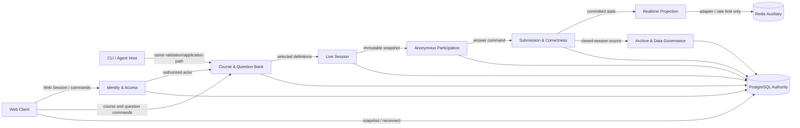
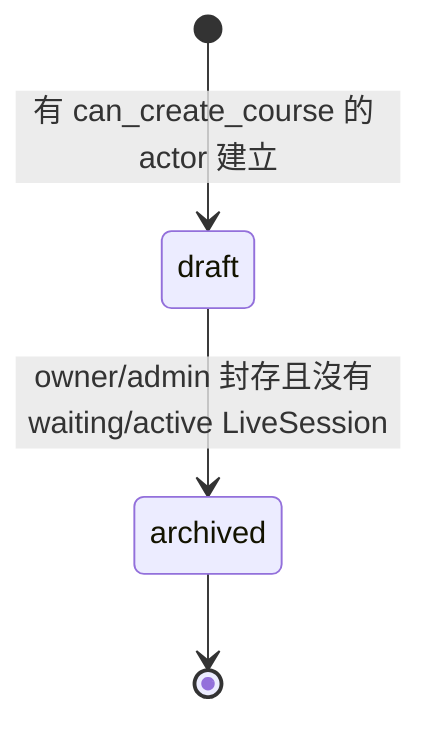
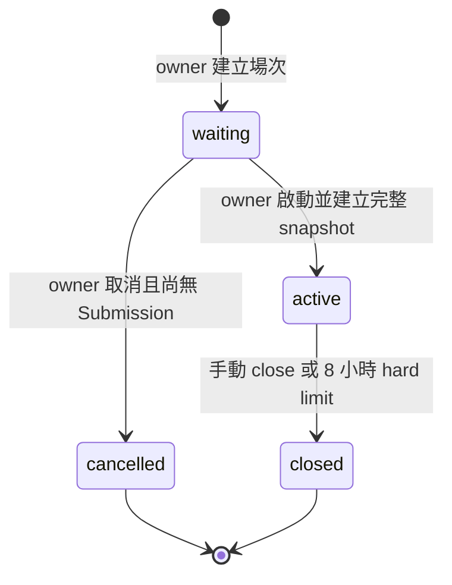
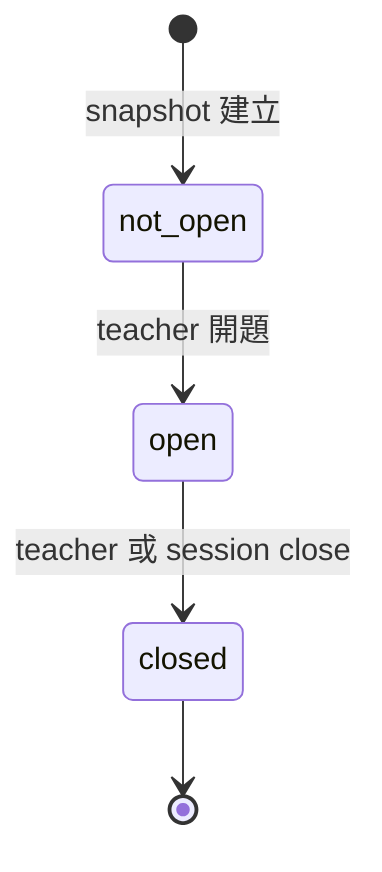
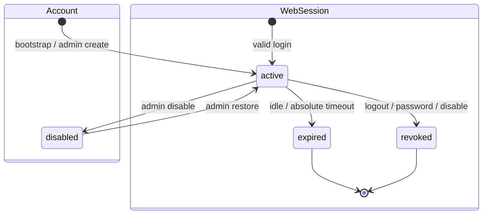
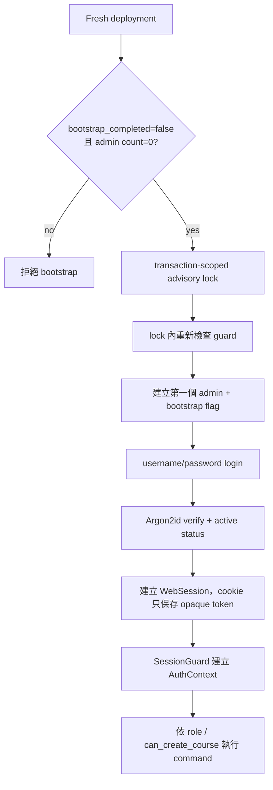
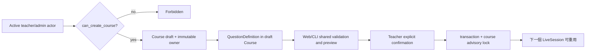
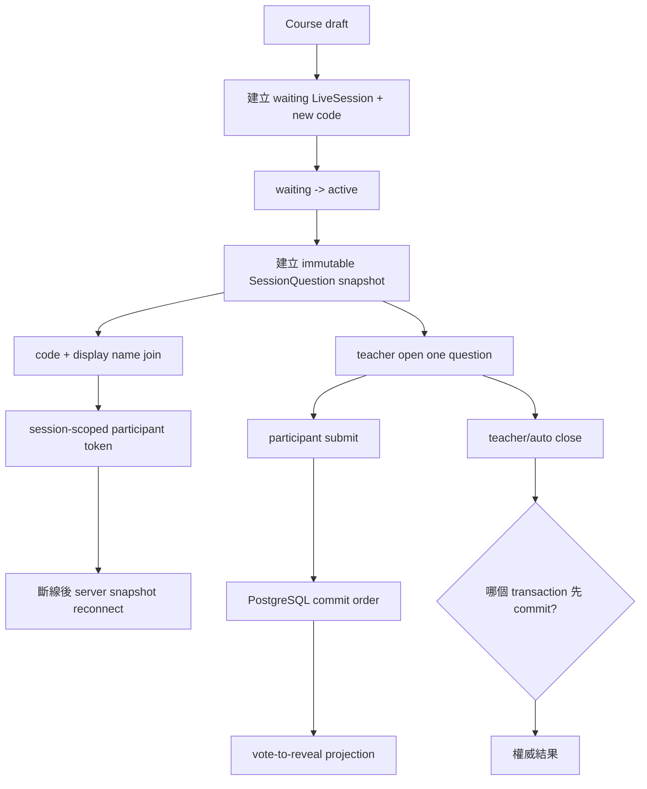
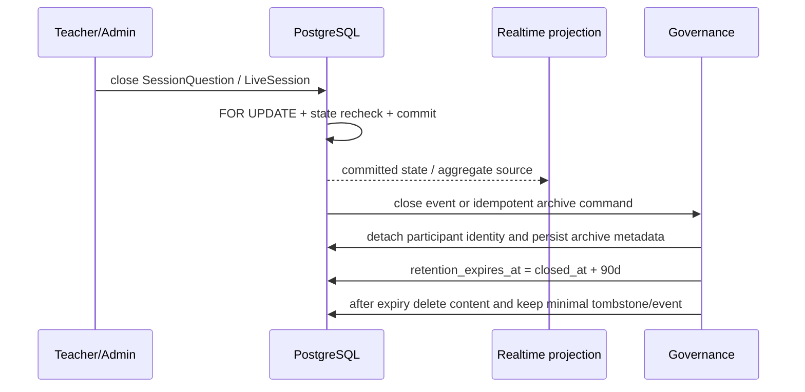

# 智學互動平台 - 系統領域與需求分析

> [!important] Phase B domain override（2026-08-23）
> 本檔早期 Identity bounded context 與 authorization matrix 只列 admin/teacher、並將 Participant 視為 anonymous-only 的描述，已由 Phase B backend decision supersede。現行 domain 包含 Student Account、`CourseEnrollment`（active/removed）、optional account-bound `Participant.accountId` 與 anonymous fallback；student 只能使用自己的 active enrollment、不得進入 course/question/live-session owner/admin paths，且 `canCreateCourse=false`。Account/displayName/token 與結果答案的可查鏈結不得進入 close/archive projection，student 沒有歷史結果入口。

> [!important] 文件定位
> 本檔是 M2 #1 領域分析文件，回答「系統如何被理解、切分與驗收」。需求行為以 [[P0 核心需求基線]]、[[題目領域契約]]、[[功能需求規格 SPEC]] 與 [[結果資料治理]] 為準；技術決策以 [[M2 關鍵技術決策]] 為準。資料欄位、DDL、正式 API wire schema 與 Socket event catalog 留給後續 M2 文件。

> [!note] 現況與目標的區分
> 本檔同時記錄目前 backend 已完成的 Identity/Course 垂直切片，以及尚未進入程式碼的完整領域。`已實作` 只代表目前工作樹中的程式碼、migration 或測試已有證據；`目標設計` 代表需求與 M2 輸入已定義、但仍須在後續 phase 實作與測試。

## 分析目的與邊界

### 目的

本檔將 M1 的可觀察需求整理成可供資料模型、Web Auth、API、即時同步與測試設計共同使用的領域語言，特別固定以下邊界：

- Course 是長期題庫與歷史場次的容器；LiveSession 是一次授課場次，兩者不是同一個狀態機。
- QuestionDefinition 是可重用來源題目；SessionQuestion 是啟用時建立的不可變場次快照。
- Web Account 是老師／管理員身分；Participant 是單一 LiveSession 內的匿名身分，兩者不混用。
- PostgreSQL 是帳號、Session、Course、未來 Submission 與結果的權威來源；瀏覽器快取與即時事件不是權威資料。
- 提交與關題的結果由伺服器 transaction commit 順序決定，不由 client 時間或事件到達順序決定。
- 題目語意與 deterministic validation 由 [[題目領域契約]] 統一，Web 與 CLI/Agent 不建立兩套 domain rule。

### 範圍

本檔涵蓋：

- Domain glossary、bounded context 與 context map。
- MVP 角色、授權責任與主要 use case。
- Course、LiveSession、SessionQuestion、Account、Web Session、Participant、Submission、ArchivedResult 的狀態與責任邊界。
- 開課、建題、開場、加入、重連、提交、關題、歸檔的端到端流程。
- 需求、M2 red card、目前 backend 證據與後續測試的追蹤關係。

本檔不處理：

- 完整 table/column/index/DDL；由 [[資料模型與 ER 設計]] 處理。
- 完整 endpoint、request/response schema、OpenAPI；由後續 API 設計文件處理。
- Socket.IO event catalog、replay/backpressure、outbox 與 retention worker 實作；由後續即時同步與結果治理文件處理。
- 300 人容量、p95/p99 門檻與部署資源；以 [[MVP 效能目標]] 和後續架構文件為準。

## Source-of-truth 層級

| 層級 | 權威來源 | 本檔使用方式 |
|---|---|---|
| 需求行為 | [[P0 核心需求基線]]、[[題目領域契約]]、[[結果資料治理]] | 定義可觀察規則、狀態與 MVP 範圍 |
| 功能規格 | [[功能需求規格 SPEC]] | 提供 SPEC、Rule、Scenario、AC 追蹤 ID |
| 技術決策 | [[M2 關鍵技術決策]] | 固定 UUID v7、TEXT + CHECK、Web Session、lock、validation token、open text、Redis 邊界 |
| 目前實作證據 | backend `prisma/schema.prisma`、migration、`src/**`、`test/**` | 判斷哪些能力已落地、哪些仍是 gap |
| 舊設計參考 | [[PostgreSQL 資料庫綱要設計]] | 只作歷史模型參考；若與 M2 UUID v7 或現行 Prisma schema 衝突，以新決策與實作為準 |

> [!warning] 不複製過時 identity 假設
> [[PostgreSQL 資料庫綱要設計]] 仍包含 BIGINT identity 的歷史假設。M2 已改定所有 PK/FK 採應用層產生的 UUID v7；#3 ERD 會明確整理此差異。本檔不把舊 DDL 當成目前 schema。

## Bounded Context 與 Context Map

### Context map

### Context responsibilities

| Bounded context | 核心責任 | 擁有的規則 | 不負責 |
|---|---|---|---|
| Identity & Access | Account、角色、開課權限、登入與管理員 bootstrap | active/disabled、admin/teacher、credential 與 session authorization | 題目內容、學員匿名身分 |
| Course & Question Bank | Course、QuestionDefinition、Option 與題庫排序 | owner、draft/archived、題型與共用 validation | 一次授課中的答案與即時結果 |
| Live Session | 一次授課、session code、狀態、題目選擇與啟用 | waiting/active/closed/cancelled、單一未結束場次、快照建立 | 長期題庫內容的修改、匿名 token 的跨場追蹤 |
| Anonymous Participation | Participant、display name、場次限定 token、重連 | token 僅限單場、display name 非 identity、終止後不可重連 | Web Account、老師授權 |
| Submission & Correctness | Submission、idempotency、答案有效性、submit/close race | 每人每題最多一筆、首次答案不可變、commit order | Socket 廣播的傳輸順序、前端渲染 |
| Realtime Projection | 將權威狀態投影給老師與學員 | vote-to-reveal、匿名化、snapshot 優先 | 保存 domain truth、取代 PostgreSQL transaction |
| Archive & Governance | closed 場次歸檔、查詢、retention、提前刪除 | 90 天保留、去識別、tombstone、最小權限 | 修改已 closed 的 Submission 或恢復已刪內容 |

### 依賴方向

- Identity & Access 提供已驗證 actor 給 Course、LiveSession 與管理操作。
- Course & Question Bank 提供可重用 QuestionDefinition；LiveSession 只讀取並建立 snapshot，不反向修改來源題目。
- LiveSession 建立 Participant 邊界；Participant token 不可作為 Web Account 或 CLI credential。
- Submission 只接受 active/open 的場次狀態，並把已 commit 的結果提供給 Realtime 與 Governance。
- Realtime 只能投影 PostgreSQL 的權威狀態；Redis 只提供 M2 定案的 rate limit 與多 instance adapter 邊界。

## Domain glossary

| 名詞 | 領域定義 | Identity / owner | 生命週期與主要責任 |
|---|---|---|---|
| Account | Web 登入帳號 | UUID；角色為 admin 或 teacher | `active` / `disabled`；目前 MVP 不建 student account |
| Web Session | Account 登入後的瀏覽器 session | DB row 綁定 Account；cookie 為場外 opaque token | idle 30 分鐘或 absolute 8 小時失效；完整 revoke/rotation 仍待後續實作 |
| Course | 老師長期維護的課程與題庫容器 | 唯一 `ownerAccountId` | `draft → archived`；archived 不可寫但保留歷史查詢 |
| QuestionDefinition | Course 中可編輯、可跨場重用的題目定義 | 歸屬 Course | 由題型契約與題庫操作管理；快照後不影響既有場次 |
| Option | poll/quiz 的題目選項 | 歸屬 QuestionDefinition 或其 snapshot | 題庫中有穩定順序；正式 schema 留 #3/#5 |
| LiveSession | Course 的一次實際授課場次 | 歸屬 Course；有獨立 UUID 與 code | `waiting → active → closed`，或 `waiting → cancelled`；終止不可逆 |
| SessionQuestion | 啟用時由 QuestionDefinition 建立的不可變快照 | 歸屬 LiveSession；可保留來源題目 ID | `not_open → open → closed`；同場最多一題 open，closed 不可重開 |
| Participant | 單一 LiveSession 內的匿名學員識別 | 場次限定 opaque token；非 Account | 可重連至同場；清除 browser/跨裝置不保證同一身分 |
| Submission | Participant 對 SessionQuestion 第一次被接受的答案 | 綁定 Participant + SessionQuestion | immutable；同 participant 同題最多一筆有效答案 |
| ArchivedResult | LiveSession closed 後可查的匿名題目、答案與彙總 | 綁定 LiveSession/Course；不得保留可回連 token/name 關聯 | 由 closed 形成，`closed_at + 90d` 到期刪除 |
| Validation token | 題目批次 preview 與 confirm 間的短期 opaque proof | 綁定 actor、course、payload hash | DB-backed、15 分鐘；取消不建立正式 idempotency record |
| `can_create_course` | Account 層級的開課授權旗標 | 由 admin 控制 | 只阻止新建 Course；不刪除既有 Course 或歷史資料 |

## 角色、授權與用例矩陣

### 角色

| 角色 | 可做的事 | 不可做的事／限制 |
|---|---|---|
| System Admin | bootstrap 後管理 Account、設定 `can_create_course`、在授權範圍內讀取/管理平台資源 | 不讀取密碼明文；MVP 不提供帳號硬刪、SSO、MFA |
| Teacher | 使用自己的 active Web Account 登入；建立/維護自己的 Course；建立場次、題目與結果查詢（依後續 phase） | 不管理其他 Account；MVP 不支援共同授課或 ownership transfer |
| Anonymous Learner | 以 session code + display name 加入單一 LiveSession、重連、提交答案、查看符合 vote-to-reveal 的結果 | 沒有 Web Account；不能查歷史結果、不能跨場追蹤 |
| CLI / Agent Host | 以經驗證 credential 代表老師，查詢授權 Course，使用共用題目 validation，經 preview/confirm 建題 | 不建立第二套 domain validator；不提供 `--yes`/`--force` bypass |
| Web / CLI Client | 傳送 command、保存 client-side token、顯示 server response | 不擁有狀態權威；不能以 client time、cache 或 event arrival 覆寫 server truth |

### 用例與授權

| 用例 | Admin | Teacher | Anonymous Learner | CLI/Agent |
|---|---:|---:|---:|---:|
| 執行首位 admin bootstrap | 受 bootstrap gate 控制 | 否 | 否 | 部署命令，不是學員操作 |
| Login / current session | 是 | 是 | 否 | 使用獨立 CLI credential 流程，留後續文件 |
| 建立 Account | 是 | 否 | 否 | 否 |
| 建立 Course | 依 `can_create_course` | 依 `can_create_course` | 否 | 代表有權限的 teacher |
| 讀取自己的 Course | 是 | 是 | 否 | 代表 teacher |
| 讀取其他 owner Course | 依管理權限 | 否；存在性不得洩漏 | 否 | 依代表 actor 權限 |
| 建立/修改 QuestionDefinition | 依後續 admin/owner policy | 自己的 draft Course | 否 | 依同一 application/domain path |
| 加入/重連 LiveSession | 依管理/教學操作，不是學員 flow | 管理自己場次 | 是，僅有效 code/token | 否 |
| Submit | 否（除非明確管理命令） | 否（老師端控制題目） | 是，僅 active/open | 否 |
| 查詢已歸檔結果 | 全平台管理範圍 | 自己 Course | 否 | 依後續授權設計 |

> [!note] 目前實作範圍
> Backend 目前已驗證 bootstrap、login、session、admin 建帳號、Course create/list/detail/archive 的部分矩陣；LiveSession、QuestionDefinition、Participant、Submission、ArchivedResult 尚未建立對應 model/controller。

## 狀態與 transition 分析

### Course

| Transition | 前置條件 | 觸發角色 | 結果與不可變量 |
|---|---|---|---|
| create → draft | active actor 且 `can_create_course = true` | Teacher / authorized admin flow | owner 固定為建立者；建立後可編輯 |
| draft → archived | 沒有未結束場次 | owner 或後續定義的 admin | terminal；不可恢復、不可寫、保留歷史 |
| archived → anything | 永不允許 | 無 | 只能讀取歷史資料 |

目前 backend 證據：`CourseService.createCourse()` 產生 UUID v7、寫入 `draft` 與固定 owner；`course-status.ts` 只允許 `draft → archived`；controller 以 SessionGuard/CanCreateCourseGuard 守護 create。LiveSession 限制尚未能在現有 service 驗證。

### LiveSession

- 同一 Course 同時最多一個 `waiting` 或 `active` LiveSession。
- `waiting → active` 時固定選定 QuestionDefinition 與順序，建立 SessionQuestion snapshot。
- `waiting` 可取消，但 `active` 不可改為 cancelled；`closed`/`cancelled` 不可恢復。
- `closed` 時停止加入、重連、開題與提交；8 小時 auto-close 與 manual close 應共用同一 application command。
- 本節為需求/領域模型；目前 backend 尚未有 LiveSession model 或 state machine。

### SessionQuestion

- 同一 LiveSession 同時最多一題 `open`。
- `open` 才接受符合題型 contract 的 Submission。
- `closed` 後不可重開；active 後不可新增或重新排序 snapshot。
- QuestionDefinition 後續修改不影響既有 snapshot。
- Submit 與 close 都要鎖定同一 SessionQuestion row；以 [[M2 關鍵技術決策]] 的 `READ COMMITTED` + commit order 作為唯一線性化點。

### Account 與 Web Session

- MVP Account 只有 `admin`、`teacher`，沒有 student account。
- disabled Account 不得登入；停用、改密碼、管理員 reset 的完整 revoke semantics 仍待後續實作。
- Web Session 是 PostgreSQL-backed opaque session：cookie 保存 raw token，DB 保存 hash；idle 30 分鐘、absolute 8 小時。
- 目前 `SessionGuard` 對缺少/無效 session 拋 401；已登入但缺少 admin 或 `can_create_course` 權限時才是 403。
- 目前切片尚未提供完整 logout、session rotation、全 session revoke、CSRF enforcement、step-up 或 rate limit。

### Participant 與 Submission

Participant 與 Submission 沒有目前 backend model，但領域責任已由 P0/SPEC 固定：

- Join 成功後取得只對單一 LiveSession 有效的 opaque participant token。
- display name 只供 UI，不是 identity、unique key 或 authorization；可重複，需拒絕控制字元、換行與 bidi。
- Submission 只在 `active` + `open` 接受；每 participant 每題最多一筆，第一次答案不可變。
- 同 idempotency key 重送回原權威結果；同 participant 不同答案重送回 conflict。
- 權威查詢由 PostgreSQL 提供；WebSocket/cache 僅是可遲到或遺失的投影。

## 主要端到端流程

### Bootstrap、登入與授權操作

目前 backend 的 bootstrap 只有 CLI/context flow（`src/bootstrap/bootstrap-admin.ts` + `BootstrapService`），不是 HTTP bootstrap endpoint；login/session/admin account creation 已有 e2e/integration evidence。完整 temp password、force change、disable/restore、logout/revoke/step-up/rate limit 仍是 Phase 2 工作。

### Course 與題庫

- Web 單題與 CLI/Agent batch 應共用同一題型語意與 validator。
- batch validation token 是 DB-backed opaque proof，綁 actor/course/payload hash/expiry；confirm 必須重送 payload 並重驗授權與 hash。
- 題目 append/reorder 依 Course-scoped advisory lock 串行化；具體表與 transaction 留 #3/#5。

### 開場、加入、重連與投影

- session code 只定位有效 waiting/active 場次，不作 participant identity。
- 重連先讀 PostgreSQL 最新狀態，不採瀏覽器 cache 或舊 Socket event。
- 題目 open 時未提交者看不到受限制 aggregate；close 後結果可依治理與 API 設計公布。
- open_text backend 只承諾安全 plain-text projection，不把文字雲視為 backend blocking requirement。

### Close、歸檔與刪除

- `cancelled` 且未收集 Submission 的場次不形成 ArchivedResult。
- archived result 不應保留能把答案回連到 display name 或 participant token 的可查關聯。
- retention、提前刪除、backup restore filter 的詳細策略以 [[結果資料治理]] 與後續設計文件為準。

## 關鍵領域不變量

| 不變量 | 責任 context | 目前證據／後續驗證 |
|---|---|---|
| 所有 identity PK/FK 為 app-generated UUID v7 | Identity / all persistence | M2 決策、`common/crypto/uuid.ts`、Prisma schema；#3 schema check |
| 狀態用 TEXT + CHECK，app union guard | All stateful contexts | migration + domain const objects；#3 migration check |
| Course owner immutable | Course | `CourseService` 不提供 owner update；integration test + DB FK |
| `draft → archived` 是 Course 唯一 transition | Course | `course-status.ts` unit test；後續 transition integration |
| 同 Course 最多一個未結束 LiveSession | Live Session | P0/SPEC；後續 partial unique + race test |
| Snapshot 後來源題目修改不影響場次 | Course/Live Session | P0/SPEC；後續 snapshot integration |
| disabled Account 不得建立有效 Web Session | Identity/Auth | `AuthService` active check；後續 disable/revoke test |
| missing session = 401；permission missing = 403 | Auth | `SessionGuard`、authorization guards、`tasks/lessons.md` |
| participant token 只限單一場次 | Participation | P0/SPEC；後續 token isolation test |
| participant/question 只接受一筆有效 Submission | Submission | P0/SPEC/M2；後續 DB unique + concurrency test |
| submit/close 由同 row lock 與 commit order 線性化 | Submission/Live | M2 lock decision；Phase 6 real PostgreSQL contention test |
| Realtime/cache 不取代 PostgreSQL authority | Realtime | P0-05、M2；reconnect/snapshot integration |
| `can_create_course` 只控制新 Course，不刪舊資料 | Identity/Course | M2 decision、Course guard；auth/course e2e |

## 需求與 M2 決策追蹤

| 來源 | 領域結果 | M2 文件／後續驗證 |
|---|---|---|
| P0-01 / SPEC-001 | Course 與 LiveSession 分離；Course draft/archived；單一未結束場次；8h auto-close | #3 ERD、API/state machine、Phase 4 integration/scheduler |
| P0-02 / SPEC-002 | code、QuestionDefinition reuse、SessionQuestion immutable snapshot | #3 ERD、Phase 3/4 migration + snapshot tests |
| P0-03 / SPEC-003 | admin/teacher Account、Web Session、password、bootstrap、credential lifecycle | [[Web Auth 與安全設計]]、Phase 2 auth matrix/e2e |
| P0-04 / SPEC-004 | poll/open_text/quiz 共用題型 contract、Web/CLI parity、preview/confirm | 後續 API/schema、Phase 3 domain contract tests |
| P0-05 / SPEC-005 | anonymous Participant、reconnect、idempotent immutable Submission、race authority | #3 ERD、即時同步設計、Phase 5/6 concurrency tests |
| P0-06 / 結果資料治理 | close 後匿名 archive、90d retention、early delete、tombstone | #3 ERD、治理設計、Phase 8 destructive-job tests |
| P0-07 / MVP 效能目標 | 300 learners + 1 teacher、W1-W8 與 tail-latency/zero correctness failures | 非功能與架構文件、Phase 9 load test |
| M2 §1 | UUID v7 app layer | #3 ERD + schema/migration consistency |
| M2 §2 | TEXT + CHECK | #3 ERD + hand-written migration |
| M2 §3 | FOR UPDATE same row + READ COMMITTED | #3 ERD + Phase 6 benchmark |
| M2 §4/5 | opaque Web Session、Argon2id | #4 Web Auth + Phase 2 security tests |
| M2 §6/7 | DB-backed validation token、Course advisory lock | #3/#4 boundaries + Phase 3 tests |
| M2 §8/9 | `can_create_course` scope、open text safe projection | #1 boundaries + later API/realtime tests |
| M2 §10/11 | `/api/v1`、stable error envelope、Redis boundary | #4/API/realtime/architecture docs |

## 目前實作、目標設計與 Gap

### 已有 backend 證據

- `SystemSetting`、`Account`、`WebSession`、`Course` Prisma model 與 additive migration。
- app-layer UUID v7 `newId()`、TEXT + CHECK migration、Prisma 7 generated client。
- Account roles `admin`/`teacher`、status `active`/`disabled`、password policy 12–128 Unicode code points、Argon2id `m=65536,t=3,p=1`。
- Bootstrap first admin 的 advisory-locked transaction 與 idempotent bootstrap flag。
- SessionService/SessionGuard、`__Host-session` cookie、idle 30m/absolute 8h、generic invalid credential error。
- Course create/list/detail/archive；owner scope、admin detail read-across、`can_create_course` create guard、draft terminal archive。
- `/api/v1` identity/course routes、global ValidationPipe、ErrorEnvelope、health probes、unit/integration/e2e coverage。

### 尚未實作或尚待驗證

- LiveSession、QuestionDefinition、Option、SessionQuestion、Participant、Submission、ArchivedResult model/controller/migration。
- Web logout、session rotation、password change/reset、disabled restore、credential epoch/full session revoke。
- CSRF token lifecycle、Origin enforcement、account/source rate limit、step-up、audit/login-attempt、CLI credential lifecycle。
- 題目 batch validation token、payload hash、preview/confirm、idempotency record。
- 8 小時 scheduler、Socket.IO/outbox/replay、aggregate、archive/retention worker、backup restore filter。
- 真 PostgreSQL 多連線 race/lock benchmark 與 P0-07 load test。

> [!warning] 實作 gate
> Phase 2 之後的程式碼不得直接跳過 #3/#4 的設計契約。若需求、M2 決策與目前 code 不一致，先更新設計文件並重新做 cross-document review，再建立 migration 或公開 wire contract。

## 相關測試與驗收分層

| 層級 | 目前／後續驗證內容 |
|---|---|
| Domain unit | status transition、password policy、session limits、題型 validation |
| Integration | Prisma constraint、bootstrap only-one-wins、session expiry/revoke、snapshot、idempotency |
| HTTP e2e | `/api/v1`、cookie、ErrorEnvelope、401/403/404/409、auth/course flows |
| Concurrency | 真 PostgreSQL 多連線 submit/close、append/reorder、bootstrap race |
| Realtime | unauthorized room、vote-to-reveal、snapshot/replay、missed/out-of-order events |
| Governance | 90d retention、early delete、tombstone、restore filter、sensitive-field redaction |
| Capacity | P0-07 W1–W8、p50/p95/p99、錯誤率、遺失/重複/彙總一致性 |

## M2 #1 完成條件

- [x] 已建立 domain glossary 與 bounded context/context map。
- [x] 已建立角色、授權責任與主要 use case 矩陣。
- [x] 已整理 Course、LiveSession、SessionQuestion、Account/Web Session 狀態與 transition guard。
- [x] 已定義 Participant、Submission、Realtime、Archive 的權威邊界。
- [x] 已將目前 backend 已實作能力與未實作 gap 分開標示。
- [x] 已連結 P0/SPEC/M2/Prisma/測試來源，供 #3 ERD 與 #4 Web Auth 使用。

## 相關連結

- 專案首頁：[[智學互動平台]]
- 需求基線：[[P0 核心需求基線]]、[[題目領域契約]]、[[結果資料治理]]
- 功能規格：[[功能需求規格 SPEC]]
- M2 設計決策：[[M2 關鍵技術決策]]
- 後續設計：[[資料模型與 ER 設計]]、[[Web Auth 與安全設計]]
- M2 交付計畫：[[M2 系統分析與設計交付計畫]]
- Backend 實作規劃：[[Backend NestJS 實作規劃]]
