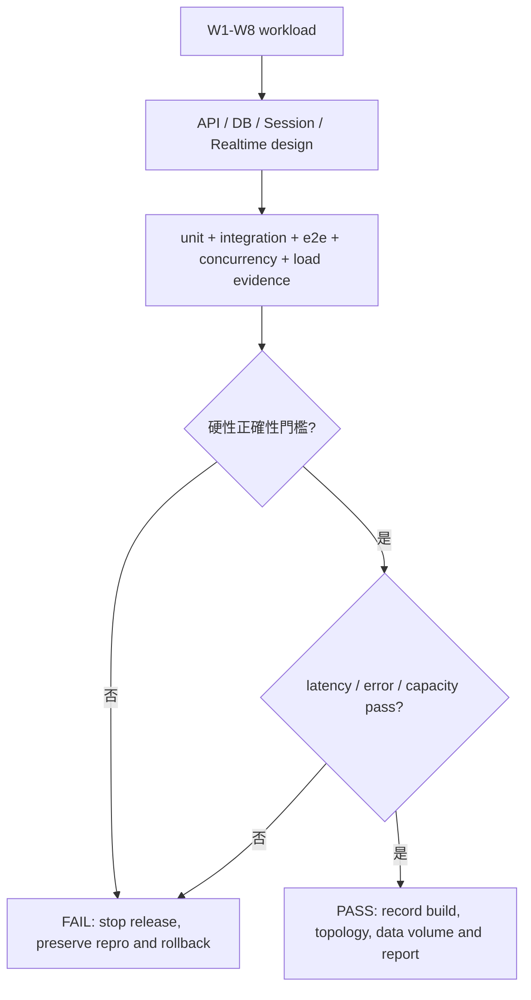

# 智學互動平台 - 非功能、風險與驗收分析

> [!important] 文件定位
> 本檔是 M2 #2 非功能、風險與驗收分析。它把 [[MVP 效能目標]]、[[MVP 效能需求 BDD 場景]]、[[結果資料治理]] 與安全／架構設計輸入整理成可執行的設計約束、風險登錄、驗收證據與 release gate。
>
> 本檔**不重新定義** P0/SPEC 的功能規則，也不把需求文件中的 `[x]` 解讀成 runtime 已通過。效能數值以 [[MVP 效能目標#MVP pass/fail 門檻]] 為唯一來源；題型語意以 [[題目領域契約]] 為準；歸檔、保留與刪除以 [[結果資料治理]] 為準。

## 1. 分析目的與判定語意

### 1.1 目前、目標與驗收的三種狀態

| 狀態 | 定義 | 本檔用語 |
|---|---|---|
| 已有證據 | backend source、migration 或 test 已能直接證明行為 | `Implemented / verified` |
| 設計已定、待實作或實測 | M2 已有方向，但尚未由 runtime 或壓測報告證明 | `Designed / pending verification` |
| 尚未定案或有 gap | 仍需 M2 設計決策、產品決策或後續 phase 實作 | `Open / blocked` |

> [!warning] 驗收原則
> 通過單元測試、HTTP e2e 或健康檢查，不能推論 300 人容量、真 PostgreSQL 競態、Socket.IO 重連、90 天 retention 或 production security 已通過。每一項 NFR 必須有對應的測試層級與可保存的證據。

### 1.2 驗收分層

| Gate | 驗收目的 | 必要證據 | 本階段結論 |
|---|---|---|---|
| G0 設計 gate | 紅卡有決策、來源與責任，不帶未決設計進入實作 | M2 文件、紅卡表、cross-document review | 本檔完成後可供 #3/#4 設計引用 |
| G1 工程 baseline | fresh checkout 可啟動、migration、health check、測試 | typecheck、lint、format、build、unit、integration、e2e | Phase 1/現有 Identity-Course slice 已有綠燈紀錄 |
| G2 功能 release gate | P0/SPEC 行為在真 DB 與 HTTP 邊界正確 | domain、integration、e2e、權限與錯誤契約測試 | 目前僅部分 auth/course slice 通過 |
| G3 競態與治理 gate | submit/close、idempotency、重連、retention 不破壞權威資料 | 多連線 PostgreSQL、故障恢復、治理測試 | 尚未開始 |
| G4 容量 release gate | W1～W8 達到 p95/p99 與零資料錯誤門檻 | 接近 production 的 Artillery/Socket.IO 壓測報告 | 尚未開始；不得宣稱 MVP NFR 通過 |

## 2. 非功能需求與驗收邊界

### 2.1 NFR catalog

| ID | 非功能需求 | 可觀察約束／門檻 | 驗收證據 | 目前狀態 |
|---|---|---|---|---|
| NFR-01 | 權威資料正確性 | 成功資料不可遺失；同 participant／question 最多一筆有效答案；彙總一致；closed commit 後不得接受新答案 | W2、W3、W5、W6、W7、W8 後以 PostgreSQL authority query 核對 | `Designed / pending verification`；LiveSession/Submission 尚未實作 |
| NFR-02 | 尾端延遲 | Join p95 ≤ 1s；Submit p95 ≤ 500ms；commit-to-broadcast p95 ≤ 2s、p99 ≤ 5s；reconnect p95 ≤ 3s | W1～W7 報告列 p50/p95/p99/max，不以平均值代替 | `Open / blocked`；尚無 realtime 與 load path |
| NFR-03 | 單場容量 | 單一 LiveSession 300 learners + 1 teacher；300 人 120s 內加入、10s 內集中提交 | W1/W2/W5 接近 production 的完整路徑壓測 | `Designed / pending verification`；容量預算待 #7 文件 |
| NFR-04 | 錯誤與降級 | 功能 request 錯誤率 < 1%（排除預期拒絕／衝突）；超量時穩定錯誤、可重試、不無限等待、不誤報成功 | 壓測報告、錯誤 code 分布、超量與 timeout/retry 場景 | `Open / blocked`；rate limit/backpressure 尚未落地 |
| NFR-05 | 安全登入與授權 | Cookie session 為 Secure/HttpOnly/SameSite；DB 為 session authority；401 與 403 語意分離；密碼不可明文 | cookie assertion、auth matrix、security tests、log review | 部分 `Implemented / verified`；production Secure invariant、CSRF、撤銷、step-up、rate limit 待後續 |
| NFR-06 | 輸入與輸出安全 | boundary validation、未知欄位拒絕；open text 僅安全 plain text；不回傳 display name/token 關聯 | DTO/integration tests、projection tests、redacted log review | 部分 `Implemented / verified`；完整題型與匿名投影待後續 |
| NFR-07 | 可用性與恢復 | liveness 不依賴 DB；readiness 反映 DB；重啟後以 PostgreSQL snapshot 恢復；重連不建第二個 participant | health e2e、restart/reconnect test、權威 snapshot 核對 | health route 有測試；startup DB dependency、readiness semantics、重連與 restart recovery 待釐清／實作 |
| NFR-08 | 併發一致性 | submit/close 以同一 SessionQuestion row lock 與 commit order 線性化；append/reorder 以 course advisory lock | 真 PostgreSQL 多連線 contention benchmark、race matrix | lock 方向已定；Phase 6 驗證前不可視為通過 |
| NFR-09 | 可觀測性 | request ID 貫穿 HTTP；structured log；敏感欄位 redaction；latency/error/DB/realtime 指標可查 | log sample、metrics dashboard、alert drill、壓測報告附錄 | request ID/Pino 基礎存在；redaction wiring、metrics/alert 待 #7 |
| NFR-10 | 資料治理與隱私 | closed 結果匿名化；90 天 retention；提前刪除有確認、稽核與 tombstone；backup restore 不復活已刪資料 | governance integration/job test、restore filter test、敏感資料掃描 | `Open / blocked`；ArchivedResult/retention 尚未實作 |
| NFR-11 | API/版本相容 | `/api/v1`；UUID；UTC ISO 8601；穩定 ErrorEnvelope；DTO whitelist + forbid unknown | contract/e2e tests、schema diff、request ID assertion | 基礎 wire contract 已驗證；完整 OpenAPI/schema versioning 待後續 |
| NFR-12 | 可維護與可測試 | production/test 共用 bootstrap；domain 不直接依賴 HTTP；migration 可重放；驗收結果可重現 | fresh checkout、unit/integration/e2e、migration status、build | `Implemented / verified`（以 tasks/todo.md 歷史證據為準） |

### 2.2 效能與正確性硬門檻

以下數值只引用 [[MVP 效能目標]]，本表是驗收索引，不是第二份效能規格。

| 指標 | Pass 條件 | Failure override |
|---|---:|---|
| 300 人加入完成時間 | ≤ 120s | 任一有效加入遺失或重複 participant 即 FAIL |
| Join API p95 | ≤ 1s | — |
| 300 人集中提交窗口 | ≤ 10s | 成功 response 但查不到 Submission 即 FAIL |
| Submit API p95 | ≤ 500ms | 同 participant／question 多筆有效答案即 FAIL |
| Commit-to-broadcast p95/p99 | ≤ 2s / ≤ 5s | 彙總與 authority 不一致即 FAIL |
| Reconnect recovery p95 | ≤ 3s | 建立第二 participant 或第二筆答案即 FAIL |
| 功能 request 錯誤率 | < 1% | 資料遺失、重複、錯誤彙總、closed 後接受答案一律 FAIL |
| closed 後新接受答案 | 0 | 不受低錯誤率豁免 |
| 相同 idempotency key 造成重複資料 | 0 | 不受低錯誤率豁免 |
| 逾 8 小時後加入／重連／提交成功 | 0 | 不受低錯誤率豁免 |

### 2.3 Workload → 設計 → 證據

## 3. W1～W8 驗收模型

| Workload | 主要驗收問題 | 必查結果 | 所需設計／測試 | 現況 |
|---|---|---|---|---|
| W1 集中加入 | 300 人能否在 120s 內加入且不重複？ | Join p95、participant 數、老師人數、拒絕 code | LiveSession、Participant、code index、rate limit、load client | 未實作 |
| W2 集中提交 | 300 人 10s 內提交是否正確且低延遲？ | Submit p95、有效 Submission 數、遺失數、option aggregate | Submission unique、transaction、aggregate、DB pool | 未實作 |
| W3 結果廣播 | commit 後是否在門檻內投影且不洩露？ | p95/p99、漏送、vote-to-reveal、最終 authority 一致 | Socket room、event seq、outbox、snapshot、projection | 未實作 |
| W4 重連 | 斷線後是否恢復而不重複建資料？ | recovery p95、狀態、已答狀態、participant/submission 數 | participant token hash、snapshot/replay、reconnect API | 未實作 |
| W5 持續運作 | 30 分鐘與 10 題互動是否穩定？ | 錯誤率、資源趨勢、連線、每題 aggregate | scheduler、backpressure、metrics、leak check | 未實作 |
| W6 Submit／close 競態 | 哪個 transaction 先 commit 是否唯一決定結果？ | closed 後新答案 = 0、提交先／關題先兩路徑 | 同 row `FOR UPDATE`、READ COMMITTED、race test | 方向已定，待 Phase 6 |
| W7 Idempotent retry | timeout 重送是否回原結果、不覆寫？ | duplicate = 0、不同 payload conflict | idempotency key + payload hash + unique constraint | 未實作 |
| W8 8h auto-close | 自動關閉是否與手動 close 同語意？ | code 失效、加入／重連／提交 = 0、archive 流程 | reliable scheduler、clock abstraction、idempotent close/archive | 未實作 |

> [!note] 報告最小內容
> 每次 W1～W8 測試必須記錄日期、commit/build、拓撲、App/DB/Redis 版本、CPU/RAM/網路、初始資料量、工具版本、p50/p95/p99/max、錯誤率、遺失／重複數、資料核對與最終 `PASS`／`FAIL`。詳見 [[MVP 效能目標#測試報告模板]]。

## 4. 故障模式、超量行為與恢復

| 故障／壓力情境 | 不可接受結果 | 必須行為 | 驗收方式 | 目前狀態 |
|---|---|---|---|---|
| PostgreSQL 不可用 | readiness 仍報成功、mutation 假成功、遺失資料 | `/health/ready` 失敗；mutation 明確失敗；不回傳成功結果 | DB stop/restart、health 與 transaction test | readiness 基礎已驗證；mutation 尚待 |
| Redis 不可用 | domain state 遺失或 Session 失去唯一權威 | Redis 僅作 rate limit/Socket adapter；降級或拒絕策略由 #7 明確定案 | Redis failure drill、DB authority query | 邊界已定；降級策略待 #7 |
| API process 重啟 | Session/Submission 消失、半完成交易 | PostgreSQL transaction rollback；重啟後 readiness 恢復；client 以 snapshot/retry 取權威結果 | graceful shutdown、restart、retry test | shutdown hook 已有；完整恢復待後續 |
| Socket event 漏送／亂序 | client state 被當成權威、答案重複 | 事件帶 sequence；重連先 snapshot，必要時 replay；REST/DB 為準 | W3/W4 event loss/out-of-order test | 未實作 |
| 過量請求／連線 | 無限等待、誤報成功、資料錯誤 | timeout、穩定 retryable error、backpressure；不可犧牲資料正確性換延遲 | W1/W2/W5 overload test | 未實作 |
| migration 失敗 | 啟動部分 schema、資料破壞 | additive/expand-first；部署前 status check；失敗停止，不自動刪資料 | fresh DB、replay migration、restore drill | Phase 1 additive migration 已驗證 |
| retention job 重試／中斷 | 重複刪除、已刪資料被 restore 復活 | job idempotent；tombstone/audit；restore filter；告警 | governance job/retry/restore test | 未實作 |

## 5. 安全、隱私與資料風險

### 5.1 強制控制

- Web Session 為 PostgreSQL-backed opaque session；cookie 不承載帳號或 domain state，DB 保存 hash。
- `__Host-` cookie 在 production Secure-by-default；測試環境的 plain HTTP 例外只限 `NODE_ENV=test`。
- 全域 `ValidationPipe` 使用 `whitelist`、`forbidNonWhitelisted`、`transform`；未知欄位不得靜默落入 domain。
- `GlobalExceptionFilter` 對外使用穩定 `ErrorEnvelope`，production 不回傳 stack trace 或內部錯誤訊息。
- Pino redaction 不得記錄 cookie、token、password、Authorization 或完整敏感 payload；request ID 可供追蹤但不得取代授權。
- `can_create_course` 是帳號級授權；Course owner 不可由 client input 任意改寫；缺 session = 401，缺權限 = 403。
- Participant token、display name、Submission 與 ArchivedResult 必須維持單場隔離與匿名化；不得以 display name 作 identity 或 authorization。

### 5.2 目前安全 gap

目前已驗證的是 Argon2id password hash、登入 generic error、cookie session、401/403、CORS/helmet 與 input validation 基礎。`PINO_REDACT_PATHS` 雖已定義，仍須確認已接入實際 logger；不可把常數存在視為 log 已完成 redaction。以下不可因現有 slice 證據而視為完成：logout/revoke/rotation、CSRF token lifecycle、Origin enforcement、帳號＋來源雙重 rate limit、step-up、temporary password/force-change、Participant token、CLI credential、audit event 與 retention deletion。

### 5.3 Backend 目前已確認的具體驗收風險

以下是由目前 source/test 直接觀察到的 implementation-level gate；它們不是需求推測，修正或明確接受前不得標成 production-ready。

| ID | 目前證據 | 風險 | 必要驗收／處置 |
|---|---|---|---|
| S-01 | `src/common/security/origin.ts` 只有 helper；未見 CSRF token issue/compare 或 mutation guard | cookie-authenticated POST 可能沒有 CSRF 防護 | 缺少或不匹配 CSRF/Origin 時回穩定 `AUTH_CSRF_INVALID`；GET 不受影響；補 HTTP security tests |
| S-02 | `src/config/env.validation.ts` 允許任一環境設定 `SESSION_COOKIE_SECURE=false`；`AuthController` 會採用 | production 可能發出不安全的 `__Host-` session cookie | production env 若為 false 必須 fail-fast 或強制 true；assert `Secure; HttpOnly; SameSite=Lax; Path=/;` 且無 Domain |
| S-03 | `src/common/observability/pino-redaction.ts` 定義路徑，但 logger wiring 尚需確認 | cookie、Authorization、password、token 或 payload 可能進 structured log | 捕獲實際 logger output，證明敏感欄位被移除／遮罩且 request ID 保留 |
| S-04 | `PrismaService.onModuleInit()` 會先 `$connect()`；health integration 在 DB 不可用時可 skip；readiness degraded 仍可能 HTTP 200 | DB 不可用時 liveness 不可獨立服務；CI 綠燈可能只是跳過 DB 測試 | 分離 DB-less liveness smoke 與 DB-required suite；DB-required job 在 DB 不可用時 FAIL；定義 readiness 的非 2xx 語意 |
| S-05 | `app.module.ts` 於 module import 時依 `process.env.NODE_ENV` 選 env/logger；bool parser 對任意非 true/1 值當 false；production 未阻擋弱 secret／`CORS_ORIGIN=*` | production 可能載入錯環境、接受弱設定或 credentialed wildcard CORS | dev/test/prod matrix；invalid boolean、弱 secret、production wildcard 均 fail-fast；確認 env precedence |
| S-06 | `CoursesController.list()` 直接 `Number(page/pageSize)`；未驗證 NaN、Infinity、負數、上限 | malformed pagination 可能造成 500、未界定查詢量或不穩定結果 | 回穩定 validation error 或明確 clamp；pageSize 有上限；補 boundary tests |
| S-07 | `CourseService.archiveCourse()` 先讀取再 unconditional update | 併發封存可能回報過時成功或覆寫狀態 | conditional update/transaction；並發 archive test；terminal transition 語意明確 |
| S-08 | `CanCreateCourseGuard` 在 controller；`CourseService.createCourse()` 未自行檢查 capability | 未來 adapter 或 internal caller 可能繞過授權閘 | application command 也驗證 active actor、owner scope 與 `can_create_course`；HTTP/alternate adapter 共用測試 |
| S-09 | DB-backed integration/e2e 在 `dbReachable=false` 時 return/skip | 測試報告的 PASS 可能掩蓋沒有 DB 證據 | DB-required CI profile：migration/DB 不可用必 FAIL；另保留明確 DB-less health smoke，不混稱全綠 |
| S-10 | `prisma/seed.ts` 直接讀 `process.env.DATABASE_URL`；不一定套用 `.env.<NODE_ENV>` | documented seed command 可能打錯環境或無法 fresh checkout 執行 | dev/test seed matrix、idempotency 與 target DB assertion；禁止跨環境寫入 |

## 6. 風險登錄

評分：`High` 代表未處理時阻擋 release；`Medium` 代表需要在對應 phase 前完成；`Low` 代表已有控制或可由 rollback 降低。

| ID | 風險與觸發訊號 | 評級 | 緩解／接受條件 | 負責 phase | 狀態 |
|---|---|---|---|---|---|
| R-01 | LiveSession/Submission/Archive domain 尚未落地；API 開始後才發現 ERD 不足 | High | 先完成 #3 ERD、unique/index/retention contract，再建 migration；禁止以 placeholder schema 進 M3 | M2 #3 | Open |
| R-02 | submit／close 競態造成答案遺失、重複或 closed 後接受 | High | 同 row `FOR UPDATE` + commit order；真 PostgreSQL 多連線 race test；失敗停止 release | Phase 6 | Designed / pending verification |
| R-03 | Session revoke/disable/password change 未完整實作，離職或停用帳號仍可使用 | High | auth epoch/full revoke、logout、password/disable integration matrix；監控 401/403 與 revoked use | Phase 2 | Open |
| R-04 | CSRF、Origin、rate limit、step-up 未完成，cookie-authenticated mutation 暴露 | High | #4 Web Auth 設計先定案；security tests + abuse test；未通過不得 production | Phase 2 | Open |
| R-05 | log、open text 或 aggregate 洩漏 token、display name、個別答案 | High | redaction、plain-text projection、vote-to-reveal、匿名 archive；敏感資料掃描與 negative tests | Phase 2/7/8 | Partially controlled |
| R-06 | 300 人尾端延遲或 DB pool 不足；以平均值掩蓋 p99 問題 | High | #7 capacity budget；W1～W8 量 p50/p95/p99/max；低錯誤率不能豁免資料錯誤 | Phase 9 | Open |
| R-07 | Socket event 漏送／亂序造成 UI 顯示錯誤結果 | High | PostgreSQL authority、event sequence、outbox、snapshot/replay、reconnect；以 authority query 判定 | Phase 7 | Open |
| R-08 | Redis 被誤當 domain authority；故障造成 Session/答案資料消失 | Medium | Redis 僅 rate limit + Socket adapter；DB 是唯一權威；Redis failure drill | Phase 2/7/9 | Decision made, implementation open |
| R-09 | 8 小時 auto-close job 漏跑、重複跑或與 manual close 分叉 | High | 共用 close command、Clock abstraction、job idempotency、告警；W8 可控時間測試 | Phase 4/7 | Open |
| R-10 | 90 天 retention、提前刪除或 restore 邊界錯誤，造成過度保留或資料復活 | High | governance design、tombstone、restore filter、job retry test；無證據不得宣稱符合 P0-06 | Phase 8 | Open |
| R-11 | API／error code／題型 validator 在 Web 與 CLI 分叉 | Medium | single domain contract、schema version、contract fixtures、cross-client parity test | Phase 3/5 | Open |
| R-12 | migration／seed／bootstrap 非 idempotent；fresh deploy 或並發 bootstrap 造成多個 admin | Medium | additive migration、advisory lock、recheck、migrate status；fresh DB + bootstrap race test | Phase 1/2 | Baseline controlled |
| R-13 | production 與 test bootstrap 不一致，測試綠燈但部署失敗 | Medium | 共用 `configureApplication`、同 env validation、fresh checkout verification | Phase 1 | Implemented / verified |
| R-14 | 超量時無限等待或誤報成功，導致 client retry storm 與資料錯誤 | High | timeout、stable retryable envelope、backpressure、rate limit、成功後 authority query；W1/W2/W5 overload drill | Phase 7/9 | Open |
| R-15 | CSRF/Origin helper 未形成 enforcement，cookie mutation 可遭跨站請求 | High | #4 定義 token/Origin guard；負向 HTTP security tests；未通過不得 production | Phase 2 | Confirmed gap |
| R-16 | production 可透過 env 關閉 Secure cookie，或接受 wildcard CORS/弱 secret | High | env validation fail-fast；production config matrix；部署前安全設定檢查 | Phase 1/2 | Confirmed gap |
| R-17 | Pino redaction path 未接入實際 logger，敏感資料可能進 log | High | logger capture test；redaction contract；禁止 raw cookie/token/password/payload | Phase 1/2 | Confirmed gap |
| R-18 | DB-required tests 在 DB 不可用時 skip，形成 false-green CI | High | DB-required job fail-fast；獨立 DB-less health smoke；報告分開列 PASS/SKIP | Phase 1/CI | Confirmed gap |
| R-19 | readiness degraded 仍 HTTP 200，且 Prisma startup connect 使 liveness 邊界不清 | Medium | 定義 orchestrator contract；分離 liveness/readiness；DB outage drill | Phase 1/7 | Confirmed gap |
| R-20 | 分頁輸入與 Course archive 併發邊界未在 application layer 守護 | Medium | DTO/query validation、bounded page size、conditional terminal update、race tests | Phase 2/3 | Confirmed gap |

## 7. M2 紅卡與設計決策登錄

| 紅卡／決策 | M2 結論 | 對應設計文件 | 驗證／退出條件 | 狀態 |
|---|---|---|---|---|
| Web Session 儲存 | PostgreSQL opaque session；cookie 僅保存高熵值，DB 保存 hash | [[Web Auth 與安全設計]] | cookie/security/revoke integration tests | 已定案；部分實作 |
| Argon2id 參數 | `m=64MiB, t=3, p=1`；資源 benchmark 另驗 | [[Web Auth 與安全設計]] | Phase 2/9 benchmark 不造成不可接受尾端延遲 | 方向已定，待驗證 |
| submit／close lock | 同 `SessionQuestion` row `FOR UPDATE`、READ COMMITTED、commit order | [[資料模型與 ER 設計]]、[[即時同步與結果治理設計]] | Phase 6 contention benchmark + race matrix | 方向已定，待驗證 |
| 題目 append/reorder | course-scoped advisory lock + transaction | [[資料模型與 ER 設計]] | concurrent append/reorder test | 已定案，待實作 |
| validation token | DB-backed opaque token，綁 actor/course/payload hash，15 分鐘 | [[API 與共用 Schema 設計]] | expiry、payload mismatch、replay、all-or-nothing tests | 已定案，待實作 |
| `can_create_course` scope | 只控制新建 Course；不刪除既有課程；CLI revoke 獨立 | [[Web Auth 與安全設計]]、[[資料模型與 ER 設計]] | auth matrix + preservation test | 已定案；部分實作 |
| open text | backend 只保證安全 plain-text list projection；文字雲為非阻擋產品決策 | [[即時同步與結果治理設計]] | encoding、匿名化、vote-to-reveal、retention tests | 已定案；待實作 |
| Redis 邊界 | 只作 rate limit 與 Socket adapter，不作 domain authority | [[架構、容量與可觀測性設計]] | Redis failure drill + DB authority check | 已定案，待實作 |
| MVP 拓撲與壓測 | 單機 Docker Compose；Artillery 或等效 Socket.IO client；Win11 Chrome/Edge 正式矩陣 | [[架構、容量與可觀測性設計]] | W1～W8 report with topology/resource metadata | 方向已定，待完整文件 |
| open text 視覺呈現 | 列表／文字雲／切換延後，不阻擋 backend data/API contract | [[即時同步與結果治理設計]] | product decision before UI release | 非阻擋 |

> [!warning] 紅卡退出規則
> 除 open text 視覺呈現外，任何紅卡若未有具體決策、責任文件與可執行驗證，不得進入對應 feature implementation。若驗證失敗，回到設計階段，不以臨時 fallback 改變 P0 的可觀察語意。

## 8. 需求到驗收追蹤矩陣

| 上游基線 | 主要 AC／workload | 設計責任 | 最終證據 | 目前判定 |
|---|---|---|---|---|
| P0-03 Web 帳號 | P0-03-AC-01～09 | Web Auth、cookie、CSRF、revoke、rate limit、step-up | auth integration/e2e + security tests | slice 部分通過，完整 P0 未通過 |
| P0-05 Participant/Submission | P0-05-AC-01～08 | Participant token、snapshot、idempotency、row lock | integration + concurrency + reconnect | 未開始 |
| P0-06 結果治理 | 90d retention、匿名 archive、提前刪除 | ER、realtime/governance、restore filter | governance job/restore/audit tests | 未開始 |
| P0-07 效能 | W1～W8、P0-07-AC-01～07 | capacity、pool、Socket、Redis、timeout、metrics | production-like load report | 未開始 |
| SPEC-001/002 | Course/LiveSession/code/snapshot | domain state + ER + API | transition/integration tests | Course slice 通過；LiveSession 未開始 |
| SPEC-003 | bootstrap/login/session/account | Web Auth + API | cookie/error/expiry/revoke matrix | 部分通過 |
| SPEC-004 | 題型、validation、preview/confirm | shared schema + validator | contract/unit/integration | 未開始 |
| SPEC-005 | reconnect、idempotency、submit/close | DB lock + realtime | race/idempotency/reconnect | 未開始 |
| SPEC-006 | `can_create_course`、匿名結果呈現 | authorization + projection | auth/realtime/privacy tests | authorization 部分通過；projection 未開始 |

## 9. 本階段完成條件與後續行動

### 9.1 本檔完成條件

- [x] NFR 以 correctness、latency、capacity、security、privacy、availability、observability、compatibility、governance 分類。
- [x] W1～W8 各有 workload、必查結果、設計責任與目前狀態。
- [x] 效能數值只引用 [[MVP 效能目標]]，並明確列出資料錯誤的 failure override。
- [x] 風險有評級、觸發訊號、緩解策略、負責 phase 與狀態。
- [x] M2 紅卡有決策、對應文件與退出條件；open text 視覺呈現明確標為非阻擋。
- [x] 需求、設計、測試與現有 backend evidence 有追蹤矩陣。
- [ ] 仍待跨文件 contract review；本檔不代表完整 M2 已簽核。

### 9.2 後續執行順序

1. 以 [[資料模型與 ER 設計]] 消解 R-01、R-02、R-07、R-09、R-10 的資料與交易邊界。
2. 以 [[Web Auth 與安全設計]] 消解 R-03、R-04、R-05 的 session、CSRF、rate limit、step-up 與 credential lifecycle。
3. 以 [[API 與共用 Schema 設計]] 固定 error、validation token、idempotency 與 Web/CLI parity。
4. 以 [[即時同步與結果治理設計]] 固定 W3/W4/W8、outbox、snapshot/replay、aggregate 與 retention。
5. 以 [[架構、容量與可觀測性設計]] 完成單機容量預算、Redis failure policy、metrics/alert 與 W1～W8 執行計畫。
6. Phase 6/8/9 保存可重現的競態、治理與壓測報告，通過 G3/G4 後才宣稱 MVP 非功能驗收完成。

## 相關連結

- 領域分析：[[系統領域與需求分析]]
- 功能規格：[[功能需求規格 SPEC]]
- 效能門檻：[[MVP 效能目標]]、[[MVP 效能需求 BDD 場景]]
- 需求基線：[[P0 核心需求基線]]、[[題目領域契約]]、[[結果資料治理]]
- M2 決策：[[M2 關鍵技術決策]]
- 後續設計：[[資料模型與 ER 設計]]、[[Web Auth 與安全設計]]、[[API 與共用 Schema 設計]]、[[即時同步與結果治理設計]]、[[架構、容量與可觀測性設計]]
- M2 交付計畫：[[M2 系統分析與設計交付計畫]]
- Backend 驗證紀錄：`smartLearning-backend/tasks/todo.md`
