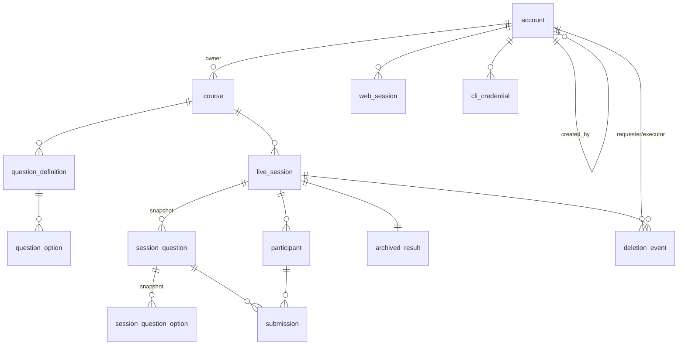
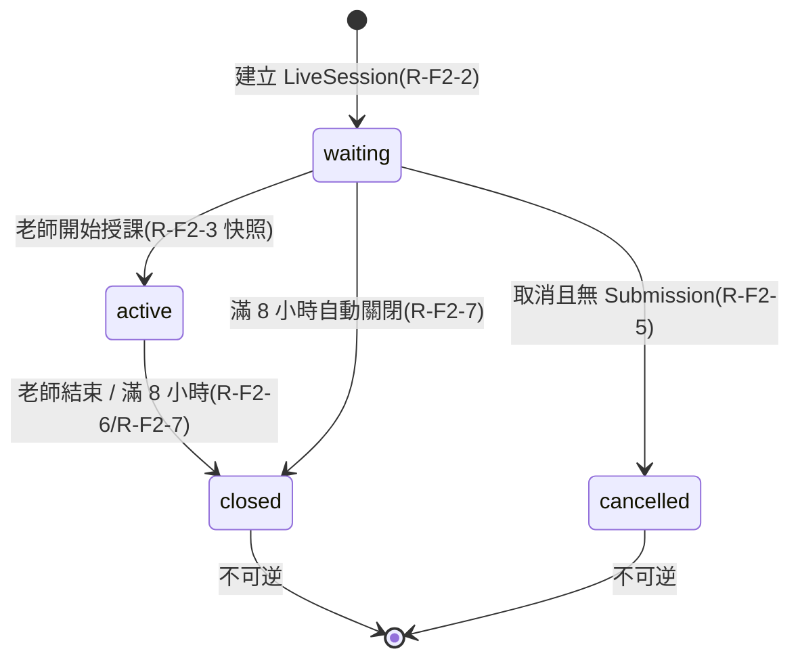

# 智學互動平台 - PostgreSQL 資料庫綱要設計

> [!warning] Historical / non-authoritative schema notice（2026-08-23）
> 本檔保留作早期 PostgreSQL DDL 設計歷史，不是目前 Phase B schema authority。它的 `BIGINT` PK 與 admin/teacher-only role 假設不得覆寫 canonical `資料模型與 ER 設計.md`、backend `prisma/schema.prisma` 或已套用 additive migrations；目前 runtime 使用 app-generated UUID v7、student、CourseEnrollment 與 nullable Participant.accountId。請勿以本檔直接產生 migration，亦不得編輯已套用 migration 以追上本檔。

> [!info] 目的
> 依 [[功能需求規格 SPEC]] SPEC-001～SPEC-006、[[結果資料治理]] P0-06 與 [[技術棧]](PostgreSQL + Prisma + NestJS),設計 PostgreSQL 資料庫綱要,作為 M2 系統設計的資料模型基線。本檔涵蓋**功能行為視角**所需的資料表、約束、索引與不變量;**負載與效能門檻**(P0-07)由 [[MVP 效能需求 BDD 場景]] 涵蓋,本檔僅在索引與併發控制處交叉引用,不重複定義門檻數值。

> [!note] 與 SPEC 紅卡的關係
> 本檔針對 [[功能需求規格 SPEC#Red cards]] 中「儲存模型 / idempotency / token / 排程」等 M2 設計輸入提出**具體方案**,標記為 `紅卡回應`;「密碼雜湊演算法、wire schema、即時通訊實作」等不屬 DB 綱要範疇者,標記為 `非本檔範疇`。實作前仍須由 M2 設計文件補齊非 DB 項目。

## 設計原則

- **正規化至 3NF**:OLTP 寫入場景(建立題目、提交答案、狀態轉移),先正規化;僅在歸檔彙總處選擇性反正規化(JSONB 快照)。
- **資料完整性優先**:狀態機、題型欄位必要/禁止、唯一性皆以 DB 層 `CHECK` / `UNIQUE` 約束強制,不僅靠應用層。
- **不可變快照**:`waiting → active` 時建立 `session_question` / `session_question_option` 不可變快照,與 `question_definition` 解耦(R-F4-3/R-F4-4)。
- **伺服器權威**:`submission.submitted_at` 與 `session_question.closed_at` 以 DB 交易 commit 順序為權威(R-F15-1)。
- **最小破壞半徑**:PK 一律使用 surrogate `BIGINT GENERATED ALWAYS AS IDENTITY`;軟刪除/封存優先,無硬刪除(R-F1-5/R-F8-6)。
- **可撤銷性**:credential(密碼、Web Session、CLI key)透過時間戳與狀態欄位支援立即失效(R-F6-5/R-F8-2)。

## ER 概觀



## 狀態機



> [!note] Course 狀態機
> `Course` 只有 `draft → archived`(R-F1-1),不使用 `active`/`closed`。封存守護:不存在 `waiting`/`active` LiveSession 才可封存(R-F1-3)。

---

# 完整 DDL(PostgreSQL 14+)

依 Bounded Context 分區。所有 `updated_at` 由應用層(Prisma middleware)維護;DB 層僅保證 `created_at` 預設值。

## 1. 帳號與認證(SPEC-003 / SPEC-006 US-F16)

### account — Web 帳號(系統管理員/老師)

```sql
CREATE TABLE account (
  id                   BIGINT GENERATED ALWAYS AS IDENTITY PRIMARY KEY,
  username             VARCHAR(64)  NOT NULL UNIQUE,        -- 登入識別碼
  display_name         VARCHAR(100) NOT NULL,               -- 平台顯示名(非學員顯示名)
  role                 TEXT         NOT NULL
                       CHECK (role IN ('admin','teacher')), -- R-F5-5 MVP 僅這兩種角色
  status               TEXT         NOT NULL
                       CHECK (status IN ('active','disabled'))
                       DEFAULT 'active',                     -- R-F6-7/R-F8-1
  can_create_course    BOOLEAN      NOT NULL DEFAULT FALSE, -- R-F16-1 開課授權旗標
  password_hash        TEXT,                                -- R-F7-4 bcrypt/argon2(紅卡:演算法待技術棧定案)
  must_change_password BOOLEAN      NOT NULL DEFAULT TRUE,  -- R-F5-3/R-F7-6 臨時密碼/首次登入強制改密碼
  password_changed_at  TIMESTAMPTZ,                         -- R-F6-5 credential 失效判定基準
  disabled_at          TIMESTAMPTZ,
  created_at           TIMESTAMPTZ NOT NULL DEFAULT now(),
  updated_at           TIMESTAMPTZ NOT NULL DEFAULT now(),
  created_by           BIGINT REFERENCES account(id)
                       ON DELETE RESTRICT                   -- 建立者管理員;bootstrap 首位為 NULL
);
```

> [!note] 臨時密碼不另立表
> 管理員簽發的「一次性臨時密碼」即設為 `password_hash` 並將 `must_change_password = true`(R-F5-2/R-F7-6);使用者首次登入改密碼後旗標轉 `false`。無需獨立臨時密碼表,避免明文保存。

### web_session — Web Session(R-F6)

```sql
CREATE TABLE web_session (
  id            BIGINT GENERATED ALWAYS AS IDENTITY PRIMARY KEY,
  account_id    BIGINT NOT NULL REFERENCES account(id) ON DELETE CASCADE,
  cookie_hash   TEXT NOT NULL UNIQUE,        -- cookie 值雜湊(紅卡:cookie 值形式待 M2,此處存 hash)
  ip_address    INET,
  user_agent    TEXT,
  created_at    TIMESTAMPTZ NOT NULL DEFAULT now(),
  last_seen_at  TIMESTAMPTZ NOT NULL DEFAULT now(),  -- R-F6-3 閒置 30 分鐘判定
  expires_at    TIMESTAMPTZ NOT NULL,                -- R-F6-3 自登入起滿 8 小時絕對逾時
  revoked_at    TIMESTAMPTZ,                         -- R-F6-4/R-F6-5 登出/改密碼/停用失效
  step_up_at    TIMESTAMPTZ                          -- R-F6-6 最近 10 分鐘 step-up 時間
);
CREATE INDEX idx_web_session_account ON web_session (account_id);
CREATE INDEX idx_web_session_active ON web_session (expires_at) WHERE revoked_at IS NULL;
```

> [!note] Cookie 安全屬性為應用層職責
> Secure / HttpOnly / SameSite(R-F6-2)由 NestJS 設定 cookie 時指定,DB 僅存 `cookie_hash` 比對。Session 失效判定:`revoked_at IS NOT NULL OR last_seen_at < now()-interval '30 min' OR expires_at < now()`。

### cli_credential — CLI key(R-F8-4)

```sql
CREATE TABLE cli_credential (
  id            BIGINT GENERATED ALWAYS AS IDENTITY PRIMARY KEY,
  account_id    BIGINT NOT NULL REFERENCES account(id) ON DELETE CASCADE,
  name          VARCHAR(64) NOT NULL,
  key_hash      TEXT NOT NULL UNIQUE,        -- CLI key 雜湊
  status        TEXT NOT NULL
                CHECK (status IN ('active','locked','revoked'))
                DEFAULT 'active',
  locked_reason TEXT,                         -- R-F8-4 security lock 原因(不等同帳號停用)
  locked_at     TIMESTAMPTZ,
  last_used_at  TIMESTAMPTZ,
  created_at    TIMESTAMPTZ NOT NULL DEFAULT now(),
  revoked_at    TIMESTAMPTZ,
  UNIQUE (account_id, name)
);
CREATE INDEX idx_cli_credential_account ON cli_credential (account_id);
```

> [!note] R-F8-4 失效分離
> `status='locked'` 僅阻擋 CLI credential 建立/啟用/輪替,不影響 Web 登入;帳號 `status='disabled'` 時應用層同步將所有 CLI key `status` 設為 `revoked`。

### login_attempt — 登入嘗試與雙重 rate limit(R-F7-7)

```sql
CREATE TABLE login_attempt (
  id            BIGINT GENERATED ALWAYS AS IDENTITY PRIMARY KEY,
  identifier    VARCHAR(64) NOT NULL,        -- 嘗試的帳號(可能不存在;不洩露是否存在)
  source_ip     INET NOT NULL,
  success       BOOLEAN NOT NULL,
  attempted_at  TIMESTAMPTZ NOT NULL DEFAULT now()
);
CREATE INDEX idx_login_attempt_id_time ON login_attempt (identifier, attempted_at DESC);
CREATE INDEX idx_login_attempt_ip_time ON login_attempt (source_ip, attempted_at DESC);
```

> [!note] 不永久鎖死(R-F7-7)
> 帳號**不設永久鎖定旗標**;rate limit 由查詢最近時間窗內 `(identifier, source_ip)` 的失敗次數動態判定。帳號存在與否不回傳(R-F6-7),`identifier` 可為不存在帳號,仍計入 rate limit。

### system_setting — 系統旗標(bootstrap)

```sql
CREATE TABLE system_setting (
  key         TEXT PRIMARY KEY,
  value       JSONB NOT NULL,
  updated_at  TIMESTAMPTZ NOT NULL DEFAULT now()
);
-- bootstrap_completed = true,R-F5-1:首位管理員建立後設 true,後續 bootstrap 拒絕
```

> [!note] 紅卡回應:bootstrap 一次性
> Bootstrap 流程以 `system_setting` 的 `bootstrap_completed` 旗標 + `account` 無 `admin` 角色列的雙重條件守護;成功後旗標為 `true`,再次執行即拒絕(R-F5-1)。

---

## 2. 課程與題目定義(SPEC-001 / SPEC-002 / SPEC-004)

### course — 持久課程容器(R-F1-1)

```sql
CREATE TABLE course (
  id               BIGINT GENERATED ALWAYS AS IDENTITY PRIMARY KEY,
  name             VARCHAR(200) NOT NULL,
  description      TEXT,
  status           TEXT NOT NULL
                   CHECK (status IN ('draft','archived'))
                   DEFAULT 'draft',                  -- R-F1-1 不用 active/closed
  owner_account_id BIGINT NOT NULL REFERENCES account(id) ON DELETE RESTRICT,  -- R-F0-2 唯一老師
  archived_at      TIMESTAMPTZ,
  created_at       TIMESTAMPTZ NOT NULL DEFAULT now(),
  updated_at       TIMESTAMPTZ NOT NULL DEFAULT now()
);
CREATE INDEX idx_course_owner ON course (owner_account_id);
```

> [!note] 一門課一位老師(R-F0-2/R-F0-4)
> MVP 不支援共同授課、指派或所有權移轉,故以 `owner_account_id` 單欄表達唯一老師,不另立 course_teacher 關聯表。建立課程需 `account.can_create_course = true`(R-F0-1/R-F16-2,應用層授權閘)。

### question_definition — 題目定義(R-F9)

```sql
CREATE TABLE question_definition (
  id              BIGINT GENERATED ALWAYS AS IDENTITY PRIMARY KEY,
  course_id       BIGINT NOT NULL REFERENCES course(id) ON DELETE RESTRICT,
  type            TEXT NOT NULL
                  CHECK (type IN ('poll','open_text','quiz')),       -- R-F9-1~R-F9-3
  prompt          TEXT NOT NULL
                  CHECK (char_length(trim(prompt)) BETWEEN 1 AND 1000),  -- R-F9-4
  selection_mode  TEXT
                  CHECK (selection_mode IN ('single','multiple')),   -- poll 必要;quiz/open_text 禁止
  position        INTEGER NOT NULL,    -- R-F11-4 課程內順序(附加到末端)
  created_at      TIMESTAMPTZ NOT NULL DEFAULT now(),
  updated_at      TIMESTAMPTZ NOT NULL DEFAULT now(),
  -- 題型欄位必要/禁止交叉約束
  CHECK (
    (type = 'poll'       AND selection_mode IS NOT NULL) OR
    (type = 'open_text'  AND selection_mode IS NULL)     OR
    (type = 'quiz'       AND selection_mode IS NULL)
  )
);
CREATE INDEX idx_qdef_course_pos ON question_definition (course_id, position);
```

> [!note] Question ID 不可變(R-F9-6)
> PK 為平台產生的 surrogate key,Web/CLI 均不得自訂正式 ID。`position` 變更僅在 `draft` Course 允許(R-F1-2),`archived` Course 不可改題(R-F11-6,應用層守護)。

> [!warning] 紅卡回應:排序併發控制
> 題目附加到末端(R-F11-4)的併發競態,以 PostgreSQL advisory lock 守護:
> ```sql
> SELECT pg_advisory_xact_lock(hashtext('qdef:' || $course_id::text));
> SELECT COALESCE(MAX(position), 0) + 1 FROM question_definition WHERE course_id = $course_id;
> ```
> 在同一交易內取得 course 專屬 advisory lock 後計算 `max(position)+1`,避免併發附加產生同號。

### question_option — 題目選項(R-F9)

```sql
CREATE TABLE question_option (
  id                     BIGINT GENERATED ALWAYS AS IDENTITY PRIMARY KEY,
  question_definition_id BIGINT NOT NULL REFERENCES question_definition(id) ON DELETE CASCADE,
  text                   VARCHAR(250) NOT NULL
                         CHECK (char_length(trim(text)) BETWEEN 1 AND 250),  -- R-F9-4
  is_correct             BOOLEAN NOT NULL DEFAULT FALSE,  -- quiz 正確答案(R-F9-3);poll/open_text 必為 FALSE
  position               INTEGER NOT NULL,
  created_at             TIMESTAMPTZ NOT NULL DEFAULT now(),
  UNIQUE (question_definition_id, position)
);
CREATE INDEX idx_qopt_qdef_pos ON question_option (question_definition_id, position);
```

> [!note] 跨列題型不變量(應用層 + DB 各司其職)
> DB 可強制:選項文字長度、`is_correct` 存在。跨列不變量由應用層 validation 一次回報(R-F10-5):
> - `poll`:2～10 選項、`is_correct` 全為 `FALSE`。
> - `quiz`:2～10 選項、`correct_option_refs` 至少 1 個且每個 ref 存在於 options、`selection_mode` 禁止(由正確答案數推導)。
> - `open_text`:無 options、無 correct。
> 選項重複判定(R-F10-2)以 Unicode 正規化 + trim + 合併空白 + 忽略大小寫,於應用層完成後再寫入。

---

## 3. 場次與不可變快照(SPEC-001 / SPEC-002)

### live_session — 單次授課場次(R-F2)

```sql
CREATE TABLE live_session (
  id            BIGINT GENERATED ALWAYS AS IDENTITY PRIMARY KEY,
  course_id     BIGINT NOT NULL REFERENCES course(id) ON DELETE RESTRICT,
  status        TEXT NOT NULL
                CHECK (status IN ('waiting','active','closed','cancelled'))
                DEFAULT 'waiting',
  session_code  CHAR(8) NOT NULL UNIQUE,    -- R-F3-1 大寫,排除 O/0/I/1
  started_at    TIMESTAMPTZ,                -- waiting→active 時間
  closed_at     TIMESTAMPTZ,                -- closed/cancelled 時間( retention 起算)
  auto_closed   BOOLEAN NOT NULL DEFAULT FALSE,  -- R-F2-7 8 小時自動關閉標記
  created_at    TIMESTAMPTZ NOT NULL DEFAULT now(),
  updated_at    TIMESTAMPTZ NOT NULL DEFAULT now(),
  CHECK (session_code = upper(session_code)),
  CHECK (session_code ~ '^[A-HJ-NP-Z2-9]{8}$')   -- 排除 I/O 與 0/1
);
CREATE INDEX idx_session_course ON live_session (course_id);
-- R-F2-1:同一 Course 同時最多一個 waiting/active(部分唯一索引)
CREATE UNIQUE INDEX uq_session_one_active
  ON live_session (course_id) WHERE status IN ('waiting','active');
-- 紅卡回應:8 小時自動關閉排程查詢索引
CREATE INDEX idx_session_autoclose
  ON live_session (started_at) WHERE status = 'active';
```

> [!note] 紅卡回應:session code 產生與唯一性
> Code 字元集 `A-H J-N P-Z 2-9`(排除 `I/O` 與 `0/1`)由產生器保證,DB 以 `CHECK` 正規式雙重守護。大小寫不敏感(R-F3-2)於查詢時 `WHERE session_code = upper($input)`。全域 `UNIQUE` 確保舊 code 不重啟(R-F3-4);產生器碰撞時以 `ON CONFLICT` 重試。Code 只用於找/加入場次,不作身分(R-F3-5)。

> [!note] 紅卡回應:單場限制(R-F2-1)
> 部分唯一索引 `uq_session_one_active` 在 DB 層強制「同一 Course 同時最多一個 waiting/active」;建立第二場時第二個 `INSERT` 違反唯一約束被拒,不靠應用層先查後寫的競態視窗。

> [!note] 紅卡回應:8 小時自動關閉排程(R-F2-7)
> 排程器以 `idx_session_autoclose` 高效掃描 `status='active' AND started_at < now() - interval '8 hours'`,逐場以 `SELECT ... FOR UPDATE` 序列化後轉 `closed`、`auto_closed=true`。與 Submission 同時發生時依 commit 順序判定(R-F15-6,見下節競態控制)。

### session_question — 場次題目不可變快照(R-F2-3/R-F4-3)

```sql
CREATE TABLE session_question (
  id                     BIGINT GENERATED ALWAYS AS IDENTITY PRIMARY KEY,
  live_session_id        BIGINT NOT NULL REFERENCES live_session(id) ON DELETE RESTRICT,
  question_definition_id BIGINT REFERENCES question_definition(id) ON DELETE SET NULL,
  position               INTEGER NOT NULL,    -- R-F2-3 場次內順序(不可變快照)
  status                 TEXT NOT NULL
                         CHECK (status IN ('not_open','open','closed'))
                         DEFAULT 'not_open',   -- R-F2-4/R-F4-5
  -- 不可變快照內容(R-F4-3/R-F4-4):active 後修改 QD 不影響此快照
  snapshot_type           TEXT NOT NULL CHECK (snapshot_type IN ('poll','open_text','quiz')),
  snapshot_prompt         TEXT NOT NULL,
  snapshot_selection_mode TEXT,                -- poll 快照;quiz/open_text 為 NULL
  opened_at               TIMESTAMPTZ,
  closed_at               TIMESTAMPTZ,         -- R-F15 提交/關題競態權威時間
  created_at              TIMESTAMPTZ NOT NULL DEFAULT now(),
  UNIQUE (live_session_id, position)
);
CREATE INDEX idx_sq_session_pos ON session_question (live_session_id, position);
-- R-F4-5:同一場次同一時間最多一題 open(部分唯一索引)
CREATE UNIQUE INDEX uq_sq_one_open
  ON session_question (live_session_id) WHERE status = 'open';
```

> [!note] 紅卡回應:SessionQuestion 儲存模型
> 採「**去正規化快照 + 可追溯來源**」:`snapshot_*` 欄位完整保存 active 當下的題幹/題型/選項模式,修改 `question_definition` 不影響進行中或歷史場次(R-F4-4)。`question_definition_id` 以 `ON DELETE SET NULL` 保留追溯鏈,即使來源定義被異動,快照仍完整可讀。`SET NULL` 而非 `CASCADE`,避免刪除定義連帶刪除歷史快照。

### session_question_option — 場次選項不可變快照

```sql
CREATE TABLE session_question_option (
  id                  BIGINT GENERATED ALWAYS AS IDENTITY PRIMARY KEY,
  session_question_id BIGINT NOT NULL REFERENCES session_question(id) ON DELETE CASCADE,
  position            INTEGER NOT NULL,
  text                VARCHAR(250) NOT NULL,    -- 快照
  is_correct          BOOLEAN NOT NULL DEFAULT FALSE,  -- 快照(quiz)
  UNIQUE (session_question_id, position)
);
CREATE INDEX idx_sqo_sq_pos ON session_question_option (session_question_id, position);
```

> [!note] 快照建構於單一交易
> `waiting → active` 時於**單一交易**內依選定題目子集與順序(R-F4-2)建立所有 `session_question` 與 `session_question_option`,位置由 1 開始遞增,無併發競態。建立後 `session_question` 內容欄位不再可寫,僅 `status`/`opened_at`/`closed_at` 由逐題控制變更(R-F4-5/R-F4-6)。

---

## 4. 參與者與提交(SPEC-005)

### participant — 匿名參與者(R-F12)

```sql
CREATE TABLE participant (
  id              BIGINT GENERATED ALWAYS AS IDENTITY PRIMARY KEY,
  live_session_id BIGINT NOT NULL REFERENCES live_session(id) ON DELETE RESTRICT,
  display_name    VARCHAR(40),            -- R-F12-5 trim 後 1~40 安全字元;歸檔時清除為 NULL
  token_hash      TEXT,                   -- R-F12-2 opaque token 雜湊;歸檔時清除為 NULL
  joined_at       TIMESTAMPTZ NOT NULL DEFAULT now(),
  CHECK (display_name IS NULL OR (char_length(display_name) BETWEEN 1 AND 40))
);
CREATE UNIQUE INDEX uq_participant_token
  ON participant (token_hash) WHERE token_hash IS NOT NULL;  -- R-F12-2 token 場次限定且唯一
CREATE INDEX idx_participant_session ON participant (live_session_id);
```

> [!note] 紅卡回應:Participant token 格式與重連(R-F12-2/R-F13)
> Token 為伺服器簽發的 opaque 值,DB 存 `token_hash`(非明文)。重連以 token hash 查回同一 `participant` row,恢復場次狀態(R-F13-1);token 場次限定由 `live_session_id` 外鍵保證,無法用於其他場次(R-F12-3)。跨裝置/清瀏覽器不保證同一 participant(R-F12-4)為已知非確定限制。顯示名安全字元(無換行/控制/方向控制符,R-F12-5)由應用層正規式驗證後寫入。

> [!note] 重複顯示名允許(R-F12-6)
> `display_name` 無唯一約束;同一場次允許重複,僅供 UI 展示,不作身分/防重複/授權依據。

### submission — 學員答案(R-F14/R-F15)

```sql
CREATE TABLE submission (
  id                   BIGINT GENERATED ALWAYS AS IDENTITY PRIMARY KEY,
  live_session_id      BIGINT NOT NULL REFERENCES live_session(id) ON DELETE RESTRICT,
  session_question_id  BIGINT NOT NULL REFERENCES session_question(id) ON DELETE RESTRICT,
  participant_id       BIGINT NOT NULL REFERENCES participant(id) ON DELETE RESTRICT,
  idempotency_key      UUID NOT NULL,            -- R-F14-3 客戶端提供
  -- 答案內容:poll/quiz=選擇的 option;open_text=文字
  selected_option_ids  BIGINT[],                 -- 對應 session_question_option.id(poll/quiz)
  text_answer          TEXT,                     -- open_text
  submitted_at         TIMESTAMPTZ NOT NULL DEFAULT now(),  -- R-F15-1 伺服器權威時間
  -- R-F14-1:同一 participant 同一 session_question 最多一筆有效 Submission
  UNIQUE (participant_id, session_question_id),
  -- R-F14-3:同一 idempotency key 重送回傳第一次結果,不新增第二筆
  UNIQUE (idempotency_key)
);
CREATE INDEX idx_sub_session_question ON submission (session_question_id);
CREATE INDEX idx_sub_session ON submission (live_session_id);
```

> [!note] 紅卡回應:Submission idempotency 與唯一性(R-F14-1～R-F14-5)
> - **唯一性(R-F14-1/R-F14-5)**:`UNIQUE (participant_id, session_question_id)` 在 DB 層強制「每人每題最多一筆」。多分頁/併發同時 `INSERT` 時,僅一筆成功 commit,其餘收到唯一約束衝突 → 回傳「已存在/衝突」(R-F14-5)。
> - **idempotency(R-F14-3)**:`UNIQUE (idempotency_key)` 使安全重送命中既有 row,應用層回傳第一次結果,不新增第二筆。
> - **不覆寫(R-F14-2/R-F14-4)**:`submission` 無 `UPDATE` 路徑;不同答案再次提交因 `(participant_id, session_question_id)` 唯一約束衝突被拒,第一次答案保留。
> - **答案不可變**:欄位於建立後不提供修改介面;DB 不加 `UPDATE` 觸發器禁改,但應用層不暴露 update。

> [!warning] 紅卡回應:提交/關題競態(R-F15)與 transaction isolation
> 採 `READ COMMITTED` + **`SELECT ... FOR UPDATE` 列鎖**序列化,不需升級至 `SERIALIZABLE`:
> ```sql
> -- 提交交易
> BEGIN;
> SELECT status, closed_at FROM session_question
>   WHERE id = $sq_id FOR UPDATE;            -- 鎖該題列
> -- 若 status='open' 且 closed_at IS NULL → INSERT submission
> COMMIT;
>
> -- 關題交易
> BEGIN;
> SELECT status FROM session_question
>   WHERE id = $sq_id FOR UPDATE;            -- 同一列鎖
> UPDATE session_question SET status='closed', closed_at=now() WHERE id=$sq_id;
> COMMIT;
> ```
> 兩交易競同一列的 `FOR UPDATE`,**後到者阻塞至先到者 commit**;commit 順序即 R-F15-1 的伺服器權威順序。提交先 commit → 答案保留並納入(R-F15-2);關題先 commit → 後續提交讀到 `status='closed'` 被拒(R-F15-3)。不採 client device time 或 WebSocket 到達順序(R-F15-1/R-F15-5)。自動關閉(R-F15-6)以同一機制對 `live_session` 列加鎖後判定。

> [!note] R-F14-6 守護
> 只有 `live_session.status='active'` 且 `session_question.status='open'` 時允許提交;應用層在 `FOR UPDATE` 讀取後檢查,不符合即拒絕。場次終止/8 小時後(R-F13-3/R-F14-6)狀態非 active,自然拒絕新提交。

---

## 5. 結果治理與稽核(結果資料治理 P0-06)

### archived_result — 歸檔結果與 90 天保留

```sql
CREATE TABLE archived_result (
  id                   BIGINT GENERATED ALWAYS AS IDENTITY PRIMARY KEY,
  live_session_id      BIGINT NOT NULL UNIQUE REFERENCES live_session(id) ON DELETE RESTRICT,
  course_id            BIGINT NOT NULL REFERENCES course(id) ON DELETE RESTRICT,
  closed_at            TIMESTAMPTZ NOT NULL,             -- retention 起算
  retention_expires_at TIMESTAMPTZ NOT NULL,             -- closed_at + 90 天
  aggregations         JSONB,                            -- 各題彙總快照;刪除時清為 NULL
  -- tombstone:刪除後保留最小狀態(不含題目/答案內容)
  deleted_at           TIMESTAMPTZ,
  deletion_reason      TEXT,                             -- 'retention_expired' / 'early_deletion'
  created_at           TIMESTAMPTZ NOT NULL DEFAULT now(),
  CHECK (retention_expires_at = closed_at + interval '90 days')
);
CREATE INDEX idx_archived_retention
  ON archived_result (retention_expires_at) WHERE deleted_at IS NULL;
CREATE INDEX idx_archived_course ON archived_result (course_id, closed_at DESC);
```

> [!note] 單一權威來源(治理 §3 點 3)
> 即時彙總與歸檔查詢讀取**同一份不可變資料**(`submission` + `session_question` 快照)。`aggregations` JSONB 為 close 時由不可變 Submission 產生的快取彙總,因 close 後 Submission 不可再改,快取與重算永遠一致,不會分歧。歸檔查詢優先讀快取,必要時可由原始 Submission 重算驗證。

> [!note] 90 天保留與 tombstone(治理 §5/§6)
> - 保留期固定從 `closed_at` 起 90 天(`CHECK` 強制),**不因 archived/disabled/查詢/備份延長**(治理 §6)。`idx_archived_retention` 供 retention job 高效掃描到期未刪項。
> - 到期或提前刪除後:`submission` / `session_question` / `session_question_option` / `participant` 列刪除,`archived_result.aggregations` 清為 `NULL`、設 `deleted_at`/`deletion_reason`,僅保留最小 metadata(tombstone)供 Course 歷史索引。
> - `cancelled` 且無 Submission 的場次**不建立** `archived_result`(治理 §3 點 7),由應用層於 close 流程判定。

### deletion_event — 刪除稽核事件(治理 §4)

```sql
CREATE TABLE deletion_event (
  id                   BIGINT GENERATED ALWAYS AS IDENTITY PRIMARY KEY,
  live_session_id      BIGINT NOT NULL REFERENCES live_session(id) ON DELETE RESTRICT,
  course_id            BIGINT NOT NULL REFERENCES course(id) ON DELETE RESTRICT,
  trigger_type         TEXT NOT NULL
                       CHECK (trigger_type IN ('retention_expired','early_deletion')),
  requester_actor_type TEXT,                          -- 'teacher'(提前刪除申請者角色)
  requester_account_id BIGINT REFERENCES account(id) ON DELETE RESTRICT,
  executor_account_id  BIGINT REFERENCES account(id) ON DELETE RESTRICT,  -- 執行管理員不可變 ID
  reason_category      TEXT NOT NULL,
  reason_note          TEXT,                          -- 不含答案內容的簡短說明
  deleted_categories   TEXT[] NOT NULL,               -- ['submission','session_question','aggregation','participant']
  deleted_counts       JSONB NOT NULL,                -- 各類別筆數
  result               TEXT NOT NULL CHECK (result IN ('success','failure')),
  error_code           TEXT,
  executed_at          TIMESTAMPTZ NOT NULL DEFAULT now()
);
CREATE INDEX idx_deletion_event_session ON deletion_event (live_session_id);
```

> [!warning] 刪除事件嚴禁含內容(治理 §4)
> 本表**不得**包含題幹、選項、正確答案、open text 或其他原始答案、統計彙總、顯示名、participant token。只記錄 actor、時間、原因類別、資料類別與筆數、結果與穩定錯誤碼。應用層與 Prisma schema 須確保寫入欄位不含上述內容。

---

## 索引策略總表

| 索引 | 用途 | 對應 Rule |
|---|---|---|
| `uq_session_one_active`(部分唯一) | 同 Course 最多一場 waiting/active | R-F2-1 |
| `uq_sq_one_open`(部分唯一) | 同場次最多一題 open | R-F4-5 |
| `idx_session_autoclose`(部分) | 8 小時自動關閉排程掃描 | R-F2-7 |
| `idx_archived_retention`(部分) | 90 天 retention job 掃描到期 | 治理 §6 |
| `idx_login_attempt_id_time` / `_ip_time` | 雙重 rate limit 視窗查詢 | R-F7-7 |
| `idx_qdef_course_pos` / `idx_qopt_qdef_pos` | 課程題目/選項依序讀取 | R-F11-4 |
| `idx_sq_session_pos` / `idx_sqo_sq_pos` | 場次快照依序讀取 | R-F2-3 |
| `idx_sub_session_question` | 關題時彙總該題答案 | R-F17 |
| `uq_participant_token`(部分唯一) | token 重連查回 participant | R-F13 |
| `submission` 兩個 UNIQUE | 每人每題唯一 + idempotency | R-F14-1/R-F14-3 |

## 不變量與 CHECK 約束總表

| 不變量 | 強制方式 | 對應 Rule |
|---|---|---|
| Course 狀態僅 draft/archived | `CHECK` | R-F1-1 |
| LiveSession 狀態機 | `CHECK` | R-F2 |
| SessionQuestion 狀態僅 not_open/open/closed | `CHECK` | R-F4-5 |
| 題型欄位必要/禁止(poll/open_text/quiz) | `CHECK` 交叉約束 + 應用層跨列 | R-F9-1～R-F9-3 |
| prompt 1～1000 字元、option 1～250 字元 | `CHECK char_length(trim(...))` | R-F9-4 |
| session_code 8 碼大寫排除混淆字元 | `CHECK` 正規式 | R-F3-1 |
| 同 Course 同時最多一場進行中 | 部分唯一索引 | R-F2-1 |
| 同場次同時最多一題 open | 部分唯一索引 | R-F4-5 |
| 每人每題最多一筆 Submission | `UNIQUE` | R-F14-1 |
| idempotency key 唯一 | `UNIQUE` | R-F14-3 |
| retention 固定 90 天 | `CHECK` 日期運算 | 治理 §5 |

## 關鍵查詢範例

### 學員以 session code 加入(大小寫不敏感,R-F3-2)

```sql
SELECT id, status FROM live_session
WHERE session_code = upper($input)
  AND status IN ('waiting','active');   -- R-F3-3 closed/cancelled 無效
```

### 重連恢復狀態(R-F13-1)

```sql
-- 以 token hash 查回 participant,再讀場次/題目/已答/可見彙總
SELECT id, live_session_id FROM participant WHERE token_hash = $token_hash;
-- 場次必須 active(R-F13-3):拒絕 closed/cancelled 重連
```

### 即時彙總(老師端匿名,R-F17-6/R-F17-7)

```sql
SELECT sqo.id, sqo.text, count(sub.id) AS vote_count
FROM session_question_option sqo
JOIN session_question sq ON sq.id = sqo.session_question_id
LEFT JOIN submission sub
  ON sub.session_question_id = sq.id
 AND $selected = ANY(sub.selected_option_ids)   -- poll/quiz
WHERE sq.live_session_id = $session_id AND sq.id = $sq_id
GROUP BY sqo.id, sqo.text
ORDER BY sqo.position;
-- 不回傳 participant/display_name,確保匿名彙總
```

### 歸檔查詢(老師僅自己的 Course,治理 §查詢權限)

```sql
SELECT ar.live_session_id, ar.closed_at, ar.retention_expires_at,
       ar.deleted_at, ar.aggregations
FROM archived_result ar
JOIN course c ON c.id = ar.course_id
WHERE c.owner_account_id = $teacher_id
  AND ar.deleted_at IS NULL
ORDER BY ar.closed_at DESC
LIMIT 50 OFFSET $offset;
```

---

## 假設與待 M2 確認

> [!warning] 本檔已回應的 SPEC 紅卡
> - **SessionQuestion 儲存模型**:去正規化快照 + `question_definition_id SET NULL` 追溯。
> - **排序併發控制**:course 題目附加以 advisory lock;場次快照於單一交易建構。
> - **session code 產生與儲存**:產生器 + `CHECK` 正規式 + 全域唯一 + `upper()` 比對。
> - **Participant token 格式/保存/重連**:opaque token hash + `live_session_id` 場次限定 + 重連查回。
> - **Submission idempotency / unique constraint / transaction isolation**:雙 `UNIQUE` + `READ COMMITTED` + `FOR UPDATE` 列鎖。
> - **8 小時自動 closed 排程**:部分索引掃描 + 逐場 `FOR UPDATE` 序列化。

> [!warning] 非本檔範疇(留待 M2 其他設計文件)
> - 密碼雜湊演算法與參數(bcrypt/argon2,[[技術棧]]紅卡)。
> - Web Session cookie 值形式與 session 儲存(NestJS 層)。
> - 正式 wire schema 與版本相容策略。
> - 即時通訊(WebSocket library、事件順序、背壓、多 instance 協調)。
> - Backup retention / restore filter / 已刪資料防復活機制。
> - Open text 結果呈現(文字列表/文字雲切換,產品/M2 紅卡;不影響本 schema)。

> [!note] 明確假設
> - PK 採 `BIGINT GENERATED ALWAYS AS IDENTITY`(非 UUID);MVP 單機部署,無分散式 ID 需求。
> - 狀態以 `TEXT + CHECK` 而非原生 `ENUM` 實作,利於 migration 可逆(`ALTER` 加新值不鎖表)。
> - `submission.selected_option_ids` 以 `BIGINT[]` 存 poll/quiz 選擇,對應 `session_question_option.id`;open_text 用 `text_answer`。兩者互斥由應用層依 `snapshot_type` 保證。
> - 時間欄位一律 `TIMESTAMPTZ`(UTC)。

## 驗證清單

- [x] 每張表有 PK(surrogate BIGINT identity)。
- [x] 所有關係有外鍵約束,並定義 `ON DELETE` 策略(RESTRICT/CASCADE/SET NULL)。
- [x] 外鍵欄位皆有索引。
- [x] 狀態機、題型欄位、長度、session code 字元集以 `CHECK`/`UNIQUE` 在 DB 層強制。
- [x] 金額/精確數不適用本 domain(無金流);答案計數以 `count()` 即時聚合。
- [x] 必填欄位 `NOT NULL`,選填欄位允許 NULL 並以部分索引處理。
- [x] `created_at`/`updated_at`/`submitted_at`/`closed_at` 等 timestamp 齊備,`TIMESTAMPTZ` UTC。
- [x] 競態以 `FOR UPDATE` 列鎖 + 部分唯一索引在 DB 層守護,不依賴應用層先查後寫。
- [x] retention 90 天以 `CHECK` 日期運算固定,不因外部事件延長。
- [x] 刪除事件表 schema 排除題目/答案/token 內容。
- [ ] Migration scripts(up/down)待 M2 實作階段產出,須可逆。
- [ ] 於接近正式環境以 [[MVP 效能目標]] workload 驗證 300 人提交之索引與併發表現(紅卡:技術棧待驗證)。

## 相關連結

- 功能規格來源:[[功能需求規格 SPEC]]
- 核心需求與 ubiquitous language:[[P0 核心需求基線]]
- 題目共用語意:[[題目領域契約]]
- 結果治理:[[結果資料治理]]
- 效能門檻(負載視角):[[MVP 效能目標]]、[[MVP 效能需求 BDD 場景]]
- 技術選型:[[技術棧]]
- 專案首頁:[[智學互動平台]]