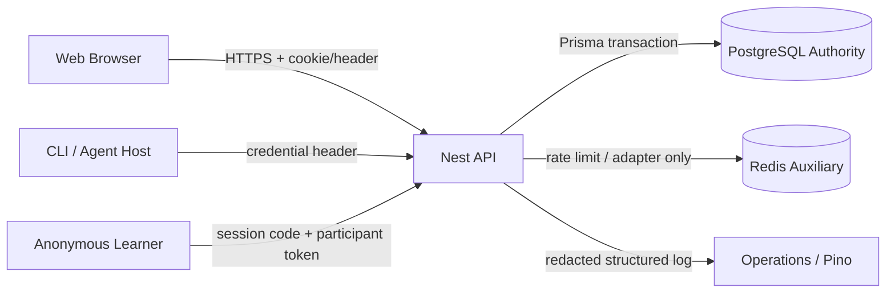
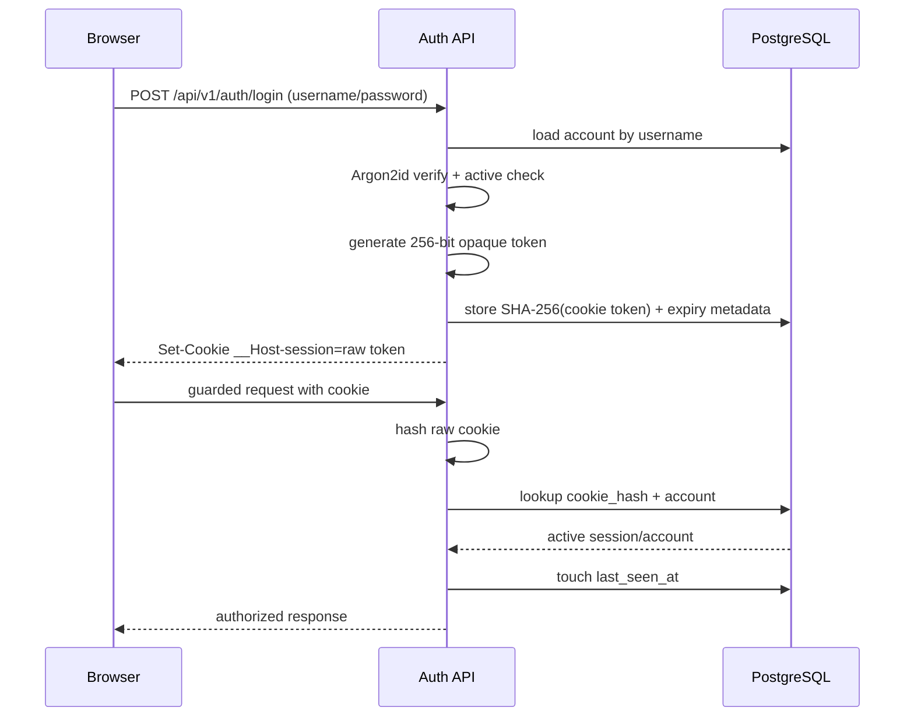
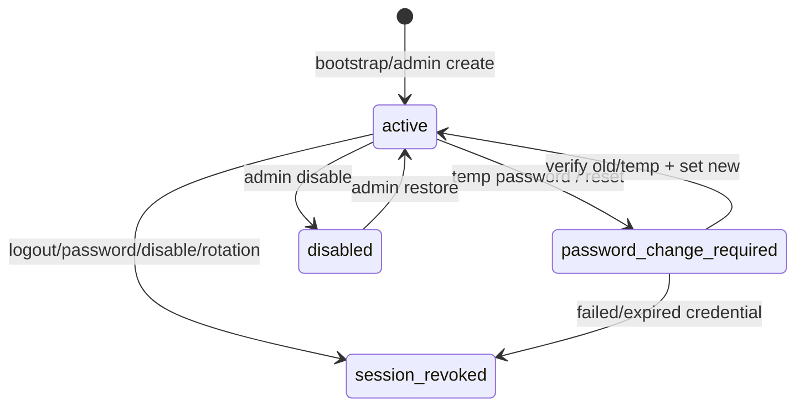

# 智學互動平台 - Web Auth 與安全設計

> [!important] 文件定位
> 本檔是 M2 #4 Web Auth 與安全設計，將 [[P0 核心需求基線#P0-03 Web 帳號生命週期]]、[[功能需求規格 SPEC#SPEC-003 Feature: Web 帳號生命週期(P0-03)]]、[[系統領域與需求分析]]、[[資料模型與 ER 設計]] 與 [[M2 關鍵技術決策]] 展開成 threat model、Auth matrix、session/cookie/CSRF/credential lifecycle 與安全驗收邊界。

> [!warning] Current / target boundary
> 本檔區分已驗證 runtime、文件 contract 與刻意 deferred target。現有 login/session、CSRF、step-up、password lifecycle、CLI credential、student Web Session、active enrollment 綁定 Participant 與匿名 fallback 均有 backend/runtime evidence；archive/retention 與 durable realtime/replay 仍是 deferred target。

## Threat model 與安全邊界

### 保護資產

| 資產 | 主要威脅 | 權威保存位置 | 保護策略 |
|---|---|---|---|
| Account identity/role | credential stuffing、enumeration、越權 | PostgreSQL `account` | generic login failure、Argon2id、role/permission guard、rate limit target |
| Password | DB 泄漏、log/response 泄漏 | PostgreSQL 只存 Argon2id hash | 不存明文；12–128 Unicode；common/breached check 後續補 |
| Web Session | cookie theft、重放、跨站 request | PostgreSQL `web_session` 只存 hash；raw token 在 cookie | 256-bit opaque token、SHA-256 hash、`__Host-session`、Secure/HttpOnly/SameSite |
| CSRF token | cookie-authenticated mutation | client cookie/header + server validation | `__Host-csrf` + header echo + Origin allowlist；目前僅 skeleton |
| Participant token | 跨場追蹤、token 重放、log 泄漏 | PostgreSQL 只存場次限定 hash | high-entropy opaque、live_session scope、不得進 log/error/event |
| CLI credential | shell/history、credential theft、跨 scope 使用 | 後續 credential store + DB hash | 不用 argv 傳秘密；MVP Windows Credential Manager target；step-up |
| Course/結果 | owner 越權、匿名資料重識別 | PostgreSQL | owner/admin matrix、404 existence hiding、plain-text projection、retention |
| Audit/security events | event 內容洩漏、不可追溯 | 後續 AuditEvent/DeletionEvent | stable actor/time/reason；禁止 password/token/answer content |

### Trust boundaries

- Browser、CLI、學員輸入、Origin、cookie/header、display name、username/password 都視為 untrusted input。
- PostgreSQL 是 Account、WebSession、Course、Participant、Submission 與結果的 authority；Redis 不保存 domain truth。
- API 不能相信 client role、client account id、client room、client time 或 event arrival order。
- log/metric/error response 不得包含 raw password、raw token、cookie、open text、完整 payload 或 credential。

## Account、role 與 authorization matrix

### Account model

MVP 只有：

- `admin`：系統管理與全平台支援範圍。
- `teacher`：自己的 Course、題庫、LiveSession 與結果範圍。
- `student`：由 admin 建立的 Web Account；不提供公開 self-registration。active `CourseEnrollment` 才能以 Web Session 綁定 Participant 進入課堂；匿名學員仍使用 session code + Participant token fallback。

Account status：

- `active`：可通過 login 與 SessionGuard，再依 role/permission 執行操作。
- `disabled`：不得 login；既有 session、CLI credential 與未使用 token 立即失效，並由 account-bound participant authorization 重新檢查。

`can_create_course` 是 Account-level flag：

- true 才能建立新 Course。
- false 只阻止新建，不刪除或撤銷既有 Course、題目、場次或歷史結果。
- 與 CLI credential revoke 分離；移除開課旗標不自動推定為 CLI credential revoke。

### Authorization matrix

| 操作 | Admin | Teacher | Student | Anonymous learner | CLI/Agent |
|---|---:|---:|---:|---:|---:|
| 首位 admin bootstrap | 只在 fresh install gate 允許 | 否 | 否 | deployment command，不是一般 API actor |
| Web login/current session | 是 | 是 | 是 | 否 | 走獨立 CLI credential flow |
| 建立 Account | 是 | 否 | 否 | 否 |
| 建立 Course | 若流程授權且 flag true | flag true | 否 | 代表有權限 teacher |
| 讀/改自己的 Course | 是 | 是 | 否 | 代表 teacher |
| 讀其他 owner Course | admin read-across；不洩漏不存在 | 否，回 404 以防 existence leak | 否 | 依代表 actor |
| 管理 Account/permission | 是 | 否 | 否 | 否 |
| 管理自己 LiveSession | 後續依 admin policy | 自己 Course | 否 | 否 |
| Join/reconnect | 管理用途不等於 learner identity | 教師控制場次 | 是，僅有效 code/token | 否 |
| Submit | 非一般操作 | 否 | 是，僅 active/open | 否 |
| 查詢 ArchivedResult | 全平台管理範圍 | 自己 Course | 不提供歷史入口 | 後續依 credential scope |

目前 backend 以 `SessionGuard`、`AdminGuard`、`CanCreateCourseGuard` 組合：缺少 SessionContext 是 authentication failure；有 session 但 role/flag 不足才是 authorization failure。

## Bootstrap 與首位 admin

### 安全條件

Bootstrap 只有在以下條件同時成立時可成功：

1. `system_setting.bootstrap_completed` 不為 true。
2. `account` 中沒有 `role = admin`。
3. transaction 內取得固定 advisory lock 後重新檢查上述 guard。
4. 成功建立首位 admin、寫入 `bootstrap_completed = true`，同一 transaction commit。

Concurrent bootstrap 的預期是 only-one-wins；loser 收到 stable conflict，不建立第二個 admin。

### 現有流程與 production target

目前只有：

- `npm run bootstrap:admin` → `src/bootstrap/bootstrap-admin.ts`。
- credentials 從 `BOOTSTRAP_ADMIN_USERNAME`、`BOOTSTRAP_ADMIN_PASSWORD`、`BOOTSTRAP_ADMIN_DISPLAY_NAME` 讀取。
- 不接受 command-line password/secret，避免 shell history。
- `BootstrapService` 使用 transaction + advisory lock + lock 內 recheck。

Production target：

- Docker secret 或互動式 stdin；不得把 bootstrap secret 放在 command line、長期環境檔、log 或輸出。
- 成功後清理暫時 bootstrap secret，並確認 bootstrap flag 已 commit。
- bootstrap CLI 只輸出非敏感 metadata（id、username、role），不輸出 password/hash/token。

### Bootstrap 驗收

- fresh DB 一次成功；再次執行穩定拒絕。
- 兩個真 PostgreSQL concurrent invocation 最多一個成功。
- 缺 credentials、password policy 不合格、username conflict 都不建立 partial state。
- exception path 關閉 Nest context，不遺留連線。

## Password policy 與 Argon2id

### Policy

- 以 Unicode code points 計數，長度 12–128。
- 允許 passphrase，不強制大小寫、數字、符號組合，不要求週期性更換。
- 目標設計拒絕平台已知 common/breached password；目前 password-policy 只實作長度，breach/common source 尚未定案。
- Password 只以 Argon2id hash 保存；管理員不應能讀回明文或原始 hash。
- 後續管理員 reset 與首次登入 force-change 使用一次性 temp password；目前切片 `mustChangePassword` 一律 false，尚未完成流程。

### Argon2id

固定 M2 baseline：

- memory `m=65536 KiB`（64 MiB）
- time `t=3`
- parallelism `p=1`
- encoded hash 自帶 algorithm/parameter metadata。

目前 `password-hasher.spec.ts` 已驗證 hash round-trip、錯誤 password rejection 與 Argon2id parameters。實際資源 benchmark、upgrade policy、production capacity 仍需 Phase 2/9 驗證，不可把 unit test 當成 benchmark 結果。

### Login failure semantics

`AuthService.login()`：

- missing account、missing hash、wrong password、disabled account 都回同一 `AUTH_INVALID_CREDENTIALS` / HTTP 401。
- missing account path 以 dummy Argon2id hash 執行 work，降低 timing enumeration。
- 不回傳 username 是否存在、status、password hash 或內部 Prisma error。
- 目前尚無 account/source 雙重 rate limit；這是 Phase 2 security gap，不能以 generic error 取代 rate limit。

## PostgreSQL-backed opaque Web Session

### Token lifecycle

- raw token 只在 login response 的 Set-Cookie 與 browser cookie；不進 DB、log、ErrorEnvelope、AuthContext 或 event。 student join 不回 raw participant token；匿名 join 才回一次性 token。 student join 不回 raw participant token；匿名 join 才回一次性 token。
- DB 只存 `cookie_hash` unique；Session row 綁 Account。
- `AuthContext` 只帶 handler 需要的 account projection（id、username、displayName、role、status、canCreateCourse）與 sessionId，永不帶 password hash。
- PostgreSQL 是唯一權威；Redis、browser cache、Socket event 不可授權。

### Cookie contract

Session cookie：

- name：`__Host-session`
- `HttpOnly: true`
- `Secure: true` in production/explicitly configured environments
- `SameSite: Lax`
- `Path: /`
- no `Domain`（符合 `__Host-` requirement）
- `maxAge`：absolute expiry 的剩餘時間

目前 `sessionCookieOptions()` 將 cookie options 集中建構；`AuthController` 只在 `NODE_ENV=test` 且未明確設定時 default `Secure=false`，因 supertest 使用 plain HTTP。這是 test-only exception，production 不可沿用。

> [!note] Cookie signing distinction
> 目前 `__Host-session` 沒有 `signed: true`；安全性來自 high-entropy opaque token + DB SHA-256 hash lookup，不是 Express signed-cookie HMAC。`COOKIE_SECRET` 目前傳給 cookie-parser，不是 session token verification key。

### Session validity

- idle timeout：30 分鐘，自 `lastSeenAt` 計算。
- absolute timeout：自建立起 8 小時，自 `expiresAt` 計算。
- validity 優先檢查 absolute/idle、`revokedAt`、Account active status。
- valid guarded request touch `last_seen_at`。
- expired/idle/revoked/no row/disabled account 都是 authentication failure，回 401。
- current-session response 已提供 `expiresAt` ISO timestamp；login、change-password 與 `GET /auth/session` 共用此 session projection。expired/idle/revoked/disabled 仍依 authentication failure semantics 回 401。

### 尚未落地的 session operations

以下是 P0/M2 target，不是目前完成項：

- logout current session（revoke + clear cookie）。
- session rotation（login、step-up、credential change 等適當邊界）。
- password change/reset/disable 時全 session revoke。
- credential version/auth epoch，或等價的 transaction-based invalidation。
- revoke reason、audit event、管理員 session visibility。
- session cleanup worker 與 bounded expiry scan。

## CSRF、Origin 與 cookie-authenticated mutation

### Target protocol

所有以 browser cookie authentication 的 state-changing method（POST、PUT、PATCH、DELETE）必須同時通過：

1. 有效 Web Session。
2. 有效 CSRF token：server 發出 non-HttpOnly `__Host-csrf` cookie，client 從 cookie 讀值並以 `x-csrf-token` header echo。
3. Origin allowlist：Origin 必須與 validated `CORS_ORIGIN` allowlist 相符。
4. stable failure code：`AUTH_CSRF_INVALID`，不得把 token/origin detail 回給 client。

GET/HEAD 等 safe method 不因 CSRF token 缺失被拒，但仍受 Session/authorization 及 Origin/CORS policy 保護。

### Current implementation boundary

已存在：

- `CSRF_COOKIE_NAME = '__Host-csrf'`。
- `CSRF_HEADER = 'x-csrf-token'`。
- `isMutation()`。
- `isOriginAllowed()`。
- `AUTH_CSRF_INVALID` error code。
- CORS credentials 與 explicit origin config。

尚未存在：

- CSRF token 產生、hash/rotation、cookie set/clear。
- Global/route guard 實際比對 cookie/header。
- mutation route 的 Origin enforcement。
- login/logout/password/step-up 的 CSRF lifecycle tests。

因此目前 login/course e2e 的成功不代表 CSRF design 已完成；Phase 2 實作前不得將 helper skeleton 當成 enforcement。

## 登入、登出、改密碼與 credential invalidation

### Current HTTP surface

目前 identity controller 已有下列核心切片：

- `POST /api/v1/auth/login`：帳密驗證、建立 WebSession、Set-Cookie、回 `SessionDto`。
- `GET /api/v1/auth/session`：SessionGuard 後回 current account/session projection。
- `POST /api/v1/admin/accounts`：SessionGuard + AdminGuard 後建立 teacher/admin account；回應不含 password hash。

目前沒有 logout、password change、admin reset、disable/restore、step-up、CLI credential endpoint。

### Target state machine

Target invariants：

- temp password 一次使用；首次登入完成新密碼前不得呼叫其他 protected use case。
- password change 先驗證 current password（reset path 依 step-up/admin policy），成功後 revoke all existing WebSessions。
- disable 使 Web Session、CLI credential、unused token 立即失效，但保留 Course、LiveSession、ArchivedResult、audit data。
- CLI security lock 只影響 CLI credential lifecycle，不等同 disabled Web Account。
- `can_create_course` 移除不撤銷既有 Course；CLI revoke 是獨立命令。

## Step-up authentication

### Target

高風險 admin/CLI operations（建立、rotate、revoke CLI key、帳號敏感設定、必要的 delete/restore 操作）需最近 10 分鐘內完成密碼 step-up。

Step-up 應：

- 重新驗證 current password，不接受只靠既有 session。
- 將短期 step-up state 綁定 Account + WebSession，server-side 保存，不由 client 自報。
- expiry 過期回 `AUTH_STEP_UP_REQUIRED` / 401 或 403（由 API contract 固定）。
- 密碼錯誤、disabled、session revoked 皆不得建立 step-up state。
- 成功 step-up 不把 password/token 寫入 log 或 response。

### Current gap

目前沒有 `step_up_at`/credential epoch 欄位、endpoint、guard 或測試；ERD 將其列為 Phase 2 planned schema，不可在現有 code 上宣稱已支援。

## Rate limit、Redis 與 abuse boundary

M2 已定：Redis 只作 rate limit 與多 instance Socket.IO adapter，PostgreSQL 仍是帳號/session/domain authority。

Login target 為兩個互補 scope：

- account/identifier window：防單一帳號被 credential stuffing。
- source IP/origin window：防單一來源掃描大量帳號。

設計限制：

- 不設永久 lockout；rate limit 應回穩定 `RATE_LIMITED`，附 retry guidance，不洩露帳號存在。
- Redis unavailable 時的 DB fallback、counter TTL、eviction、多 instance consistency 留後續架構/非功能文件定案。
- rate limit 不得成為 PostgreSQL authority 的替代品，也不得允許 bypass `SessionGuard` 或 permission checks。

目前 `AuthService` 尚未寫入 LoginAttempt，也沒有 rate limit；這是明確 Phase 2/架構 gap。

## Participant token、CLI credential 與跨界限

### Participant token

- server 產生 high-entropy opaque token，raw value 只回給該 browser/session。
- DB 只存 token hash，並綁 `live_session_id`；不可跨場使用或作 platform identity。
- participant display name 只為 UI，允許同場重複；不可寫入 authorization/audit key。
- token 不能出現在 Pino log、ErrorEnvelope、Socket event 或 deletion event。
- closed/cancelled/expired session 拒絕 join/reconnect；archive/retention 時解除 name/token 與答案關聯。

### CLI credential

MVP target：

- 單一官方驗證 Agent host。
- CLI credential 與 Web Session 分開管理；建立/rotate/revoke 需 step-up。
- Windows 11 target 儲存於 Windows Credential Manager；不把 raw key 寫入 command args、shell history、config log。
- API 使用明確 credential header；server DB 只存 hash、account scope、status、created/last-used/revoked metadata。
- disabled Account 同步使 CLI credential 失效；`can_create_course` 移除不自動 revoke CLI credential。

`CliCredential` model、admin endpoints、hash-only credential store 與 step-up issuance 已由 backend 落地；rotation/successor、expiry policy 與 CLI course commands 仍 deferred。

## Error、HTTP status、audit 與 redaction

### Stable error semantics

| 情境 | HTTP | Code | 語意 |
|---|---:|---|---|
| 缺少/無效/過期/撤銷/disabled Web Session | 401 | `UNAUTHORIZED` 或 auth-specific code | 尚未建立可用 authentication context |
| 帳號不存在/密碼錯/disabled login | 401 | `AUTH_INVALID_CREDENTIALS` | generic failure，避免 enumeration |
| 已登入但非 admin | 403 | `FORBIDDEN` | authentication 成功，authorization 不足 |
| 已登入但 `can_create_course=false` | 403 | `FORBIDDEN` | 只阻止新建，不影響既有 Course |
| CSRF token/header/origin 不符 | 403/401（待 API contract 固定） | `AUTH_CSRF_INVALID` | 不回傳 token/origin 詳細值 |
| step-up 過期/不存在 | 401/403（待 API contract 固定） | `AUTH_STEP_UP_REQUIRED` | 要求重新輸入 password |
| rate limit | 429 | `RATE_LIMITED` | 穩定、可重試、不可洩露帳號存在 |
| username/credential unique conflict | 409 | `CONFLICT` | 可帶 field，但不可帶秘密 |

Global ErrorEnvelope 只回 stable code、human message、optional field/blocking/nextStep；unknown error 不回 stack、SQL、hash 或 token。

### Logging/redaction rules

- Pino 必須 redact password、authorization、cookie、set-cookie、csrf、session token、participant token、CLI key、raw payload/open text。
- login failure 可記 request id、actor type（若安全）、來源分類、穩定 code、latency；不記 username existence conclusion 或 raw credentials。
- audit event 記 immutable actor/account ID、action、target ID、time、result、stable reason；不得記 password/token/answer content。
- deletion event 只留治理要求的最小 metadata；詳見 [[結果資料治理]]。

## Current implementation vs Phase 2 gap

| Capability | Current evidence | Phase 2 target / gap |
|---|---|---|
| Admin/teacher roles | `roles.ts` + DB CHECK | 完整 lifecycle matrix |
| Account status | `account-status.ts` + schema | disable/restore + immediate revoke |
| First admin bootstrap | BootstrapService/CLI + advisory lock | secret delivery hardening/ops runbook |
| Password hashing | Argon2id helper/spec | common/breached list、upgrade/benchmark、force change |
| Login generic failure | AuthService + dummy hash | account/source rate limit、LoginAttempt |
| Web session create/load/touch | SessionService + schema | logout、rotation、full revoke、step-up epoch |
| Session cookie | `__Host-session` helper/controller | CSRF cookie/token lifecycle、production assertions |
| Session guard | `SessionGuard` returns 401 on missing/invalid | test revoked/disabled/expiry and all protected routes |
| Admin authorization | AdminGuard | sensitive operations + step-up |
| Course permission | CanCreateCourseGuard | admin toggle endpoint + audit |
| Origin/CSRF | helper skeleton + error code | actual guard/middleware and integration tests |
| CLI credential | not implemented | model/store/header/scope/revoke |
| Participant token | not implemented | Phase 5 token isolation/reconnect |
| Audit/login attempt | not implemented | redacted append-only schema and queries |
| Redis rate limit | env optional only | architecture/operation/DB fallback |

## Security acceptance matrix

| AC / test area | Expected evidence | Status |
|---|---|---|
| Bootstrap only-one-wins | true PostgreSQL concurrent integration test | Current integration covers bootstrap concurrency; keep as regression gate |
| Generic login failure | wrong password and unknown username same 401/code shape | Current auth e2e |
| Password storage | no plaintext; Argon2id parameters and roundtrip | Current unit test |
| Cookie attributes | `__Host-session`, HttpOnly, SameSite, Secure production/test exception | Current e2e + config review |
| Missing session semantics | no cookie/invalid cookie → 401, not 403 | Current e2e + [[tasks/lessons.md]] |
| Role/permission | authenticated wrong role/flag → 403; existing owner scope preserved | Current auth/course e2e |
| Idle/absolute expiry | fake clock boundary tests; expired session cannot refresh | Current domain unit; integration follow-up |
| Logout/revoke | cookie cleared, row revoked, replay rejected | Phase 2 pending |
| Password/disable revoke | all sessions invalid after mutation | Phase 2 pending |
| CSRF/Origin | mutation missing/mismatched token/origin → stable error; safe GET unaffected | Phase 2 pending |
| Rate limit | account + source windows, no permanent lock, 429 stable | Phase 2/architecture pending |
| Step-up | high-risk action requires recent 10m password verification | Phase 2 pending |
| Participant isolation | token cannot cross LiveSession; no raw token logs | Phase 5 pending |
| CLI credential | store/header/revoke/disable scope and redaction | Phase 2 pending |
| Audit redaction | security/deletion events omit secret/content | Phase 2/8 pending |

## Implementation tripwires from `tasks/lessons.md`

後續實作每個 phase 都必須在 checklist/verification 中引用以下既有 lessons，不另造矛盾規則：

- Prisma 7 advisory lock 回傳 PostgreSQL `void` 時使用 `$executeRaw`，不要用 `$queryRaw`。
- versioned controller 明確標 `version: '1'`；health controller 使用 neutral version，並維持 `/health/*` prefix exclusion。
- plain-HTTP supertest 只有 test env 可將 `SESSION_COOKIE_SECURE=false`；production 與明確設定環境仍 secure-by-default。
- 缺少/無效 session 必須 throw `UnauthorizedError` 形成 401；只有已驗證但 permission 不足才回 403。
- Prisma 7 import 從 `generated/prisma/client`，不回到 `@prisma/client`。
- env 由 ConfigModule `validate` hook 驗證；test `.env.test` 使用合法 port（目前 3001），不要用 `PORT=0`。
- 若重新引入 Swagger，先確認安全版本與 transitive `js-yaml` 風險，不把 Phase 2 文件需求直接當成依賴安裝理由。

## Rollout、rollback 與 operational guard

- Phase 2 auth schema 一律 additive；先 migration，再部署讀路徑，最後啟用寫路徑/feature flag。
- CSRF、rate limit、step-up、revoke worker 可分開啟用；先 test/staging 驗證，再 production。
- 若新 auth path 有問題，可回退 application path/feature flag；保留向後相容欄位，不依賴 destructive down migration。
- 已執行的 logout/revoke 可安全重試；已撤銷 credential 不得以 rollback 恢復。
- password、session、CLI key、participant token 的 revoke/rotation 需有 metrics/alert，但 telemetry 不得含秘密。
- 本文件不授權直接修改現有 schema 或公開 API；任何 wire/schema 改動先更新 #3、後續 API 文件與 migration plan。

## M2 #4 完成條件

- [x] 已建立 threat model、trust boundary 與資產保護策略。
- [x] 已建立 Account role/status/`can_create_course` authorization matrix。
- [x] 已定義 bootstrap、Argon2id、opaque Web Session、cookie、CSRF/Origin、error semantics。
- [x] 已清楚區分目前已實作能力與 logout/revoke/rate-limit/step-up/CLI 等 gap。
- [x] 已固定 401/403 semantics、generic login failure、redaction 與 Redis authority boundary。
- [x] 已把 `tasks/lessons.md` tripwires 接成後續 implementation checklist。
- [x] 已引用 #1/#3 與既有 source-of-truth，未在本檔重定義題目或 Socket wire schema。

## 相關連結

- 上游領域分析：[[系統領域與需求分析]]
- 上游資料模型：[[資料模型與 ER 設計]]
- 需求：[[P0 核心需求基線]]、[[功能需求規格 SPEC]]
- 技術決策：[[M2 關鍵技術決策]]
- Backend lessons：`smartLearning-backend/tasks/lessons.md`
- Backend auth source：`src/modules/identity/application/auth.service.ts`、`src/common/auth/session.service.ts`、`src/common/auth/session.guard.ts`
- Backend security source：`src/common/security/cookies.ts`、`src/common/security/origin.ts`
- Backend persistence source：`prisma/schema.prisma`、`src/prisma/transaction.service.ts`
