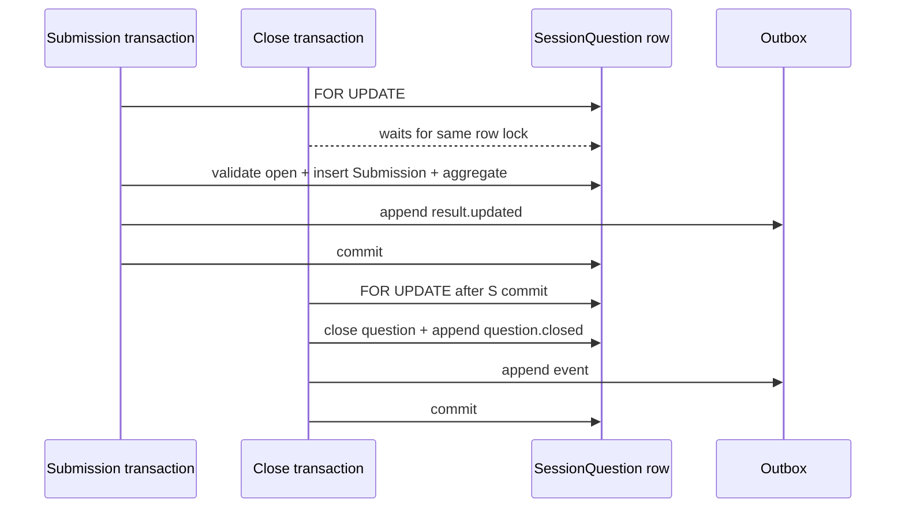

# 智學互動平台 - 即時同步與結果治理設計

> [!important] 文件定位
> 本檔把 [[P0 核心需求基線]] 的重連、Submission、submit/close 競態與 [[結果資料治理]] 的歸檔、90 天保留、提前刪除，落成 Socket.IO 同步、權威順序與資料治理設計。API primitive/envelope 以 [[API 與共用 Schema 設計]] 為準；資料表與索引以 [[資料模型與 ER 設計]] 為準。

> [!warning] Current / target boundary
> Backend 目前沒有 LiveSession、Participant、Submission、Socket Gateway、outbox 或 ArchivedResult runtime。以下是 M2 target contract，不代表即時互動或 retention 已實作；Phase 1 health/auth/course evidence 不足以宣稱本檔能力完成。

## 1. Authority and synchronization principles

- PostgreSQL 是 LiveSession、SessionQuestion、Participant、Submission、aggregate、archive 與 deletion authority。
- REST snapshot 與 Socket event 都是 PostgreSQL state 的投影；browser cache、Socket 到達順序、client clock、event 是否先到不得授權或決定結果。
- 每個成功 domain mutation 先在 PostgreSQL commit，再發布可重試的通知；未 commit 的事件不得對 client 宣稱成功。
- Submission、彙總更新與 outbox append 必須在同一 transaction；廣播失敗只能造成待重播通知，不得造成答案遺失。
- participant token 僅對單一 LiveSession 有效；display name 僅供當場 UI，不得成為 archive、authorization 或 audit key。

## 2. Socket.IO topology and connection boundary

### 2.1 Namespace and rooms

- Namespace：`/live`，由 Nest Gateway 管理。
- Canonical room：`session:{liveSessionId}`。
- Optional visibility rooms：`teacher:{liveSessionId}` 與 `participant:{liveSessionId}`；若使用單一 room，server 仍須逐 client 套用 visibility projection，不可把 teacher-only data broadcast 給 participant。
- Server 不以 room membership 作為 domain authority；每次敏感 command 仍重查 PostgreSQL 的 session、actor、token scope 與 state。

### 2.2 Handshake

| Actor | Credential | Server checks | Initial result |
|---|---|---|---|
| Teacher/admin | Web Session cookie | active session、role、Course ownership/admin scope | teacher projection + latest snapshot |
| Participant | session code + participant token | token hash、LiveSession binding、active/not expired | participant projection + visibility-limited snapshot |
| Unknown client | none/invalid | reject before room join | stable `UNAUTHORIZED`/`SESSION_NOT_JOINABLE` |

Raw participant token is never emitted in event payload, error envelope, log, metric label or room name. Closed/cancelled/expired session rejects reconnect and removes effective access even if a stale Socket connection remains.

## 3. Event contract

All events use `schemaVersion: 1` and the shared envelope primitives from [[API 與共用 Schema 設計]]:

```json
{
  "event": "result.updated",
  "schemaVersion": 1,
  "eventSeq": 1042,
  "aggregateVersion": 17,
  "serverTimestamp": "2026-08-16T03:00:00.000Z",
  "liveSessionId": "0190c6b8-0000-7000-8000-000000000001",
  "visibility": "participant_after_submit",
  "data": {}
}
```

### 3.1 Catalog

| Event | Producer/commit trigger | Visibility | Replay/coalesce |
|---|---|---|---|
| `session.snapshot` | join/reconnect or `sync.required` recovery | actor-specific | full snapshot; never coalesced away |
| `session.state_changed` | waiting/active/closed/cancelled transition commit | teacher + eligible participants | ordered; replayable |
| `question.opened` | SessionQuestion `not_open → open` commit | teacher + participants | ordered; replayable |
| `question.closed` | SessionQuestion `open → closed` commit | teacher + all participants | ordered; replayable |
| `result.updated` | accepted Submission/aggregate version commit | vote-to-reveal projection | latest non-authoritative notification may coalesce |
| `session.closed` | manual/automatic close commit | teacher + all participants | ordered; replayable; closes future writes |
| `sync.required` | event gap, expired outbox, permission/state refresh | one client | control signal; client must fetch snapshot |

`eventSeq` is monotonic per LiveSession and assigned in the same transaction as the outbox record. `aggregateVersion` is monotonic for the relevant result aggregate. `serverTimestamp` is informational and never replaces commit order.

### 3.2 Visibility rules

- Teacher sees anonymous aggregate and joined/submitted counts, never a display-name-to-answer mapping.
- Participant sees their own submission status and only the aggregate allowed by vote-to-reveal: after their current answer while open, or for everyone after question close.
- A participant never receives correct answers before the product rule permits them; quiz result projection follows the same closed/reveal rule.
- Open-text `data` is a safe plain-text list projection. It excludes display name, participant token, raw metadata and HTML/Markdown. Whether the UI renders list or word cloud is a non-blocking product decision and does not change this server contract.

## 4. Snapshot, outbox and replay

### 4.1 Snapshot

`GET /api/v1/live-sessions/{sessionId}/snapshot` and `session.snapshot` return an actor-specific, PostgreSQL-derived projection:

- LiveSession ID/status/code validity (never raw internal token).
- Current SessionQuestion and status.
- Ordered question metadata and immutable snapshot content allowed for the actor.
- Participant's own submitted/not-submitted state when participant-authenticated.
- Visibility-filtered aggregate and `eventSeq`/`aggregateVersion` watermark.

The client replaces stale local state with the snapshot; it does not merge a stale browser cache over server values.

### 4.2 Outbox lifecycle

1. Domain transaction locks and mutates authoritative rows.
2. The same transaction updates aggregate counters and appends an outbox event with `eventSeq`.
3. Commit makes both data and outbox record durable.
4. A publisher reads bounded pending outbox rows and emits to the appropriate room/projection.
5. Delivery success marks the outbox record delivered; transient failure retries with bounded backoff.
6. On gap, retention expiry or publisher restart, the client receives `sync.required` and performs a fresh snapshot query.

The outbox is short-lived operational delivery state, not a second domain authority. It has a bounded retention window sufficient for reconnect replay; expired events are not fabricated. When an event sequence cannot be replayed, the server sends `sync.required` rather than guessing missing deltas.

### 4.3 Replay contract

A reconnect may send `lastEventSeq`. The server either:

- replays all still-retained events strictly after that sequence, then sends a current watermark; or
- sends `sync.required` followed by a full snapshot when there is a gap, stale sequence, permission change or closed session boundary.

Duplicate event delivery is safe: clients deduplicate by `(liveSessionId, eventSeq)` and still accept a newer snapshot watermark. A late event with an older `eventSeq` cannot overwrite newer state.

## 5. Submission, aggregation and broadcast

### 5.1 Submission transaction

For a valid participant submission:

1. Authenticate participant token and confirm LiveSession is `active`.
2. Begin PostgreSQL transaction.
3. Lock the same `SessionQuestion` row with `FOR UPDATE`.
4. Re-check SessionQuestion is `open`, answer schema is valid and participant has no accepted submission.
5. Insert Submission under `(participantId, sessionQuestionId)` uniqueness and idempotency key rules.
6. Update the aggregate and increment `aggregateVersion`.
7. Append the result event to outbox.
8. Commit; only then return success and publish `result.updated`.

A duplicate same-key request returns the first committed result. A different answer after the first accepted answer returns `SUBMISSION_CONFLICT` and cannot overwrite it. A database conflict is handled as a stable conflict/replay path, not as a second success.

### 5.2 Submit/close linearization

Submit and manual/automatic close use the same SessionQuestion lock order and READ COMMITTED transaction model:



- Submission commits first: answer is retained and included in aggregate.
- Close commits first: later Submission is rejected; closed commit means zero newly accepted answers.
- Client time, Socket arrival order and UI state never decide this result.
- Auto-close at the eight-hour hard limit invokes the same close command and lock protocol as manual close.

### 5.3 Coalescing and backpressure

- `result.updated` may be coalesced per `(LiveSession, SessionQuestion, visibility)` to the newest aggregate version when the client has not yet received an intermediate display update.
- Submission acknowledgements, idempotency results, state transitions and `session.closed` are never coalesced away.
- Queue depth and oldest outbox age are bounded; over capacity returns stable retryable errors or asks clients to resync. It never blocks indefinitely, reports success before commit or drops a committed Submission.
- After reconnect, the snapshot/aggregate watermark is authoritative even if a prior event was missed.

## 6. Close, archive and retention governance

### 6.1 Close and archive

When LiveSession becomes `closed`:

1. Close the currently open SessionQuestion under the shared lock.
2. Reject future join, reconnect and Submission at the state boundary.
3. Freeze SessionQuestion, Submission and aggregate rows.
4. Remove application-queryable display-name/participant-token links to answers according to the ERD/anonymization step.
5. Create ArchivedResult from the same authoritative snapshot/aggregate.
6. Record `closedAt` and `purgeAt = closedAt + 90 days`.
7. Emit `session.closed` only after commit.

`cancelled` before `active` and without Submission does not create an ArchivedResult; it retains only the minimum LiveSession metadata required by [[結果資料治理]]. Manual close and eight-hour auto-close use this identical governance path.

### 6.2 ArchivedResult projection

Archive query returns:

- LiveSession/Course metadata, `closedAt`, `purgeAt`, current retention status.
- Immutable SessionQuestion snapshot, anonymous raw answers and aggregate according to role permission.
- No display-name/participant-token join, no participant identity lookup and no learner history entry point.
- Teacher scope limited to owned Course; admin scope limited to support/management authority.

Real-time aggregate and archived aggregate must be derived from the same committed Submission authority. A mismatch is a release-blocking correctness failure even when latency/error thresholds pass.

### 6.3 Retention job

The retention worker is idempotent and bounded:

- Select due archives by `purgeAt`, lock/claim a bounded batch and delete answer-bearing snapshot, Submission and aggregate data.
- Repeat safely after process/DB failure; a completed item is not deleted twice in a way that creates a false success.
- Create a minimal `DeletionEvent` containing LiveSession/Course IDs, trigger `retention_expired`, timestamp, categories/counts and stable result/error code only.
- Never store prompt, option, correct answer, open text, display name, token or aggregate in the deletion event.
- Alerts fire on oldest due item age, repeated failures and backup/restore validation failures.

Backups and restore processes must filter expired/deleted application data before serving it. A backup must never resurrect deleted answers, aggregate or participant linkage through normal application queries.

## 7. Early deletion

- Course teacher creates a deletion request; this does not delete data.
- Admin must authenticate, supply an allowed reason and explicitly confirm the whole LiveSession archive deletion.
- There is no pre-delete answer export or hidden backup. The operation is not reversible.
- Deletion and minimum tombstone/audit event use an idempotent transaction or resumable job with stable status.
- A repeated confirm returns the existing deletion result; it does not recreate or partially delete data.
- `COURSE_ARCHIVED` or teacher disabled does not change the original 90-day deadline; it also does not grant delete permission.

## 8. Failure and recovery matrix

| Failure | Client-visible behavior | Authority/repair |
|---|---|---|
| Socket disconnect | reconnect with token and `lastEventSeq` | replay or `sync.required` + PostgreSQL snapshot |
| Outbox gap/expiry | `sync.required`, no guessed delta | full snapshot and new watermark |
| Duplicate event | ignore older `(sessionId,eventSeq)` | newer snapshot/aggregate wins |
| Publisher restart | transient delivery delay, no false success | pending outbox retry |
| PostgreSQL unavailable | mutation fails clearly; readiness fails | no event/success before commit |
| Redis unavailable | use documented rate-limit/adapter degradation | PostgreSQL domain state remains authority |
| Aggregate broadcast overload | coalesce display updates, preserve ack/state | queue/backpressure metrics and resync |
| Retention worker crash | item remains due and retryable | idempotent claim/retry + alert |
| Restore includes expired data | restore gate fails | filter before application exposure |

## 9. W1～W8 evidence mapping

| Workload | Realtime/governance evidence |
|---|---|
| W1 Join | token-scoped handshake, room join, snapshot, participant uniqueness |
| W2 Submit | locked Submission transaction, aggregate/outbox commit, p95 and zero loss |
| W3 Broadcast | visibility projections, coalescing, event watermark and final authority query |
| W4 Reconnect | token reuse, replay/snapshot recovery, no duplicate participant/Submission |
| W5 Sustain | queue/outbox age, connection health, aggregate/archive consistency |
| W6 Race | submit/close same row lock and commit-order race matrix |
| W7 Retry | same-key replay, hash conflict, no duplicate valid Submission |
| W8 Auto-close | controlled clock, shared close/archive path, zero post-close join/reconnect/submit |

## 10. Design status and acceptance

| Capability | Status | Required proof |
|---|---|---|
| Socket namespace/rooms/event catalog | Designed / pending verification | Gateway contract and integration tests |
| Snapshot/replay and gap recovery | Designed / pending verification | reconnect/replay tests and W4 report |
| Submit/close linearization | Designed / pending verification | true PostgreSQL race test and W6 report |
| Aggregate/outbox consistency | Designed / pending verification | transaction + failure recovery tests |
| Vote-to-reveal/open-text projection | Designed / pending verification | visibility/projection tests |
| ArchivedResult/90-day retention | Designed / pending verification | governance job/restore tests |
| Early deletion/tombstone | Designed / pending verification | admin confirmation/idempotency/redaction tests |
| Open-text list vs word cloud | Non-blocking product decision | does not change server plain-text contract |

- [ ] No accepted Submission is lost, duplicated or absent from the final aggregate.
- [ ] Closed commit rejects all later joins, reconnects and Submissions.
- [ ] Reconnect never treats Socket/browser state as authority.
- [ ] Archive is anonymous, scoped, paginated and retained/deleted exactly as [[結果資料治理]] specifies.
- [ ] Metrics and alerts are defined in [[架構、容量與可觀測性設計]]; wire names are reviewed in [[M2 跨文件 Contract Review]].

## 相關連結

- 需求與語意：[[P0 核心需求基線]]、[[題目領域契約]]、[[結果資料治理]]
- API：[[API 與共用 Schema 設計]]
- 上游設計：[[資料模型與 ER 設計]]、[[非功能、風險與驗收分析]]、[[Web Auth 與安全設計]]
- 架構：[[架構、容量與可觀測性設計]]
- 效能：[[MVP 效能目標]]、[[MVP 效能需求 BDD 場景]]
- 技術決策：[[M2 關鍵技術決策]]、[[技術棧]]
- Review：[[M2 跨文件 Contract Review]]
