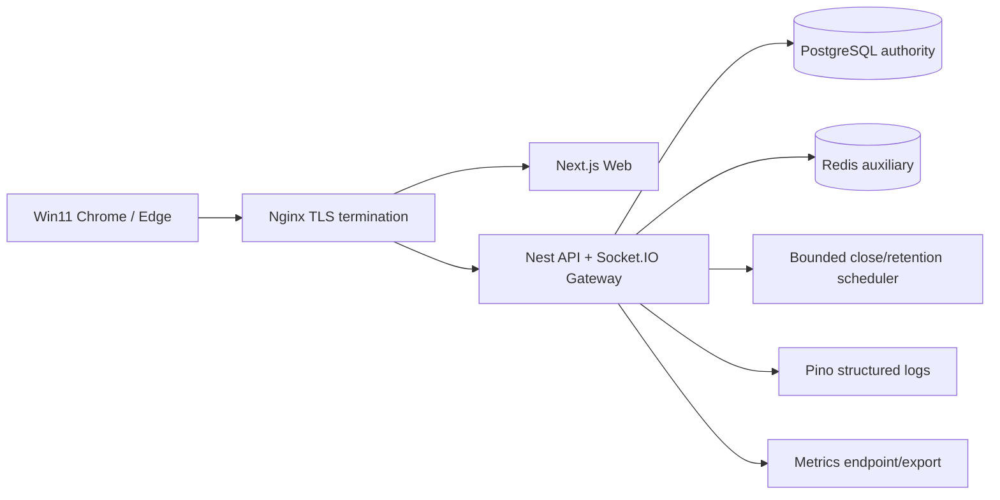

# 智學互動平台 - 架構、容量與可觀測性設計

> [!important] 文件定位
> 本檔把 [[MVP 效能目標]] 的單場 300 位學員 + 1 位老師 workload，與 [[M2 關鍵技術決策]] 的 Socket.IO、Docker Compose、PostgreSQL authority、Redis boundary 與 Pino/metrics 方向，轉成可驗收的部署、容量、降級與觀測設計。

> [!warning] Current / target boundary
> Backend 目前已具備 Nest production/test bootstrap、health probes、request ID、Pino 基礎與 PostgreSQL integration，但尚未有 Socket.IO、Redis、scheduler、metrics backend、dashboard、load harness 或完整 redaction wiring。本檔的資源數值是 M4 壓測前的 capacity budget assumptions，不是已通過的效能結果。

## 1. Source of truth and design invariants

- P0-07 的 W1～W8、p95/p99、錯誤率與零資料錯誤門檻只以 [[MVP 效能目標]] 為準；本檔不重新定義 pass/fail。
- PostgreSQL 是 Account、WebSession、Course、LiveSession、Participant、Submission、aggregate、archive 與 deletion authority。
- Redis 只作 rate-limit counter、Socket.IO multi-instance adapter 的輔助元件；Redis 不保存 domain state，不授權 request，不替代 PostgreSQL transaction。
- API/Socket/worker 都必須使用 stable error、request/correlation ID、UTC timestamp 與敏感資料 redaction。
- 超量時可拒絕或延遲，但不得無限等待、誤報成功、遺失/重複 Submission 或以過期 client state 當結果。

## 2. MVP topology

### 2.1 Docker Compose services

| Service | MVP role | Authority/failure rule |
|---|---|---|
| `nginx` | TLS termination, reverse proxy, WebSocket upgrade, request size/timeouts | Must not log credentials; upstream failure is explicit 5xx |
| `web` | Next.js responsive UI | Client state is a cache/projection, never authority |
| `api` | Nest REST, Socket.IO Gateway, application services | Only committed PostgreSQL state can produce success/event |
| `postgres` | durable domain/session/result/audit store | readiness reflects connection health; backup/restore is governed |
| `redis` | rate limit and Socket.IO adapter only | unavailable path follows documented degrade/reject policy |

MVP keeps Gateway and bounded scheduler in the API container to minimize deployment complexity. Scheduler jobs must be idempotent and bounded so a long retention/delete task cannot starve interactive request handling. A later scale-out can separate workers without changing domain authority or event semantics.

### 2.2 Health and lifecycle

- `/health/live` is process liveness and must not depend on PostgreSQL or Redis.
- `/health/ready` reports PostgreSQL readiness and relevant required dependencies; it must fail when mutations cannot safely commit.
- Graceful shutdown stops accepting new work, closes Socket connections with a retryable signal, drains bounded in-flight work and closes Prisma/Redis clients.
- Startup does not claim ready until required database connectivity/configuration is valid. Redis is required only when the selected rate-limit/adapter mode cannot safely degrade.
- Nginx forwards request ID/correlation headers but strips untrusted upstream identity headers before the application establishes context.

## 3. Single-session capacity model

### 3.1 Workload baseline

The committed acceptance baseline is exactly one LiveSession with 300 anonymous learners and one teacher. W1～W8 definitions, measurement boundaries and correctness gates remain in [[MVP 效能目標]] and [[MVP 效能需求 BDD 場景]].

| Dimension | Initial budget assumption | Verification |
|---|---:|---|
| Concurrent Socket clients | 301 plus bounded reconnect headroom | W1/W4/W5 load report |
| Join burst | 300 joins in 120s | W1: join p95 ≤ source threshold |
| Submit burst | 300 submissions in 10s | W2/W6/W7: submit p95 ≤ source threshold |
| Result fan-out | 301 eligible projections per update | W3: commit-to-broadcast p95/p99 |
| Reconnect burst | 30 clients in 10s | W4: recovery p95 |
| Sustained session | 30 minutes, at least 10 questions | W5: errors/resources/consistency |
| Scheduler due work | bounded batch; no interactive starvation | W8/retention failure drill |

These figures describe a test envelope, not a claim that the current backend meets it. Any budget change requires a new M2 review because it changes the test evidence expected by P0-07.

### 3.2 Resource budget to measure

Record, rather than assume, the following for each pre-release run:

- API CPU, RSS/heap, event-loop delay and GC pauses.
- PostgreSQL CPU/RAM, active/idle pool connections, transaction latency, lock wait time, slow queries and index hit ratio.
- Redis memory, command latency, connected clients, evictions, key TTL and adapter publish/subscribe failures.
- Socket current connections, accepts/rejects, reconnects, event queue depth, outbox oldest age, broadcast latency and coalesced update count.
- Nginx upstream latency, 4xx/5xx/429, WebSocket upgrade failures and request body rejection.

No resource threshold in this section replaces the P0 functional correctness gates: one lost/duplicated accepted answer or one post-close accepted answer fails the run regardless of latency.

## 4. PostgreSQL and Redis boundaries

### 4.1 PostgreSQL

- Use Prisma transaction boundaries defined by ERD and realtime design; do not use global `SERIALIZABLE` as a default.
- Submit/close lock the same SessionQuestion row under READ COMMITTED; Course question append/reorder uses the agreed course-scoped advisory lock.
- Configure a bounded application pool; pool size must leave headroom for health, scheduler and administrative traffic. The final number is a measured deployment parameter, not a wire contract.
- Apply statement/transaction timeouts and surface timeout as retryable only when commit status is known/queriable through idempotency.
- Index authority paths: session code lookup, participant token hash, Submission uniqueness, SessionQuestion status/order, archive owner/date/purgeAt and deletion state.
- Monitor lock waits and transaction retries; a retry cannot silently repeat a non-idempotent command.

### 4.2 Redis

| Use | Allowed | Required behavior |
|---|---|---|
| Login/account + source rate limits | Yes | TTL counters, stable 429, no account enumeration |
| Socket.IO adapter | Yes | fan-out coordination only; PostgreSQL remains state authority |
| Session/Submission/result truth | No | never authorize or reconstruct missing domain data |
| Durable archive/backup | No | PostgreSQL/backup governance only |

Redis outage policy is mode-specific: if rate limiting cannot safely fail closed, reject the protected request with a stable retryable error; if adapter is unavailable in single-instance mode, continue local delivery while marking multi-instance readiness degraded. No Redis fallback may bypass SessionGuard, ownership, or permission checks. Counter TTL/eviction and multi-instance consistency are load-tested operational behavior, not domain semantics.

## 5. Timeout, retry, rate limit and overload

### 5.1 Request classes

| Class | Timeout/retry rule | Success authority |
|---|---|---|
| Read/snapshot | bounded timeout; safe retry | latest PostgreSQL snapshot |
| Join/reconnect | bounded timeout; same token may retry | participant/session authority |
| Submission | client supplies Idempotency-Key; retry only same key | committed Submission result |
| Batch confirm | token + Idempotency-Key; retry same pair | committed command result |
| Close/open | idempotent state command; retry same intent | committed state transition |
| Retention/delete job | bounded claim/retry with job id | deletion status/tombstone |
| Socket broadcast | publisher retry, never fake commit | outbox + snapshot watermark |

### 5.2 Overload behavior

- Validate/rate-limit before expensive password/hash or domain work where policy permits, without revealing account existence.
- Reject new work with stable `RATE_LIMITED`, `CONFLICT`, `SESSION_NOT_JOINABLE` or timeout code plus actionable retry guidance.
- Bound request body, batch size, Socket event size, queue depth, outbox scan batch and scheduler work.
- Coalesce only non-authoritative `result.updated` display events; never coalesce Submission acknowledgement, idempotency response or state transition.
- On queue saturation, prefer a clear retryable response and preserve committed data over accepting work that cannot be durably processed.
- Metrics must distinguish expected conflict/rejection from unexpected functional errors; P0-07 `<1%` excludes deliberate expected conflicts but not data loss.

## 6. Structured logging and redaction

### 6.1 Required fields

Every request/event/job log should include only safe operational metadata:

- `requestId`/`correlationId`, service, route/event/job name, actor type (not raw credential), status/code, duration, retry count and outcome.
- Resource IDs may be logged when they are not secrets; participant token, raw session token, CLI key, password, cookie value and open-text content may not.
- Include `liveSessionId`/`courseId` only where operationally necessary and retention/privacy policy allows.
- Log schema version and deployment/build identifier for incident correlation.

### 6.2 Redaction invariants

Pino/transport redaction must cover `password`, `authorization`, `cookie`, `set-cookie`, CSRF/session/participant tokens, CLI key material, raw payload, open text, answer content and validation token. Error responses/logs never expose stack, SQL, password hash or raw request body. Sampling/diagnostics cannot disable redaction in production.

The existing request ID middleware, Pino redaction helper and global exception filter are reusable foundations; complete field coverage and Socket/job logger wiring remain implementation tasks.

## 7. Metrics, dashboards and alerts

### 7.1 Metric families

Use low-cardinality labels only (`route_template`, `method`, `status_class`, `error_code`, `actor_type`, `event`, `outcome`); never label by raw user, token, prompt or arbitrary course/session ID.

| Family | Examples | Why |
|---|---|---|
| HTTP | request count, latency histogram, 4xx/5xx/429, timeout | API SLO and overload diagnosis |
| Auth | login failures, rate-limit decisions, session create/revoke/expiry | abuse and credential lifecycle |
| DB | pool usage, query/transaction latency, lock wait, retry, constraint conflict | authority health and contention |
| Socket | current connections, handshake failures, reconnects, events, ack latency | realtime health |
| Outbox | pending count, oldest age, publish/retry/failure, `sync.required` | delivery lag and replay pressure |
| Aggregate | accepted/rejected submissions, duplicate/idempotent replay, aggregate version | correctness audit |
| Governance | archive duration, retention due/success/failure, deletion/tombstone counts | privacy/retention compliance |
| Runtime | CPU/RSS/heap/event-loop delay/GC | capacity and saturation |

### 7.2 Dashboard and alert gates

Dashboard panels should show API latency/error, DB pool/lock waits, Socket connections/reconnects, outbox age, aggregate correctness counters, retention backlog and resource trends together with build/topology metadata.

Alert on:

- PostgreSQL readiness failure or mutation error spike.
- Unexpected 5xx, timeout or non-expected conflict spike.
- Outbox oldest age/queue depth above bounded operating budget.
- Socket reconnect/handshake failure spike or connection count above tested envelope.
- Submission/aggregate mismatch, accepted-after-close or duplicate-valid-answer count greater than zero.
- Retention/deletion backlog, repeated job failure or restore filter failure.
- Redaction/logger health failure or metrics export failure where it hides correctness signals.

Thresholds for latency and correctness follow [[MVP 效能目標]]; alert thresholds must not be lower fidelity than the release gate.

## 8. Load testing and browser matrix

### 8.1 Tool and data generation

- Preferred load tool: Artillery with a Socket.IO-capable client or an equivalent deterministic client harness.
- Seed one Course with enough poll/open_text/quiz questions, one teacher, 300 distinct participant identities/tokens and controlled answer fixtures.
- Generate stable idempotency keys, session codes and request IDs per run; do not print raw tokens in reports.
- Run W1～W8 against production-like build/configuration, PostgreSQL and full Socket.IO path; mocks may support unit tests but not P0-07 pass/fail.
- After each workload, query PostgreSQL authority for participant count, valid Submission count, uniqueness, aggregate, states, archive status and post-close rejection.

### 8.2 Browser/profile matrix

- Formal full-path matrix: Windows 11, latest stable Chrome and latest stable Edge, clean supported profiles.
- Responsive/mobile browser smoke verifies layout and basic join/submit/reconnect only; it is not a 300-client performance promise.
- Record browser, OS, build, network, topology, CPU/RAM, PostgreSQL/Redis versions, initial data and tool version in every report.

### 8.3 Execution stages

1. PR/unit: schema/domain and deterministic contract tests.
2. Integration: PostgreSQL transactions, lock/race, snapshot/replay and governance jobs.
3. Pre-release: W1～W8 Artillery/Socket load on a dedicated production-like Compose environment.
4. Manual browser smoke: supported Chrome/Edge and responsive mobile path.
5. Review report: p50/p95/p99/max, expected vs unexpected errors, resource trends, correctness query and final `PASS`/`FAIL`.

## 9. Failure drills and rollback

| Drill | Expected behavior | Recovery signal |
|---|---|---|
| PostgreSQL unavailable | readiness fails; mutation does not fake success | DB restored, readiness and idempotency query pass |
| Redis unavailable | documented rate-limit/adapter degrade or stable reject | domain reads/writes still PostgreSQL-correct |
| API restart | transaction rolls back; outbox/DB state survives; clients resync | readiness + snapshot/replay pass |
| Publisher crash | pending outbox retries; no lost committed Submission | outbox age returns to budget |
| Retention worker crash | due item remains retryable; no partial false success | job status/tombstone audit |
| Nginx/WebSocket interruption | client reconnects with token/sequence | W4 recovery and no duplicate participant |
| Saturated queue/pool | bounded timeout/retryable error, no silent loss | error/queue metrics and authority counts |

Application rollback may disable a new realtime/worker path or return to a prior compatible read path. Do not restore revoked credentials or deleted data as a rollback shortcut. Schema/migration rollback is outside this design gate and must follow additive migration policy.

## 10. Design status and acceptance

| Capability | Status | Evidence still required |
|---|---|---|
| Compose/Nginx/PostgreSQL/Redis topology | Designed / pending verification | deployment smoke and failure drill |
| 300+1 capacity budget | Designed / pending verification | W1～W8 report with resource metadata |
| Timeout/retry/overload behavior | Designed / pending verification | overload and retry/idempotency tests |
| Pino/request ID/redaction | Partially implemented / pending verification | HTTP/Socket/job redaction review |
| Metrics/dashboard/alerts | Designed / pending verification | metrics integration + alert drill |
| Browser/load-test matrix | Designed / pending verification | pre-release report |
| Open-text visual rendering | Non-blocking product decision | server plain-text projection remains fixed |

- [ ] No M2 capacity number is presented as a measured result.
- [ ] All release gates retain the zero-data-error constraints from [[MVP 效能目標]].
- [ ] Redis failure cannot authorize or fabricate domain state.
- [ ] Logs/metrics contain no secret or answer content and are sufficient to diagnose W1～W8.
- [ ] Contract names and event metrics match [[API 與共用 Schema 設計]] and [[即時同步與結果治理設計]].

## 相關連結

- 效能：[[MVP 效能目標]]、[[MVP 效能需求 BDD 場景]]
- 需求與治理：[[P0 核心需求基線]]、[[結果資料治理]]、[[題目領域契約]]
- 設計：[[API 與共用 Schema 設計]]、[[即時同步與結果治理設計]]、[[資料模型與 ER 設計]]、[[Web Auth 與安全設計]]、[[非功能、風險與驗收分析]]
- 技術決策：[[M2 關鍵技術決策]]、[[技術棧]]
- Review：[[M2 跨文件 Contract Review]]
