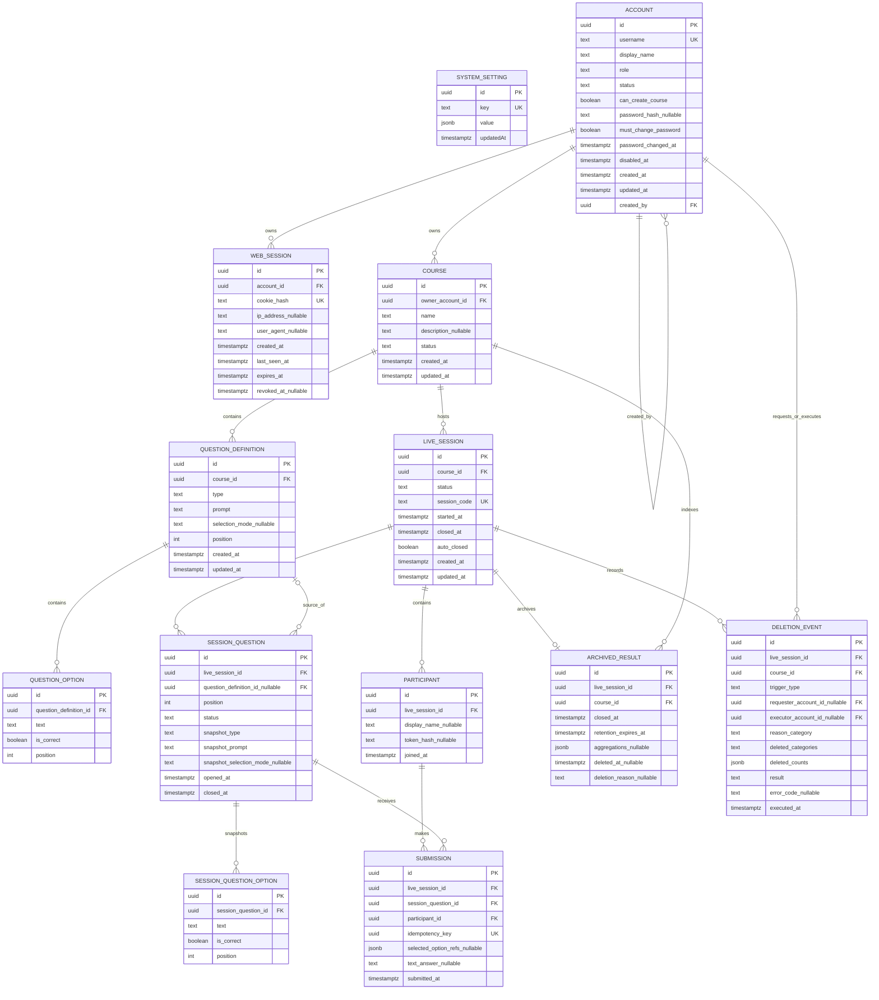

# 智學互動平台 - 資料模型與 ER 設計

> [!important] 文件定位
> 本檔是 M2 #3 的 canonical logical data design。它把 [[系統領域與需求分析]]、[[P0 核心需求基線]]、[[題目領域契約]]、[[結果資料治理]] 與 [[M2 關鍵技術決策]] 轉成 entity、關聯、constraint、transaction 與 migration 邊界。實際已部署欄位以 backend `prisma/schema.prisma` 與 migration 為準；未來模型必須在對應 phase 以 additive migration 落地。

> [!warning] 舊 PostgreSQL 文件的歷史衝突
> [[PostgreSQL 資料庫綱要設計]] 原本以 `BIGINT GENERATED ALWAYS AS IDENTITY` 為 PK，且部分 Argon2/Web Auth 仍標為待定。M2 已改定 UUID v7、app-layer 產生，backend 現行 Prisma/migration 亦已採 UUID。本檔不複製舊 BIGINT DDL；舊文件在同步修訂前只作歷史模型參考。

## 設計原則與權威邊界

1. **PostgreSQL 是 domain state authority**：Account、WebSession、Course，以及後續 LiveSession、Submission、結果與稽核資料以 PostgreSQL 為唯一權威。
2. **所有 identity 採 UUID v7**：由 app layer `newId()` 產生並在 create 時帶入；DB 不使用 identity 或 UUID v4 default。
3. **狀態採 TEXT + CHECK**：Prisma 以 `String` 對應，domain module 以 const object/union guard 守護，CHECK 由手寫 SQL migration 補上。
4. **時間採 TIMESTAMPTZ**：儲存 UTC instant；API 由 application layer 序列化為 UTC ISO 8601。
5. **不可變快照**：LiveSession 啟用時將 QuestionDefinition/Option 複製為 SessionQuestion snapshot，後續來源題目修改不影響場次。
6. **DB constraint 優先於先查再寫**：unique、partial unique、FK、CHECK 與 transaction/lock 共同守護不變量。
7. **敏感原值不落 DB**：Web session cookie、Participant token、CLI credential 原值只存在 client/header；DB 只存不可逆 hash 或必要 metadata。
8. **expand-first migration**：先加表/欄位/index/constraint，再啟用讀寫路徑；不以 destructive down migration 作 production rollback 前提。
9. **Redis 不是 domain state**：只作 M2 定案的 rate limit counter 與多 instance Socket.IO adapter。

## 現況模型與目標模型

| 分類 | Entity | 狀態 | 來源／說明 |
|---|---|---|---|
| 已落地 | `SystemSetting` | 已有 Prisma model + migration | bootstrap flag；Phase 1 |
| 已落地 | `Account` | 已有 Prisma model + migration | admin/teacher、active/disabled；完整 disable/restore 延後 |
| 已落地 | `WebSession` | 已有 Prisma model + migration | DB hash、idle/absolute check；完整 revoke/rotation 延後 |
| 已落地 | `Course` | 已有 Prisma model + migration | draft/archived、immutable owner；題庫/live session 延後 |
| 目標 | `QuestionDefinition` / `QuestionOption` | Phase 3 | Course 題庫與共用題型 contract |
| 目標 | `LiveSession` / `SessionQuestion` / `SessionQuestionOption` | Phase 4 | 場次狀態、code、immutable snapshot |
| 目標 | `Participant` / `Submission` | Phase 5/6 | 匿名 join、重連、答案正確性與 race |
| 目標 | validation token / batch command / idempotency record | Phase 3/6 | preview/confirm 與安全重試 |
| 目標 | `ArchivedResult` / `DeletionEvent` / tombstone | Phase 8 | 90d retention、early deletion、restore filter |
| 目標 | `LoginAttempt` / `AuditEvent` / `CliCredential` / credential epoch | Phase 2 | 完整 auth、安全稽核與 credential revocation |

> [!note] 目標模型不是目前已存在的 DDL
> 未標為「已落地」的 entity 只代表 M2 logical design 方向與 domain responsibility，不代表已建立 Prisma model、migration、controller 或測試。

## Core ERD

## 已落地模型：Identity、Session、Course

### `system_setting`

目前 migration 實際建立：

- `id UUID PRIMARY KEY`，app layer 產生 UUID v7。
- `key TEXT UNIQUE`，目前 seed/bootstrap 使用 `bootstrap_completed`。
- `value JSONB NOT NULL`。
- migration 實際欄名為 quoted camelCase `updatedAt TIMESTAMPTZ`；這是目前 `SystemSetting.updatedAt` 未加 `@map` 的結果，後續若要統一 snake_case 必須另開 additive migration，不在本次修改。

Bootstrap 的 domain invariant 是：`bootstrap_completed` 不為 true 且 Account 中沒有 admin，並在同一 transaction 內取得 advisory lock 後重新檢查；成功後 upsert flag 為 true。

### `account`

目前 Prisma/migration 欄位與 constraint：

| 欄位/constraint | 語意 |
|---|---|
| `id UUID PK` | app-generated UUID v7 |
| `username TEXT UNIQUE NOT NULL` | Web login identifier |
| `display_name TEXT NOT NULL` | Account display name，不是 anonymous participant display name |
| `role TEXT CHECK ('admin','teacher')` | MVP 只有兩種 Web role |
| `status TEXT CHECK ('active','disabled') DEFAULT 'active'` | disabled 不得登入；完整 disable/restore flow 延後 |
| `can_create_course BOOLEAN DEFAULT false` | 只控制新建 Course |
| `password_hash TEXT NULL` | Argon2id hash；永不保存明文，bootstrap/切片允許 null 以表示未可登入 |
| `must_change_password BOOLEAN DEFAULT false` | 欄位已預留；目前切片沒有 temp-password force-change flow |
| `password_changed_at`, `disabled_at` | TIMESTAMPTZ nullable；完整 credential invalidation 延後 |
| `created_by UUID NULL` | self-FK；首位 admin 為 null，`ON DELETE RESTRICT` |
| `created_at`, `updated_at` | TIMESTAMPTZ |

Relations：Account 1:N WebSession (`ON DELETE CASCADE`)、Account 1:N Course owner (`ON DELETE RESTRICT`)、Account self relation created-by (`ON DELETE RESTRICT`)。目前 index 為 `username` unique、`created_by` index。

### `web_session`

- `id UUID PK`、`account_id UUID NOT NULL`。
- `cookie_hash TEXT UNIQUE NOT NULL`：raw cookie token 不落 DB。
- `ip_address`、`user_agent` 可為 null。
- `created_at`、`last_seen_at`、`expires_at`、`revoked_at` 為 session lifecycle metadata。
- Account 刪除時 session cascade；`account_id` 有 index；`expires_at WHERE revoked_at IS NULL` 有 partial index。
- idle validity 由 `last_seen_at` + 30m 判定，absolute validity 由 `expires_at` + 8h 判定。
- 目前 token 是 256-bit random opaque value 的 SHA-256 hash lookup；cookie 未 signed，`COOKIE_SECRET` 目前只交給 cookie-parser。
- logout、rotation、password/disable 全 session revoke、step-up timestamp 欄位與 credential epoch 尚未落地。

### `course`

- `id UUID PK`、`owner_account_id UUID NOT NULL`。
- `name TEXT NOT NULL`、`description TEXT NULL`。
- `status TEXT CHECK ('draft','archived') DEFAULT 'draft'`。
- owner FK `ON DELETE RESTRICT`；owner immutable 是 application invariant。
- `owner_account_id` 有 index。
- 目前沒有 QuestionDefinition、LiveSession relation；那些由後續 migration additive 加入。

## 目標模型：題庫、場次與快照

### QuestionDefinition / QuestionOption

QuestionDefinition 歸屬 Course，可跨 LiveSession 重用；其欄位語意引用 [[題目領域契約]]，至少需要：

- `type`: `poll`、`open_text`、`quiz`。
- `prompt`：trim 後 1–1,000 Unicode 字元。
- `selection_mode`：只對 poll 為 `single`/`multiple`；open_text/quiz 禁止。
- `position`：Course 內題目順序，append/reorder 必須受 Course-scoped advisory lock 或等價 concurrency control 保護。
- QuestionOption 的 text、position、is_correct 與題型交叉限制由 application validation + DB constraints 分工。
- QuestionDefinition/Option 的正式 UUID 由平台產生，client_ref 只屬 batch payload，不是正式 identity。
- archived Course 不得寫題目；已有 LiveSession snapshot 不依賴來源題目後續修改。

### LiveSession

建議的 logical constraints：

- `course_id` FK `ON DELETE RESTRICT`。
- `status TEXT CHECK ('waiting','active','closed','cancelled')`。
- `session_code` 為全域唯一的 8 碼 non-confusable uppercase code；查詢時 canonicalize uppercase；closed/cancelled 後不重用。
- `started_at`、`closed_at`、`auto_closed` 保存生命週期與 8h hard limit 證據。
- Course 以 partial unique index 限制同時最多一個 `waiting` 或 `active`。
- `closed`/`cancelled` terminal；取消只允許未 active 且沒有 Submission 的場次。

### SessionQuestion / SessionQuestionOption

- `live_session_id` FK；`question_definition_id` 可 nullable，作來源追溯，不可讓來源刪除破壞 snapshot。
- snapshot 欄位保存 type、prompt、selection mode、option text、correctness、position；來源 QuestionDefinition 後續修改不影響快照。
- status `not_open`/`open`/`closed`；同一 LiveSession 用 partial unique index 限制最多一題 `open`。
- `(live_session_id, position)` unique，並保留 stable order。
- `waiting → active` 時在單一 transaction 建立完整 snapshot；建立後只允許狀態與 opened/closed timestamps 變更。
- session question closed 後不可重開；active 後不可新增/刪除/重排 snapshot。

## 目標模型：Participant、Submission、Idempotency

### Participant

- `live_session_id` FK `ON DELETE RESTRICT`。
- `display_name` 只供當場 UI；trim 後 1–40 safe Unicode，禁止 newline/control/bidi；不設 unique constraint。
- `token_hash` 為場次限定 opaque participant token 的 hash；不保存 raw token。
- 以 `live_session_id` + token lookup 保證不能跨場使用；清除 browser/換裝置不保證同一 participant。
- archive/retention 時解除或刪除 token/name 與答案之間可查的關聯。

### Submission

- 綁定 `live_session_id`、`session_question_id`、`participant_id`；application 層需檢查三者屬於同一場次。
- `idempotency_key UUID UNIQUE`；相同 key 重送回第一次權威結果，不新增 row。
- `(participant_id, session_question_id) UNIQUE`；多分頁/併發最多一筆有效 Submission。
-答案依題型互斥：poll/quiz 儲存 option refs；open_text 儲存 plain text；不提供修改路徑。
- `submitted_at TIMESTAMPTZ` 是 server timestamp；不採 client time 或 Socket arrival order。
- 只有 LiveSession active 且 SessionQuestion open 才允許 insert。

### Validation token / batch command

- 題目 batch preview/confirm 使用 DB-backed opaque validation token，DB 只存 token hash。
- token 綁定 actor/key、course、canonical payload hash、expiry（M2 方向為 15 分鐘）。
- confirm 必須重送 payload、重算 hash、重查 actor 權限與 Course 狀態；payload 改變即失效。
- 正式 idempotency record 只在 command 建立；取消的 preview 不留下 pending payload。
- 具體欄位與 wire schema 留後續 API/題庫設計，但不可改為 signed token 而未更新 M2 決策。

## 目標模型：Archive、Retention 與 DeletionEvent

### ArchivedResult

- 一個 closed LiveSession 至多一個 ArchivedResult；`live_session_id UNIQUE`。
- 保存 `course_id`、`closed_at`、`retention_expires_at = closed_at + 90d`、匿名題目/答案/aggregate 的查詢投影。
- 即時 aggregate 與 archive 必須源自同一組已 commit、不可變的 SessionQuestion/Submission；快取彙總不能成為另一個不一致的權威。
- cancelled 且從未收集 Submission 的場次不建立 ArchivedResult。
- Course archived 或 teacher disabled 不延長 retention。

### DeletionEvent / tombstone

DeletionEvent 只保存：

- LiveSession/Course ID。
- requester/executor actor type/id。
- trigger type（`retention_expired` / `early_deletion`）、固定 reason category、時間。
- deleted categories/counts、success/failure、stable error code。

不得保存：題幹、選項、正確答案、open text、aggregate、display name、participant token 或其他原始內容。刪除完成後只保留治理需要的最小 tombstone；backup restore 必須過濾已達刪除期限的內容。

## Constraint、Index 與 Delete strategy

| Domain invariant | DB design | Application responsibility |
|---|---|---|
| Identity UUID v7 | `UUID` PK/FK，無 DB default | 每個 create 使用 `newId()` |
| Role/status 合法 | `TEXT + CHECK` | union/const guard、transition state machine |
| Username/session token unique | unique index/hash | generic conflict mapping、不可洩漏敏感原值 |
| Account → WebSession | FK `ON DELETE CASCADE` | revoke semantics、session loading |
| Account → Course | FK `ON DELETE RESTRICT` | owner immutable、permission scope |
| Course 未結束場次最多一個 | partial unique `(course_id) WHERE status IN (...)` | transition recheck、P2002 mapping |
| Session 同時最多一題 open | partial unique `(live_session_id) WHERE status='open'` | lock order、stable error |
| 每人每題一筆答案 | unique `(participant_id, session_question_id)` | check active/open、immutable write path |
| 安全重送 | unique idempotency key + payload hash | 相同 hash 回原結果，不同 hash conflict |
| 題目 append order | transaction advisory lock keyed by `qdef:<courseId>` | same lock helper、單一 transaction `MAX(position)+1` |
| Submit/close race | row `FOR UPDATE` on same SessionQuestion | same lock order、commit order semantics |
| Retention | `retention_expires_at` index/claim path | bounded job、dry-run、retry、restore filter |
| Delete safety | minimal tombstone/event | 不把敏感內容寫入 event/log |

### Foreign-key delete policy

- Account → WebSession：`CASCADE`，帳號刪除（若未來允許）不能留下可用 session。
- Account → Course：`RESTRICT`，MVP 不硬刪帳號/課程，保護歷史 owner reference。
- Account self `created_by`：`RESTRICT`，保留建立者追蹤。
- Course/LiveSession/SessionQuestion/Submission：以 `RESTRICT` 或 archive/tombstone 流程優先，避免一般 cascade 破壞歷史結果。
- SessionQuestion → Option snapshot：可在治理 deletion transaction 中整體清理，但不得因來源 QuestionDefinition 修改而 cascade 破壞 snapshot。

## Transaction、Lock 與 Concurrency table

| 操作 | Transaction boundary | Lock / constraint | 權威結果 |
|---|---|---|---|
| 首位 admin bootstrap | admin insert + bootstrap flag 同一 interactive transaction | fixed advisory lock；lock 內重查 flag/admin count；`$executeRaw` 處理 PostgreSQL void | 只有一個 winner；loser conflict |
| Course create | course insert | Account permission guard + FK | owner 固定、draft |
| 題目 append/reorder | validation + position assignment + writes | Course-scoped advisory xact lock | position 不重複、順序可重現 |
| LiveSession create | state/owner check + insert | partial unique index；必要時 transaction recheck | 同 Course 只有一場 waiting/active |
| waiting → active | state check + complete snapshot insert | single transaction；snapshot rows immutable after commit | session snapshot 與 order 一致 |
| open/close question | state check + status/timestamp update | same SessionQuestion `FOR UPDATE`; one-open partial unique | one open / terminal close |
| Submission | participant/session/question check + insert | same SessionQuestion `FOR UPDATE` + two unique constraints | commit order determines accept/reject |
| Session close/auto-close | session/question transition + archive trigger/command | same lock order；claim/lock for jobs | manual/auto close semantics identical |
| Retention deletion | bounded claim + deletion + minimal event | claim lock/idempotency + restore filter | repeated worker safe；內容不可復活 |

M2 baseline 使用 PostgreSQL `READ COMMITTED`；不預設全域 `SERIALIZABLE`。Phase 6 必須用真 PostgreSQL 多連線驗證 submit p95、lock contention、timeout/retry 與 zero duplicate/loss；若門檻不達標，只能在設計階段調整 lock strategy，不在實作中悄悄改變語意。

## Prisma mapping 與 migration boundary

### 目前 mapping

- Prisma generator 是 Prisma 7 `provider = "prisma-client"`，輸出 `generated/prisma`；程式碼從 `generated/prisma/client` 匯入。
- `String @db.Uuid` 對應 PostgreSQL UUID；M2 identity 不使用 BIGINT。
- `DateTime @db.Timestamptz` 對應 UTC instant。
- `SystemSetting.updatedAt` 目前沒有 `@map`，所以實際 migration column 是 quoted `updatedAt`；其他 identity/course timestamp 多數採 snake_case `@map`。
- Prisma 無法直接產生 CHECK、partial unique 與 advisory lock SQL；由手寫 migration 補上。

### 已有 migration

- `20260815163722_init_system_setting`：只新增 `system_setting`，是 additive baseline。
- `20260815174233_add_identity_and_course`：新增 account、web_session、course、FK、CHECK、unique/partial index；明確排除 credential epoch、audit、login attempt、CLI credential、step-up、題目/live session。

### 後續 migration 規則

1. 每一 phase 先更新 logical design，再建立 additive schema。
2. 以 `prisma migrate dev --create-only` 產生基礎檔，再手寫 CHECK/partial index/lock-related SQL；review 完才 deploy。
3. 任何 entity 新增都要同時補 FK、index、delete policy、domain guard 與 integration test。
4. 不將 PostgreSQL schema 文件的 BIGINT DDL 直接貼入 migration。
5. 破壞性資料刪除只由 Phase 8 governance job 執行；先 dry-run/count/sample，不能以一般 rollback 宣稱可復原已刪內容。

## Current → target traceability

| Entity / rule | Current evidence | Target phase |
|---|---|---|
| SystemSetting bootstrap flag | `prisma/schema.prisma`、seed、BootstrapService | Phase 2 hardening |
| Account role/status/permission | schema/migration、roles/status、Auth/Course e2e | Phase 2 full lifecycle |
| WebSession hash/expiry | schema/migration、SessionService/Guard | Phase 2 revoke/rotation/CSRF |
| Course owner/status | schema/migration、CourseService/status unit | Phase 3题庫與場次前置 |
| QuestionDefinition/Option | requirements + old DB design only | Phase 3 migration/domain tests |
| LiveSession/snapshot | requirements + old DB design only | Phase 4 |
| Participant | requirements + old DB design only | Phase 5 |
| Submission/idempotency | requirements + lock decision + old DB design only | Phase 6 concurrency |
| Realtime/archive/deletion | governance + M2 decision only | Phase 7/8 |

## M2 #3 完成條件

- [x] 已以 UUID v7、TEXT + CHECK、TIMESTAMPTZ 建立 canonical identity/state/time strategy。
- [x] 已將已落地的 SystemSetting、Account、WebSession、Course 與未來 entity 分開標示。
- [x] 已建立涵蓋題庫、snapshot、Participant、Submission、archive 的 logical ERD。
- [x] 已列出 FK/delete policy、unique/partial index、CHECK 與 owner/token boundaries。
- [x] 已定義 transaction、FOR UPDATE、advisory lock、idempotency 與 commit-order responsibility。
- [x] 已記錄 Prisma 7 mapping、手寫 migration 邊界與舊 BIGINT 文件衝突。
- [x] 已明確標示未來模型尚未有 backend code/migration/test，避免誤宣稱完成。

## 相關連結

- 上游領域分析：[[系統領域與需求分析]]
- 需求與狀態：[[P0 核心需求基線]]、[[題目領域契約]]、[[功能需求規格 SPEC]]
- 技術決策：[[M2 關鍵技術決策]]
- 歷史 DB 設計：[[PostgreSQL 資料庫綱要設計]]
- 結果治理：[[結果資料治理]]
- Backend schema：`prisma/schema.prisma`
- Backend migrations：`prisma/migrations/20260815163722_init_system_setting/migration.sql`、`prisma/migrations/20260815174233_add_identity_and_course/migration.sql`
- Transaction helper：`src/prisma/transaction.service.ts`
